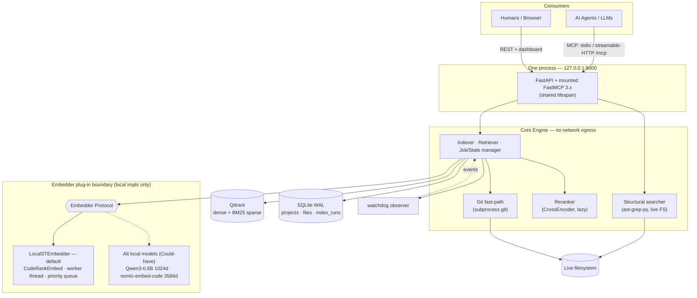
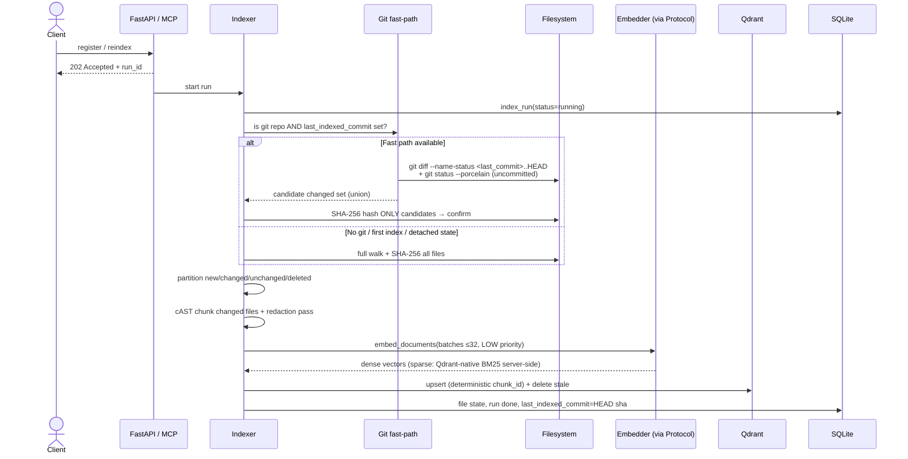
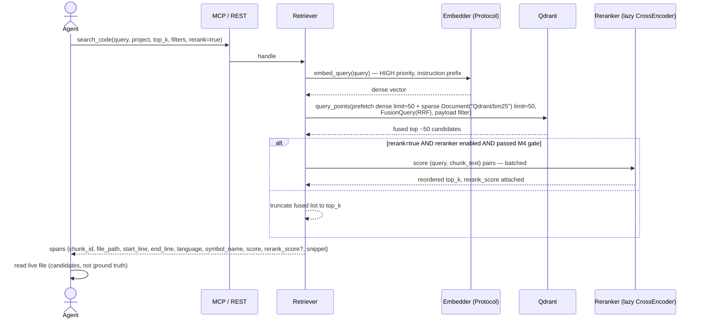
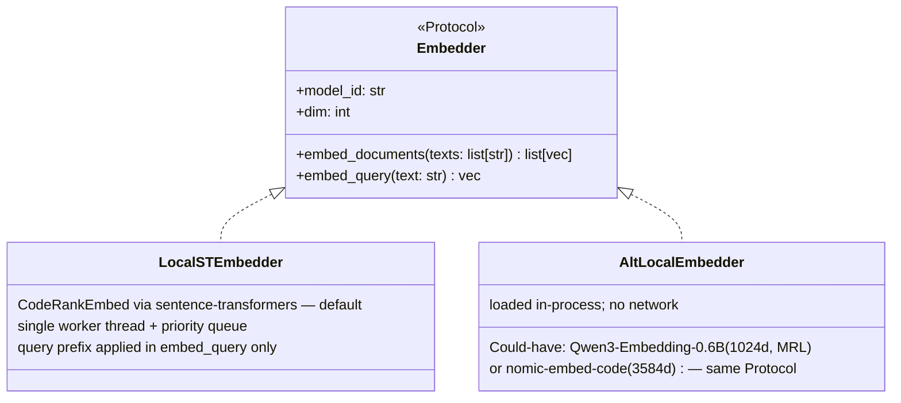
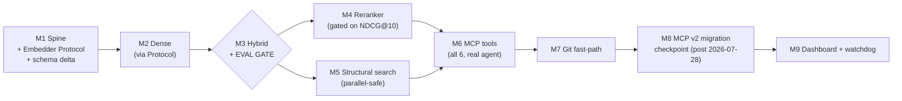

<!-- Steve — Senior Architecture Review | 2026-07-03 (rev 2) | Supersedes rev 1 (2026-07-02) and milestone plan in Code-Indexer-Architecture-Overview.md §9 -->

# Code Indexer — Phase 1 (Expanded) Architecture & Build Plan

**Status:** Draft for review, rev 2.
**Rev 2 change:** Stakeholders confirmed the security finding on hosted embedding (rev 1, Finding 1). **Hosted-embedder pluggability is removed entirely.** Embedding is local-only; source code never leaves the machine — the approved constraint stands unmodified. The `Embedder` abstraction is retained for *local* model pluggability (see Finding 1, revised). Former M8 is deleted; milestones renumbered.
**Change driver (rev 1):** Stakeholders moved Phase-2 features into Phase 1: reranker, ast-grep structural search, git-aware diffing. (Hosted-embedder pluggability was the fourth; removed in rev 2.)
**Baseline:** This document extends, and where noted overrides, `Code-Indexer-Architecture-Overview.md` (2026-06-15). Everything not restated here stands as approved.

---

## 0. Architecture Review Findings — Read Before the Plan

Stakeholder approval to spend more time does not make the pulled-forward features equal. These findings shape the scope and sequencing below.

**Finding 1 — Hosted embedding contradicted an approved constraint. RESOLVED: removed.** The approved architecture (§2.4 of the Overview) states: *"Embeddings are produced by a local model, so source code never leaves the machine."* A hosted embedder would have sent every chunk of source code to a third-party API — a reversal of a security decision, not a feature addition. Stakeholders reviewed this on 2026-07-03 and rejected hosted embedding outright (ADR-25). Consequences carried through this revision: no remote implementation, no opt-in flag, no third-party trust-boundary crossing, one fewer milestone. **What survives:** the `Embedder` interface itself. It was never justified only by hosted providers — the approved local upgrade paths (Qwen3-Embedding-0.6B at 1024-dim, nomic-embed-code at 3584-dim vs. CodeRankEmbed's 768) already require dimension, model-id, and instruction-prefix encapsulation, and the existing `embedding_model` versioning rule (model change → full re-embed) hangs off it. The interface costs nearly nothing now and is expensive to retrofit; it stays a Must.

**Finding 2 — Building the reranker before the M3 evaluation is spending on an unmeasured lever.** The approved design's own logic (§6.2) is that quality claims are validated, not assumed. A cross-encoder reranker reorders the top ~50 fused results; if the BM25 channel is misconfigured (the known tokenization risk on identifiers), the reranker will partially mask that defect and you will ship a slower system that hides a cheaper fix. The reranker therefore lands **immediately after** the M3 evaluation gate, is measured against the M3 baseline with NDCG@10, and ships default-on only if it measurably wins. It stays in Phase 1 as requested — but sequenced behind the gate, not in front of it.

**Finding 3 — Git-aware diffing is the lowest-value item of the pulled-forward set.** SHA-256 hash-diff already solves correctness for change detection, including uncommitted edits, non-git directories, and dirty trees. Git-awareness is purely a *fast-path optimization*: asking git "what changed since commit X" is cheaper than hashing every file on large repos. It cannot replace hashing (git knows nothing about unstaged editor buffers mid-save, and non-git projects exist). It is scheduled last among the new features, and if the timeline compresses, it is the first candidate to slip — the system is correct without it, just slower to re-scan very large repos.

**Finding 4 — The extended timeline still straddles the MCP v2 breaking release.** MCP SDK v2 stable is targeted for **2026-07-28**, alongside the 2026-07-28 spec release that moves the protocol to a stateless core and (in the SDK) renames the bundled `FastMCP` class to `MCPServer` — the v2 beta (`2.0.0b1`, released 2026-06-30) already drops the `mcp.server.fastmcp` import path. Removing the hosted-embedder milestone shortens the plan by one slot but does not move the calendar: the migration checkpoint (**M8** in this revision) remains first-class scheduled work pinned to the upstream date, not to preceding milestones. Mitigation is unchanged in mechanism: build on standalone FastMCP 3.x, pin hard in `uv.lock`, decide at the checkpoint.

**Finding 5 — Structural search must query the live filesystem, not the index.** The tempting design — extract structural facts at index time into Qdrant payloads — builds a second index, adds staleness surface, and duplicates what ast-grep's parallel Rust engine already does in milliseconds against real files. The correct design is the opposite: `structural_search` is a **live-filesystem tool** that bypasses the index entirely. This is also more honest with the system's own core contract ("the file is ground truth") — structural results are never stale by construction. Consequence: structural search shares almost no code with the retrieval pipeline, which is why it can be built in parallel and is low-risk despite being new.

With those on the record, the plan.

---

# 1. Scope (MoSCoW)

Scope is stated per feature, not per milestone, so the trade-offs are visible. "Phase 1" below means this expanded phase; "Won't" means deferred beyond it or rejected.

## Must have

| Item | Why it is Must |
|---|---|
| M1 spine: project registration, discovery, `.gitignore`/binary/secret filtering, SHA-256 diff, SQLite (WAL) state | Foundation; everything reads/writes this state |
| cAST chunker (reimplemented on `tree-sitter-language-pack`) | Chunk quality + metadata (`symbol_name`, `node_type`); approved centerpiece |
| **`Embedder` abstraction (interface + local impl)** | Local model pluggability: the documented upgrade paths differ in dimension (768/1024/3584) and instruction handling; the interface is nearly free at design time and prohibitively expensive to retrofit. All embedding calls go through it from M2 day one |
| Dense retrieval: CodeRankEmbed → Qdrant | Semantic channel |
| Hybrid retrieval: BM25 sparse + RRF(k=60) fusion | The design's core thesis; non-negotiable per approved doc |
| Evaluation harness + 30–50 query golden set (M3 gate) | Every downstream quality decision (reranker on/off, tokenization, fusion choice) depends on it. With extra features in scope, this gate matters *more*, not less |
| MCP tools over standalone FastMCP 3.x: `search_code`, `list_projects`, `get_index_status`, `get_chunk`, `reindex` | Primary interface; the product |
| Secret skip-list + redaction pass | Approved security posture (defense-in-depth even though nothing leaves the machine — the index itself is a retrievable surface) |

## Should have

| Item | Why Should, not Must |
|---|---|
| Reranker: `BAAI/bge-reranker-v2-m3` cross-encoder over top ~50 fused results | Stakeholder-requested; sequenced after the M3 gate and gated on measured NDCG@10 improvement (Finding 2). Ships as a per-request flag `rerank: bool` |
| ast-grep structural search: `structural_search` MCP tool + `POST /structural-search` | Stakeholder-requested; live-filesystem design (Finding 5) makes it low-risk and parallelizable |
| Dashboard (Jinja2) + watchdog auto-reindex | Approved M5 content, unchanged |
| Git-aware diff fast-path | Stakeholder-requested; optimization only (Finding 3). First to slip under pressure |

## Could have

| Item | Trigger to build it |
|---|---|
| Code-aware BM25 tokenization (camelCase/snake_case splitting, client-side sparse encoding) | Only if the M3 symbol-subset evaluation underperforms with Qdrant-native BM25 (§4.6 of Overview) |
| DBSF fusion / RRF k-sweep | Only if the M3 harness shows RRF(60) losing on NDCG@10 |
| Alternative *local* embedder wired behind the Protocol (Qwen3-Embedding-0.6B) | Only if multilingual / mixed prose-code queries measurably underperform on the golden set |
| `nomic-ai/CodeRankLLM` listwise LLM reranker | Only if the cross-encoder reranker is measurably insufficient *and* 7B-class inference is affordable. Note it is an LLM, not a `CrossEncoder` |
| pygit2 instead of git-CLI subprocess for the git fast-path | Only if subprocess overhead is measured to matter (it won't at MVP scale) |

## Won't have (this phase — or rejected)

**Hosted / remote embedding of any kind — rejected by stakeholder decision 2026-07-03 (ADR-25), not merely deferred.** The local-only constraint (Overview §2.4) is reaffirmed: no code chunk, query, or metadata is transmitted to any third-party embedding API. Any future proposal to revisit this must re-open ADR-25 explicitly with a new security review; it must not arrive as a "pluggability" feature.

Also out: multi-repo / cross-repo search at scale, network hosting + authentication (localhost-only stands; FastMCP's auth machinery is the later on-ramp), call-graph / code-graph engine, fine-tuned embedding models, SPA dashboard, distributed indexing, ast-grep **rewrite** capability (search only — the tool never mutates user code).

---

# 2. Tech Stack

Versions verified against PyPI/GitHub as of **2026-07-02**. Re-pin from the registry at build time; `uv.lock` is the source of truth.

| Layer | Package | Version | License | Notes |
|---|---|---|---|---|
| Runtime | Python | 3.12 (target; 3.11 floor) | PSF | Interpreter pinned via `.python-version` |
| Project mgr | uv | 0.11.x | MIT/Apache | `uv init --package` src layout |
| Web framework | fastapi[standard] | 0.136.x | MIT | Bundles uvicorn, CLI, Jinja2 stack |
| ASGI server | uvicorn | 0.49.x | BSD-3 | Via `fastapi[standard]` |
| Agent protocol | fastmcp (standalone, PrefectHQ) | 3.x (latest 3.4.x) | Apache-2.0 | **Not** the bundled `mcp.server.fastmcp`. Mount via `http_app()` + shared lifespan |
| MCP SDK | mcp | resolved by fastmcp; if imported directly, `>=1.27,<2` | MIT | v1.28.1 current stable. **v2 stable targeted 2026-07-28 — breaking.** v2.0.0b1 (2026-06-30) removes `mcp.server.fastmcp`. Do not float; see M8 |
| Vector DB | qdrant (Docker) + qdrant-client | server 1.15.x+ / client 1.18.x | Apache-2.0 | Server ≥1.15.2 for native BM25 (`Modifier.IDF` + `models.Document(model="Qdrant/bm25")`) |
| Embedding runtime | sentence-transformers | 5.x (5.4+) | Apache-2.0 | Loads CodeRankEmbed (`trust_remote_code=True`) and the CrossEncoder reranker |
| Default embedder | nomic-ai/CodeRankEmbed | 137M, **768-dim**, 8192 ctx | **MIT** | Query-only prefix: `Represent this query for searching relevant code:` |
| Reranker | BAAI/bge-reranker-v2-m3 | ~568M | Apache-2.0 (per HF card) | `CrossEncoder("BAAI/bge-reranker-v2-m3")`; lazy-loaded |
| Parser | tree-sitter + tree-sitter-language-pack | 0.25.x / 1.8.x | MIT | Single grammar source; kreuzberg-dev maintains the pack |
| **Structural search** | **ast-grep-py** | **0.44.0** (2026-06-22) | MIT | PyO3 native bindings, wheels for cp310–cp314; self-contained Rust engine with its own grammars — no conflict with tree-sitter-language-pack, but language-name mapping differs (§3.5) |
| **Git fast-path** | **git CLI via `subprocess`** (default) | system git ≥2.30 | GPLv2 (unlinked) | Zero Python deps, no license linkage. Optional upgrade: pygit2 1.19.3 (GPLv2 **with linking exception** — acceptable, but note it in the license inventory) |
| File watcher | watchdog | 6.0.x | Apache-2.0 | |
| State store | sqlite3 (stdlib), WAL | stdlib | Public domain | `journal_mode=WAL`, `synchronous=NORMAL`, `busy_timeout=5000` |
| Templates | Jinja2 | via fastapi[standard] | BSD-3 | Dashboard |

**Deliberately absent:** any HTTP client for embedding (httpx was in rev 1 solely for the removed remote path — gone with it); `astchunk` (test oracle only, installed from git in dev-deps, never a runtime dependency); Celery/Redis; any ORM. ~~`fastembed`~~ *(corrected by ADR-32: `models.Document` BM25 encoding requires fastembed client-side — local Qdrant has no server-side text inference; the rev-2 assumption that "Qdrant-native BM25 replaces the client-side encoder" held only for the IDF half).*

---

# 3. Complete In-Depth Architecture

## 3.1 System overview

The system remains a hybrid retrieval service: one Core Engine, two thin adapters (MCP, REST), one Qdrant container, one SQLite file. The three new features attach at three distinct points — and notably, two of the three do **not** touch the retrieval hot path's data model at all. There is **no network egress from the core engine**: every model runs in-process, and the only sockets are localhost (Qdrant, the bound service).



Note what the diagram encodes: the **structural searcher reads the filesystem, not Qdrant**; the **reranker sits behind the retriever**, invisible to the data model; the **git fast-path only feeds the indexer's diff step**; and the embedder boundary contains **only local implementations** — there is no edge leaving the machine.

## 3.2 Indexing pipeline (revised: git fast-path inserted)

The pipeline is the approved eight-step flow with one insertion at the diff step. Hash remains the source of truth; git only narrows the candidate set.



**Git fast-path rules (the correctness boundary, stated precisely):**
1. The fast path may only *shrink* the set of files that get hashed. It never marks a file unchanged on its own authority.
2. The candidate set is `git diff --name-status <last_indexed_commit>..HEAD` **union** `git status --porcelain` (staged + unstaged + untracked-and-not-ignored). Deletions from both feed the stale-chunk pruner.
3. Fall back to full hash-walk when: no `.git`, no stored `last_indexed_commit`, the stored commit is unreachable (rebase/forced push/gc), `git` exits non-zero, or the repo is mid-merge/rebase (`.git/MERGE_HEAD` etc. present). Fallback is silent and logged — never an error surfaced to the caller.
4. `last_indexed_commit` (nullable TEXT) is written to `projects` only after a run completes successfully.
5. Implementation is `subprocess` against the system git CLI. It's the zero-dependency, license-clean option, and at MVP scale the process-spawn cost (~10ms) is noise next to embedding. pygit2 is the documented upgrade if profiling ever says otherwise.

**Why not use git as the primary change detector?** Because the approved hash design is *more* correct: it catches uncommitted buffers, works on non-git directories, and is immune to history rewrites. Git-awareness earns its keep only on repos large enough that hashing every file per run is felt — which is exactly why it's an optimization milestone, not a foundation one.

## 3.3 Retrieval pipeline (revised: reranker inserted)



**Reranker design decisions:**
- **Placement in the concurrency model.** The cross-encoder is compute-bound, like the embedder. It runs on a **second dedicated single worker thread** with the same HIGH/LOW discipline — *not* the embedder's worker. Rationale: a rerank of 50 pairs takes materially longer than a query embed; sharing one worker would let a rerank head-of-line-block the *next* query's embedding. Two single-thread workers, each serialized, keeps both models safe and both latencies bounded. On CPU, budget `torch` threads across both (leave cores for the event loop and Qdrant client).
- **Lazy load + kill switch.** The ~568M model loads on first reranked request (or at startup via config `reranker.preload=true`), and `reranker.enabled=false` removes it entirely — memory footprint is a real cost on developer laptops, and the system must remain fully functional without it.
- **Contract.** `rerank` defaults to the config value; the response always states whether reranking was applied. Candidate depth (default 50) and rerank batch size are config, not constants.
- **Gate.** Default-on only if the M4 evaluation shows NDCG@10 improvement over the M3 hybrid baseline on the golden set. If it doesn't win, it ships default-off with the measurement recorded in the decision log. (Per Finding 2 — we don't ship a latency tax on faith.)
- **Input truncation.** bge-reranker-v2-m3 pairs are truncated to the model's max length; chunks already target 300–800 tokens, so truncation is rare — log when it happens.
- **`chunk_id` in hits (M6, ADR-36).** Every hit carries the deterministic Qdrant point id, because the approved `get_chunk(chunk_id)` tool is unusable if agents can never learn a chunk id — search hits are the only discovery surface. Additive field; the rest of the span shape is unchanged.

## 3.4 The `Embedder` plug-in boundary (local-only)

This is the load-bearing abstraction that survived the hosted-embedder removal — because its justification was always broader than remote providers. It is deliberately tiny.



Design rules that make pluggability real rather than decorative:

1. **Nothing outside the boundary knows the vector size.** The Qdrant collection's dense `VectorParams(size=...)` is read from `embedder.dim` at collection-creation time. 768 (CodeRankEmbed), 1024 (Qwen3-0.6B MRL), 3584 (nomic-embed-code) — same code path.
2. **`model_id` is the versioning key**, written to Qdrant payload and SQLite `projects.embedding_model` exactly as already approved. Swapping implementations triggers the existing full-re-embed rule; the system refuses to serve mixed-model results. No new mechanism needed — this is why the abstraction is cheap.
3. **The query-prefix quirk lives inside the implementation.** CodeRankEmbed's `Represent this query for searching relevant code:` prefix is `LocalSTEmbedder`'s private business; an instruction-aware alternative (Qwen3) handles its instructions in its own implementation. The Retriever calls `embed_query()` and knows nothing.
4. **Local-only is enforced structurally, not by convention.** The Protocol has no remote/credentials surface and no HTTP client dependency anywhere in `core/`. A future attempt to add a remote implementation would require new dependencies — which trips rule 3 of `CLAUDE.md` (no new runtime deps without an ADR) and re-opens ADR-25. Guardrails over goodwill.
5. **Sparse is unaffected.** BM25 is Qdrant-server-native; the lexical channel is identical regardless of which dense embedder is active. This is a nice consequence of the native-BM25 correction already made in the draft.
6. **Async shape.** The Protocol is async (`async def`). `LocalSTEmbedder` awaits its worker via `run_in_executor`. The indexer and retriever are already async; no impedance mismatch.

## 3.5 Structural search (ast-grep)

**Contract:** structural search answers the third query row from the approved matrix ("functions that call `db.Exec` without a context arg") by pattern-matching ASTs of **live files**. It does not touch Qdrant, SQLite chunk state, or the embedder. It reuses exactly two things from the core: the project registry (to resolve `project` → `root_path`) and the discovery filter (`.gitignore`, secret skip-list, size caps — so structural search cannot leak what indexing would have excluded).

**Tool surface:**

```
structural_search(
  pattern: str,            # ast-grep pattern, e.g. "db.Exec($$$ARGS)"
  language: str,           # required — ast-grep patterns are per-language
  project: str,
  paths: list[str] | None, # optional subtree restriction
  max_results: int = 100,
) -> [{file_path, start_line, end_line, matched_text, meta_vars}]
```

REST mirror: `POST /structural-search`. Same core function underneath, per the thin-adapter rule.

**Implementation decisions:**
- `ast-grep-py` (`SgRoot(src, language).root().find_all(pattern=...)`) in-process, over the discovery-filtered file list for the requested language. The engine is parallel Rust; per-file parse+match is fast, and `max_results` plus an optional wall-clock budget bound worst-case cost on huge repos.
- File reads are blocking I/O + native compute → run the scan in a thread (`run_in_executor` on the default pool — *not* the embedding workers; structural search must not queue behind an index batch).
- **Language-name mapping is a real seam:** ast-grep and tree-sitter-language-pack do not use identical language identifiers everywhere. Maintain one explicit `LANGUAGE_MAP` in `core/languages.py` mapping the project's canonical language names (as stored in `files.language`) to (a) the tree-sitter-language-pack grammar name and (b) the ast-grep language string. Unmapped languages return a clean "unsupported for structural search" error, mirroring the chunker's fallback philosophy.
- **Search only.** ast-grep's rewrite capability is explicitly not exposed. An MCP tool that mutates user source is a different risk class and a Won't for this phase.
- Pattern errors (invalid pattern for the language) return a structured error with ast-grep's diagnostic — agents iterate on patterns; make that loop cheap.

**Rejected alternative — index-time structural extraction:** pre-extracting call sites/definitions into Qdrant payloads was considered and rejected. It duplicates ast-grep's job, adds a second staleness surface to the system's highest-risk area, bloats payloads, and constrains queries to whatever was pre-extracted. Live scanning is slower per query but always correct and unbounded in expressiveness. At MVP repo scale, "slower" is still sub-second for most patterns.

## 3.6 Unchanged foundations (delta-free, restated for completeness)

The following stand exactly as approved and are not re-argued here: Qdrant single shared collection + `project_id` payload filter; named dense + named sparse (`Modifier.IDF`) vectors with payload keyword indexes created before bulk load; RRF(k=60) default fusion via `FusionQuery`; deterministic content-derived `chunk_id`; SQLite WAL settings and `wal_checkpoint(TRUNCATE)` after large runs; in-process asyncio job worker with `202 + run_id` and status polling; secret skip-list; localhost-only binding; Jinja2 dashboard; watchdog watcher; cAST reimplementation with `astchunk` as test oracle only.

## 3.7 Data model deltas

Smaller than rev 1 — the expanded scope now requires exactly **one** new column on `projects`, zero new tables, plus the two `index_runs` telemetry columns §3.8's observability delta already mandates (made explicit at M7 build time):

```sql
-- projects: one addition
ALTER TABLE projects ADD COLUMN last_indexed_commit TEXT;  -- git fast-path anchor, NULL = no fast path

-- index_runs: fast-path telemetry (§3.8 observability; Finding 3 audit trail)
ALTER TABLE index_runs ADD COLUMN fast_path_used  INTEGER; -- 1/0 per run, NULL = pre-M7 row
ALTER TABLE index_runs ADD COLUMN candidate_count INTEGER; -- |candidate set|, NULL when full walk
```

(`files_total` already stores the full file count, so fast-path value is measurable as `candidate_count` vs `files_total` per run. Applied as additive `PRAGMA table_info`-guarded migrations in `state.init_db` — older DBs upgrade in place.)

(Rev 1's `allow_remote_embedding` column is deleted with the feature. If any rev-1 scaffolding was already built, drop the column — do not leave a dead security flag in the schema, where it would imply a capability that must not exist.)

Qdrant point schema: **unchanged.** (The reranker's `rerank_score` is response-only; structural search stores nothing; the embedder key `embedding_model` already exists.) That two of three features needed no vector-store schema change is evidence the attachment points are right.

Config file (`config.toml`, read at startup) gains: `[embedder]` (`model` — a local model id, `dim` override for MRL cases), `[reranker]` (`enabled`, `preload`, `candidates=50`, `batch_size`), `[structural]` (`max_results`, `timeout_s`), `[git]` (`fast_path = true`).

## 3.8 Cross-cutting deltas

- **Concurrency:** now *two* single-thread compute workers (embedder, reranker) plus the default thread pool (structural scans, file I/O). The CPU-thread budget (`torch.set_num_threads`) is set once, globally, accounting for both models. Backpressure behavior unchanged: queries preempt indexing; freshness lags under heavy query load and recovers.
- **Security:** the trust boundary is *simpler than rev 1* — there is no deliberate crossing at all. Everything in §6.1 of the Overview stands unmodified: localhost binding, secret skip-list, redaction pass (still valuable: the index itself is a retrievable surface, so secrets must not enter it even locally). The system makes zero outbound network calls at runtime; model weights are fetched once at install time, which is the only network activity and happens before any user code is read.
- **Observability:** `index_runs` additionally records whether the git fast-path was taken and candidate-set size vs. full file count (so the optimization's value is measurable, not assumed — Finding 3 gets audited by its own telemetry).
- **Evaluation:** the golden set carries a fourth query category — structural patterns — evaluated for correctness of `structural_search` (exact match sets), separate from the retrieval metrics. The harness gains a latency column: p50/p95 for search with and without rerank, because the reranker's cost must be visible next to its NDCG gain.

---

# 4. Milestones

Revised sequence (rev 2: former M8 hosted-embedder deleted; subsequent milestones renumbered). Original M1–M3 are untouched — the spine and the evaluation gate come first precisely because the new features depend on that gate. New work is inserted after MCP so an agent is exercising the system while quality features land.



| # | Milestone | Deliverable | Exit criterion (proves) |
|---|---|---|---|
| M1 | Spine | Registration, discovery + filtering (gitignore/binary/secret), SHA-256 diff, SQLite WAL with the `last_indexed_commit` column, **`Embedder` Protocol defined with a fake impl for tests** | Incremental detection works on a real repo; interface compiles the whole downstream design |
| M2 | Dense | cAST chunker → `LocalSTEmbedder` (CodeRankEmbed) → Qdrant dense-only, REST `POST /search` | NL→code returns sane spans; **zero direct `SentenceTransformer` calls outside the embedder module** (enforced by a grep in CI) |
| M3 | Hybrid + **gate** | Native BM25 sparse + RRF; golden set (30–50 queries, 4 categories); harness with Recall@10 primary | Hybrid beats M2 dense-only on Recall@10, **especially the symbol subset**. If not: fix tokenization (Could-have triggers) before *anything* proceeds to M4 |
| M4 | Reranker | bge-reranker-v2-m3 on dedicated worker, `rerank` flag, lazy load, harness extended with NDCG@10 + latency p50/p95 | Measured NDCG@10 delta vs M3 recorded; default-on/off decision made from data (Finding 2 discharged) |
| M5 | Structural search | `structural_search` core fn + REST endpoint, `LANGUAGE_MAP`, discovery-filter reuse, structural queries added to golden set | Known patterns return exact expected match sets on the target repo; secret-skip-listed files never appear |
| M6 | MCP | FastMCP 3.x mounted (shared lifespan), stdio + streamable-HTTP, all six tools incl. `structural_search`; connect a real agent | Agent completes a task using `search_code` → read file, and `structural_search`, end to end |
| M7 | Git fast-path | Candidate-set diffing per §3.2 rules, `last_indexed_commit`, telemetry | Re-index of a large repo with a 3-file change hashes ~3 files, not all; every fallback condition has a test |
| M8 | **MCP v2 checkpoint** | Post-2026-07-28: assess stable MCP v2 + FastMCP's compatible range; migrate or explicitly re-pin with a dated revisit | Transports pass integration tests against the pinned, decided-upon versions; decision recorded |
| M9 | Dashboard + watchdog | Jinja2 monitoring page (runs, failures, freshness), watchdog auto-reindex | Edit on a watched project re-indexes that file within seconds; a human can see index health |

**Sequencing rationale worth stating:** M5 depends only on M1 (registry + filters), so it can run in parallel with M4 if there are two pairs of hands — it's the designated schedule-recovery lever. M8 is pinned to the calendar, not to preceding work: it happens when upstream ships, and the plan acknowledges that instead of pretending the ecosystem holds still. Deleting the hosted-embedder milestone shortens the critical path by one slot but does not move M8's date.

---

# 5. Pre-Build: `.claude/` Setup for Agentic Development with SQLite Session Management

The app will be built largely with Claude Code. This section defines the project's `.claude/` folder so that (a) every session starts with correct project context, (b) architectural guardrails are enforced mechanically, not by hope, (c) **session continuity (memories) persists in SQLite** — the same storage philosophy as the product itself: relational truth in one zero-config file — and (d) **mistakes are captured as lessons and re-injected at session start**, so the agent corrects its approach across sessions instead of repeating errors (§5.6).

Terminology, kept deliberately distinct: **memories** are project state — what happened, where work stopped, what's blocked. They live in the `sessions` table and need no new mechanism. **Lessons** are corrective knowledge — a mistake, the correct approach, and the rationale — with a lifecycle. They get their own table and their own retrieval path.

> Claude Code specifics referenced here (folder layout, settings precedence, hook events, command frontmatter) follow the official docs — verify against https://code.claude.com/docs/en/slash-commands and the Claude Code overview at https://docs.claude.com/en/docs/claude-code/overview before first use, as the CLI ships fast.

## 5.1 Folder layout

```
code-index/
├── .claude/
│   ├── settings.json            # committed: permissions, hooks (below)
│   ├── settings.local.json      # gitignored: personal overrides, keys
│   ├── commands/
│   │   ├── milestone.md         # /milestone <n> — load milestone spec + status
│   │   ├── eval.md              # /eval — run the M3 harness, report metrics
│   │   ├── session-log.md       # /session-log — write a mid-session checkpoint
│   │   ├── lesson.md            # /lesson — capture a mistake → corrective lesson (§5.6)
│   │   └── adr.md               # /adr <title> — record a decision to the DB + docs
│   ├── hooks/
│   │   ├── session_start.py     # inject last session memory + active lessons
│   │   ├── session_end.py       # persist session summary, next steps; prompt for lessons
│   │   └── guard_bash.py        # PreToolUse: veto dangerous commands
│   └── scripts/
│       └── devlog.py            # CLI over dev/devlog.sqlite (init/read/write/render)
├── dev/
│   ├── devlog.sqlite            # session + lesson DB (WAL) — GITIGNORED, machine-local
│   └── LESSONS.md               # rendered active lessons — COMMITTED, PR-reviewed (§5.6)
├── CLAUDE.md                    # project memory (root; loaded every session)
└── ...
```

## 5.2 Session-management schema (`dev/devlog.sqlite`)

Same WAL pragmas as the product DB. Three tables — sessions, decisions, milestone progress — mirroring exactly what a returning session needs to know:

```sql
PRAGMA journal_mode=WAL;

CREATE TABLE IF NOT EXISTS sessions (
  id          TEXT PRIMARY KEY,        -- Claude Code session id
  started_at  TEXT NOT NULL,
  ended_at    TEXT,
  milestone   TEXT,                    -- e.g. 'M4'
  summary     TEXT,                    -- what was accomplished
  next_steps  TEXT,                    -- explicit handoff to the next session
  blockers    TEXT
);

CREATE TABLE IF NOT EXISTS decisions (
  id          INTEGER PRIMARY KEY AUTOINCREMENT,
  session_id  TEXT REFERENCES sessions(id),
  decided_at  TEXT NOT NULL,
  title       TEXT NOT NULL,
  decision    TEXT NOT NULL,
  rationale   TEXT NOT NULL            -- no rationale, no row — house rule
);

CREATE TABLE IF NOT EXISTS milestones (
  id          TEXT PRIMARY KEY,        -- 'M1'..'M9'
  status      TEXT NOT NULL DEFAULT 'pending',  -- pending|in_progress|done|blocked
  exit_criterion TEXT,
  evidence    TEXT,                    -- link/notes proving the exit criterion
  updated_at  TEXT
);

CREATE TABLE IF NOT EXISTS lessons (
  id          INTEGER PRIMARY KEY AUTOINCREMENT,
  created_at  TEXT NOT NULL,
  session_id  TEXT REFERENCES sessions(id),
  category    TEXT NOT NULL,           -- e.g. chunker|qdrant|mcp|testing|process
  mistake     TEXT NOT NULL,           -- what went wrong, concretely
  lesson      TEXT NOT NULL,           -- the correct approach, imperative voice
  rationale   TEXT NOT NULL,           -- WHY — same house rule as decisions
  occurrences INTEGER NOT NULL DEFAULT 1,  -- bumped on recurrence, drives promotion
  status      TEXT NOT NULL DEFAULT 'active'  -- active|promoted|retired
);
```

`devlog.py` exposes: `init`, `session-start <id>`, `session-end <id> --summary --next`, `latest` (prints last session summary + next_steps + open blockers + milestone board), `decision add`, `milestone set`, and for lessons: `lesson add`, `lesson bump <id>` (recurrence), `lesson retire <id>`, `lesson promote <id>`, `render-lessons` (regenerates `dev/LESSONS.md` from `status='active'` rows), and `lessons import` (rehydrates the table from `LESSONS.md` on a fresh clone, since the DB itself is gitignored).

## 5.3 Hooks (wired in `.claude/settings.json`)

```json
{
  "permissions": {
    "allow": [
      "Read", "Edit", "Write",
      "Bash(uv run *:*)", "Bash(uv add *:*)", "Bash(git status:*)",
      "Bash(git diff:*)", "Bash(git log:*)", "Bash(pytest *:*)",
      "Bash(docker compose *:*)",
      "Bash(python .claude/scripts/devlog.py *:*)"
    ],
    "deny": [
      "Bash(rm -rf *:*)",
      "Edit(.env*)",
      "Edit(dev/devlog.sqlite)"
    ]
  },
  "hooks": {
    "SessionStart": [
      { "hooks": [ { "type": "command",
        "command": "python .claude/hooks/session_start.py" } ] }
    ],
    "SessionEnd": [
      { "hooks": [ { "type": "command",
        "command": "python .claude/hooks/session_end.py" } ] }
    ],
    "PreToolUse": [
      { "matcher": "Bash",
        "hooks": [ { "type": "command",
        "command": "python .claude/hooks/guard_bash.py" } ] }
    ],
    "PostToolUse": [
      { "matcher": "Edit|Write",
        "hooks": [ { "type": "command",
        "command": "uv run ruff format --quiet $CLAUDE_FILE_PATH || true" } ] }
    ]
  }
}
```

- **`session_start.py`** runs `devlog.py latest` and emits its output so it lands in context: last summary, explicit next steps, blockers, milestone board, plus the three architecture doc filenames. It then emits the contents of `dev/LESSONS.md` (falling back to `devlog.py render-lessons` output if the file is missing). This is both the memory mechanism *and* the lesson-retrieval mechanism — a new session begins already knowing where the last one stopped and which mistakes not to repeat, from the store, not from a human retyping it.
- **`session_end.py`** records `ended_at` and prompts persistence of summary/next-steps, plus one explicit question: *"any mistake this session worth a /lesson?"* — capture is cheapest while the failure is fresh. (The `/session-log` and `/lesson` commands are the in-session way to write these deliberately rather than relying on session end.)
- **`guard_bash.py`** vetoes (exit 2) destructive patterns and any network call outside the allowlist — mirroring, in the dev environment, the same trust discipline the product enforces.
- The `deny` on editing `devlog.sqlite` directly forces all writes through `devlog.py`, keeping the schema honest.

## 5.4 `CLAUDE.md` (root — kept short deliberately)

```markdown
# Code Indexer

Hybrid code-retrieval service for AI agents. MCP primary, REST secondary.
Local-only: no code, query, or metadata ever leaves the machine (ADR-25).

## Read first
- Code-Indexer-Phase1-Expanded-Architecture.md  (this plan — authoritative)
- Code-Indexer-Architecture-Overview.md          (approved baseline)

## Commands
- `uv run uvicorn code_index.app:app --host 127.0.0.1 --port 8000`
- `uv run pytest` | `uv run pytest tests/eval/ -m golden` (harness)
- `docker compose up -d` (Qdrant)
- `python .claude/scripts/devlog.py latest` (session state)

## Hard rules
1. All embedding calls go through core/embedder.py's Embedder Protocol. Never
   import sentence_transformers outside that module. CI greps for this.
2. bind 127.0.0.1 only. Never 0.0.0.0. No outbound HTTP anywhere in core/ —
   remote embedding was rejected (ADR-25); do not reintroduce it.
3. No new runtime deps without a decision row (use /adr). astchunk is
   dev/test only.
4. Milestone exit criteria are the definition of done — update via devlog.py.
5. mcp pin: fastmcp resolves it; never float past <2 until M8 decides.
6. Every design decision gets a rationale (decisions table + doc). No
   rationale, no merge.
7. When a mistake is caught (wrong approach, broken invariant, reverted
   work, failed exit criterion), record it with /lesson BEFORE moving on.
   Active lessons in dev/LESSONS.md are binding guidance, second only to
   these hard rules. A lesson may never weaken rules 1-6.

## Layout
src/code_index/{core,api,mcp,app.py} — api/ and mcp/ are thin over core/.
```

## 5.5 Slash commands (representative)

`.claude/commands/milestone.md`:

```markdown
---
description: Load the spec, exit criterion, and current status for milestone $1
allowed-tools: Read, Bash(python .claude/scripts/devlog.py *:*)
---
1. Run `python .claude/scripts/devlog.py latest` for current state.
2. Read the "$1" row of the Milestones table in
   Code-Indexer-Phase1-Expanded-Architecture.md §4 and the relevant §3 design.
3. Restate the exit criterion, list remaining work as a checklist, and confirm
   the plan with me before writing code.
```

`.claude/commands/eval.md` runs the harness and reports Recall@10 / NDCG@10 / latency against the recorded M-baselines; `.claude/commands/adr.md` appends to the `decisions` table *and* the doc's decision log in one step, taking `$ARGUMENTS` as the title.

`.claude/commands/lesson.md`:

```markdown
---
description: Capture a mistake as a corrective lesson in the devlog
allowed-tools: Bash(python .claude/scripts/devlog.py *:*), Read
---
1. Check existing lessons: `python .claude/scripts/devlog.py render-lessons`.
   If this mistake matches an existing lesson, run `lesson bump <id>`
   instead of adding a duplicate — recurrence is the promotion signal.
2. Otherwise run `lesson add` with: category, the concrete mistake, the
   corrective lesson in imperative voice ("Query the live filesystem for
   structural search, never the index"), and the rationale. No rationale,
   no lesson.
3. Run `render-lessons` to refresh dev/LESSONS.md, and state the new
   active-lesson count. If it exceeds 15, propose which lesson to retire
   or promote — do not silently exceed the cap.
```

## 5.6 Lessons & memories — the self-improvement loop

**Storage decision (ADR-27): SQLite is the system of record; a rendered, committed Markdown file is the retrieval artifact. Neither alone is sufficient.**

The naive framings both fail. *DB-only* fails at retrieval: Claude Code does not passively query SQLite — knowledge influences behavior only if it is injected into context, so a lesson that lives solely in a table is a lesson never learned. *Raw-md-only* fails at lifecycle: append-only files grow without bound (context bloat is a real cost — every injected token competes with working context), accumulate near-duplicates instead of reinforcement signal, and rot when contradicted lessons are never retired. The hybrid takes each format for what it is good at:

| Concern | Where it lives | Why |
|---|---|---|
| Capture, dedup, occurrence counting, status lifecycle | `lessons` table, `devlog.sqlite` | Structured updates (`bump`, `retire`, `promote`) are queries, not text surgery |
| Retrieval into agent context | `dev/LESSONS.md`, regenerated by `render-lessons`, emitted by `session_start.py` | Injection is the only mechanism that actually changes behavior |
| Durability across clones/machines | `LESSONS.md` is **committed**; the DB is gitignored | Lessons are team knowledge; session memories are machine-local. `lessons import` rehydrates a fresh clone's DB from the md |
| Human oversight | `LESSONS.md` diffs appear in PRs | A bad lesson is reviewable and revertible like any other change |

**Memories need no new mechanism.** The `sessions` table (summary, next_steps, blockers) *is* the memory system, injected at SessionStart since rev 1. It stays DB-only and machine-local deliberately: "where I stopped on my machine" has no business in git.

**Lesson lifecycle — the part that makes this self-improvement rather than a diary:**

1. **Capture.** When a mistake is caught — wrong approach, broken invariant, reverted work, failed exit criterion — `/lesson` records it (CLAUDE.md rule 7 makes this mandatory, and `session_end.py` asks once more at session close). A lesson without a rationale is rejected, same house rule as decisions: "don't do X" without *why* invites relitigating.
2. **Reinforce, don't duplicate.** A recurring mistake bumps `occurrences` on the existing lesson. This turns repetition into signal instead of noise.
3. **Inject.** Every session starts with the active set in context. Lessons are written in imperative voice so they read as instructions, not history.
4. **Promote.** At `occurrences >= 3` (or immediately for anything safety- or invariant-related), the lesson is proposed for **promotion into a CLAUDE.md hard rule or a guard-hook check** — permanent, always-loaded, mechanically enforced where possible — and its row flips to `promoted`, leaving the rotating set. The best lesson is one that stops being a lesson and becomes a guardrail.
5. **Retire.** Lessons contradicted by a later ADR, made obsolete by refactoring, or unused past a milestone boundary are flipped to `retired`. They stay in the DB for audit; they leave the injected set.
6. **Cap.** Hard limit of **15 active lessons**. The cap is the forcing function for steps 4–5: exceeding it forces a promote-or-retire decision instead of silent context bloat. Injection order is `occurrences DESC, created_at DESC` so if truncation ever happens, the most-reinforced lessons survive.

**Two guards, because a self-modifying instruction store is an attack surface on itself:**

- **Lessons can never weaken guardrails.** A "lesson" like *"skip the eval harness, it's slow"* or *"tests can come later"* is invalid by construction — CLAUDE.md rule 7 subordinates lessons to rules 1–6, and the `/lesson` command's review step is expected to reject them. The failure mode this prevents is real: an agent rationalizing a shortcut and then *persisting the rationalization* so every future session inherits it.
- **Promotion requires human approval.** The agent proposes; the human merges the CLAUDE.md diff. Self-improvement of the rotating set is autonomous; self-modification of the permanent rules is not.

**Rejected alternatives, for the record:** per-session raw md lesson files (`lessons/2026-07-*.md`) — unbounded injection surface, no dedup, no lifecycle; committing `devlog.sqlite` — binary diffs, merge conflicts, and it drags machine-local session memories into git; a Claude Code *skill* holding lessons — skills are model-invoked on relevance-match, which makes retrieval probabilistic exactly where it must be guaranteed (a lesson that only *sometimes* loads is not a correction mechanism). Hook injection is deterministic; that property is the whole point.

---

# 6. Prompts for Building the App (Claude Code)

Battle-tested prompt shapes, one per milestone plus utilities. Each assumes the `.claude/` setup above (so context injection and guardrails are already active). They are deliberately specific about exit criteria and anti-goals — vague prompts are how scope leaks.

**M1 — Spine**
> /milestone M1 — Implement the M1 spine per §3 and the approved Overview §4.2: uv `--package` src layout, SQLite state module (WAL pragmas, the schema in Overview §5.2 plus the `last_indexed_commit` column from §3.7 of the Phase-1 doc), discovery with .gitignore + binary + secret-skip-list filtering, SHA-256 diff partitioning into new/changed/unchanged/deleted. Also define the `Embedder` Protocol in `core/embedder.py` exactly per §3.4, with a `FakeEmbedder` for tests. No embeddings, no Qdrant writes yet. Write pytest coverage for: diff partitioning on a fixture repo, skip-list exclusion, and WAL concurrent read-during-write. Exit: `devlog.py milestone set M1 done` only when all tests pass.

**M2 — Dense**
> /milestone M2 — Implement the cAST chunker on tree-sitter-language-pack per Overview §4.3 (split-then-merge, 300–800 token budget, metadata attached, concatenation-reproduces-file invariant tested; use astchunk as a dev-dependency test oracle on 5 fixture files). Implement `LocalSTEmbedder` (CodeRankEmbed, single worker thread, priority queue, query prefix in `embed_query` only). Create the Qdrant collection with dense size from `embedder.dim`. Wire `POST /search` dense-only. Anti-goal: no sparse channel yet. Add the CI grep asserting no `sentence_transformers` import outside `core/embedder.py`, and a second grep asserting no HTTP client imports anywhere in `core/`.

**M3 — Hybrid + gate**
> /milestone M3 — Add the sparse channel using Qdrant-native BM25 (`Modifier.IDF` sparse config; query via `models.Document(text=..., model="Qdrant/bm25")`) and RRF fusion via `query_points` prefetch, per the Draft's verified snippets. Then build the eval harness: load `tests/eval/golden.yaml` (I will label 40 queries across NL/symbol/structural categories), report Recall@10, Recall@5, NDCG@10 per category, and compare against the stored M2 baseline. Stop and show me the numbers before proceeding — if the symbol subset does not beat dense-only, propose the code-aware tokenization fix from §4.6 of the Overview instead of continuing.

**M4 — Reranker**
> /milestone M4 — Add bge-reranker-v2-m3 per §3.3: dedicated single worker thread separate from the embedder, lazy load, `reranker.enabled` and `preload` config, `rerank: bool` request flag, candidates=50 default. Extend the harness with NDCG@10 and p50/p95 latency with/without rerank. Run it and present the delta table; the default-on decision is mine, from those numbers. Anti-goal: do not touch the embedder worker or the Qdrant schema.

**M5 — Structural search**
> /milestone M5 — Implement `structural_search` per §3.5: ast-grep-py over discovery-filtered live files, `LANGUAGE_MAP` in `core/languages.py`, `run_in_executor` on the default pool, `max_results` + timeout budget, structured pattern-error responses, REST `POST /structural-search`. Search only — never expose rewrite. Tests: 5 known patterns with exact expected match sets on the fixture repo, plus a negative test proving a skip-listed file never matches.

**M6 — MCP**
> /milestone M6 — Mount standalone FastMCP 3.x per the Draft's verified pattern: `mcp.http_app(path="/")`, `FastAPI(lifespan=mcp_app.lifespan)`, mounted at `/mcp`; also expose stdio via `mcp.run()` entry point. Implement all six tools (`search_code`, `structural_search`, `list_projects`, `get_index_status`, `get_chunk`, `reindex`) as thin wrappers over core functions — assert in tests that MCP and REST responses for the same query are identical. Verify the lifespan wiring with an integration test that would catch the "Task group is not initialized" failure.

**M7 — Git fast-path**
> /milestone M7 — Implement the git candidate-set fast path per §3.2's five rules, subprocess-based. Every fallback condition (no repo, missing/unreachable anchor commit, git error, mid-merge state) gets its own test that asserts silent fallback to full hash-walk with identical final partitioning. Record fast-path telemetry in `index_runs`.

**M8 — Dashboard + watcher** *(critical; promoted from the initial draft's §9 M5, which had silently fallen off the as-built board — ADR-38)*
> /milestone M8 — Build the human monitoring surface and automatic freshness, the observability half of the MVP (Overview §4.9, §6.5). Server-rendered Jinja2 dashboard at `GET /`: indexed projects, per-project file/chunk counts, last-index time, run status/progress (live percent + ETA), failed files, pending-reindex files per project — read through core over SQLite state, no logic in `api/`. `watchdog` observer per watched project records pending changes always; when a project's `auto_reindex` is enabled it reindexes **only** the changed file(s) within seconds, started in the app lifespan alongside the asyncio worker. Watch + auto-reindex are per-project flags, **both default off** (ADR-40); a persistent compute-device setting (auto/GPU/CPU) governs (re)index model placement; a usage page charts index activity/health, search usage (metadata-only `query_log`, never query text), and watcher activity. Exit: humans see index health AND freshness is automatic *when enabled, with staleness always visible when not*. Constraints: localhost-only (bind 127.0.0.1, rule 2), no outbound HTTP in `core/`, no CDN assets (everything served from `/static`). Runtime deps `jinja2` + `watchdog` per ADR-39. Anti-goal: no SPA build tooling; mutations limited to `reindex`, the per-project watch/auto-reindex flags, the device setting, project registration (ADR-42), and project deletion (ADR-43).

**M9 — MCP v2 checkpoint** *(renumbered from M8 by ADR-38; ADR-26 checkpoint preserved)*
> /milestone M9 — MCP v2 is now stable (post 2026-07-28). Check FastMCP 3.x's current compatible `mcp` range and changelog; run our transport integration tests against the latest lock-resolvable set. Produce a one-page memo: migrate now / pin-and-revisit-by-date, with the breaking changes that affect us specifically (transport statelessness, session model). Record it with /adr. No code changes without the memo approved.

**Utility prompts**
> /eval — after any change to chunking, fusion, tokenization, or models. Numbers or it didn't happen.
> /adr <title> — any time a design choice deviates from or extends this document.
> /session-log — before ending any session: summary, next steps, blockers → devlog.

---

# 7. Appendix

## A. Decision log — deltas introduced by this document

ADR numbers are stable across revisions; ADR-25 is rewritten, not renumbered.

| # | Decision | Chosen | Key reason | Alternative (why not) |
|---|---|---|---|---|
| 19 | Reranker sequencing | After M3 eval gate; default-on only on measured NDCG@10 win | Don't ship a latency tax that may mask a BM25 defect (Finding 2) | Build before eval (unmeasured spend) |
| 20 | Reranker concurrency | Second dedicated single-thread worker | Rerank of 50 pairs would head-of-line-block query embeds on a shared worker | Shared worker (latency coupling); thread pool (unsafe concurrent forward passes) |
| 21 | Structural search substrate | Live filesystem via ast-grep-py, index bypassed | Zero staleness by construction; reuses ast-grep's parallel Rust engine; no second index (Finding 5) | Index-time extraction (duplicate staleness surface, constrained expressiveness) |
| 22 | ast-grep capability exposure | Search only, rewrite never | Mutating MCP tool is a different risk class | Expose rewrite (out of trust scope this phase) |
| 23 | Git integration | subprocess git CLI; candidate-set-shrink only; hash remains truth | Zero deps, license-clean, correctness preserved (Finding 3) | pygit2 (fine, but unneeded dep + GPL-linking-exception to track); git as primary detector (misses uncommitted/non-git) |
| 24 | Embedder pluggability | Tiny async Protocol; dim/model_id/prefix encapsulated; **local implementations only** | Local upgrade paths differ in dim (768/1024/3584); reuses existing `embedding_model` versioning; near-zero upfront cost | Provider-specific branches in indexer/retriever (leaks everywhere); deleting the abstraction with the hosted feature (over-correction — the local justification stands) |
| 25 | **Hosted embedding: REJECTED** (rev 2, stakeholder decision 2026-07-03) | No hosted/remote embedding of any kind. Local-only constraint (Overview §2.4) reaffirmed. No credentials surface, no HTTP client in `core/`, enforced by CI grep + dep rule | Sending source code to a third-party API reverses an approved security constraint; stakeholders reviewed the rev-1 gating proposal and chose removal over mitigation | Rev 1's gated opt-in (mitigation still leaves residual exfiltration risk and audit burden); silent pluggability (posture change hidden as a feature) |
| 26 | MCP v2 handling | Scheduled M8 checkpoint; FastMCP drives the `mcp` range until then | Expanded timeline straddles the 2026-07-28 breaking release (Finding 4) | Ignore until breakage; migrate to v2 beta now (pre-stable churn) |
| 27 | Agent lessons & memories storage (§5.6) | Hybrid: `lessons` table in devlog.sqlite as system of record (lifecycle, dedup, occurrence count); committed `dev/LESSONS.md` rendered from it as the injected retrieval artifact; 15-lesson cap; ≥3 occurrences → human-approved promotion to CLAUDE.md rule; memories stay in the existing `sessions` table | Retrieval, not storage, is the binding constraint — only context injection changes behavior; md-only has no lifecycle and bloats context; DB-only is invisible to the agent; committed md survives clones and gets PR review | DB-only (never enters context); raw md files (unbounded, no dedup/retire); committing the sqlite file (binary conflicts, leaks machine-local memories); a lessons *skill* (relevance-matched loading is probabilistic where retrieval must be deterministic) |
| 28 | `.gitignore` matching (M1, 2026-07-03) | `pathspec` (MIT) runtime dep | Canonical pure-Python gitwildmatch impl, zero transitive deps; hand-rolling negation/`**`/anchoring semantics is a bug farm | `git check-ignore` subprocess (breaks on non-git dirs, which discovery must support); hand-rolled matcher (high defect risk) |
| 29 | M1 API surface (2026-07-03) | None — M1 is core-library only; FastAPI/uvicorn land in M2 with `POST /search` | M1 exit criterion needs no HTTP; registration/discovery/diff are core fns per the thin-adapter rule; fewer deps in the foundation milestone | Ship FastAPI skeleton in M1 (dead surface, more deps to review before anything serves it) |
| 30 | Grammar assets (M2, 2026-07-04) | Keep tree-sitter-language-pack 1.12.x (pyo3 rewrite; grammars fetched on first `get_parser`) + install-time prefetch `python -m noesis.prefetch` covering all `EXT_TO_LANGUAGE` grammars and the embedding model | Grammars are the same asset class as model weights, which §3.8 already fetches at install time; ADR-25's threat is exfiltration, and a grammar download sends no code/query out. Missing grammar degrades to line-chunk fallback | Downgrade to doc-pinned 1.8.x with wheel-bundled grammars (zero runtime network but incompatible classic API — full chunker rewrite for no exfiltration-risk reduction) |
| 31 | Generated-lockfile skip-list (M2, 2026-07-04) | Discovery skips committed lockfiles (uv.lock, package-lock.json, Cargo.lock, go.sum, …) via a GitIgnoreSpec list, same mechanism as the secret skip-list | Live verify: uv.lock alone was 53% of this repo's chunks — half the embed cost on machine-written retrieval noise that .gitignore never catches (lockfiles are committed) | Keep indexing them (wasted embed time, junk hits); rely on size cap (lockfiles sit under 1MB) |
| 32 | BM25 TF encoding (M3, 2026-07-04, stakeholder-approved) | `qdrant-client[fastembed]` runtime dep; `models.Document(model="Qdrant/bm25")` client-side TF, `Modifier.IDF` server-side; prefetch warms the ~100 KB BM25 assets and pins `FASTEMBED_CACHE_PATH` (default `data/fastembed_cache`) so runtime stays offline. Also verified: `FusionQuery` exposes no RRF k — the server constant is fixed, so this doc's "RRF(k=60)" is not configurable; DBSF stays the fallback fusion lever | Verified against qdrant-client 1.18.0: `models.Document` raises `ImportError` without fastembed — local deployments have no server-side text inference (Cloud-only feature), so §2's "fastembed deliberately absent" note rested on inference that doesn't exist locally. TF runs in-process; asset download is install-time, same class as ADR-30 grammars — exfiltration posture unchanged | Hand-rolled sparse encoder (zero deps, easy §4.6 tokenization later, but custom TF weighting is a correctness risk against an unmeasured gate); Qdrant Cloud inference (code leaves machine, reopens ADR-25) |
| 33 | Reranker model-loading boundary (M4, 2026-07-04, stakeholder-approved) | New `core/reranker.py` behind a tiny `Reranker` Protocol; CLAUDE.md rule 1 + CI grep amended to allow `sentence_transformers` in exactly two modules — `core/embedder.py` and `core/reranker.py`, the model-loading boundaries | §2 always planned sentence-transformers to load both CodeRankEmbed *and* the CrossEncoder; rule 1's wording predates M4. The amendment keeps the rule's intent (one module per model class, Protocol-only calls, CI-grepped) and mirrors ADR-20's worker separation at module level | House the CrossEncoder inside `core/embedder.py` (satisfies the rule's letter, muddies the boundary it protects) |
| 34 | Rerank request-flag default (M4, 2026-07-04, stakeholder-approved) | `rerank` defaults to `reranker.enabled`: `enabled=true` → rerank on by default with per-request opt-out; `enabled=false` (shipped pre-gate default, Finding 2) → model never loads and `rerank=true` returns `reranked:false` stated in the response, not an error | §3.3 says "`rerank` defaults to the config value" and §3.7 lists only enabled/preload/candidates/batch_size — `enabled` doing double duty (availability + default) implements the contract with no new config key and no doc deviation | Separate `default_on` key (more flexible, but a config surface the doc doesn't list) |
| 35 | **M4 gate decision: reranker ships default-off / opt-in** (2026-07-04, from measured data) | Quality gate **passed** (overall NDCG@10 +0.106, Recall@10 +0.088, every category up, zero regressions, 40-query golden set); latency gate **failed** (12.2 s p50 / 13.4 s p95 per reranked query, T4 GPU fp32 — ~27× the proposed 500 ms p95 budget; CPU strictly worse). Ships `reranker.enabled=false`, per-request `rerank:true` opt-in. Full data + verification: `m4-reranker-benchmarks.md` | The 12 s is intrinsic model cost, not a defect — device logged `cuda`, tokenization measured at 215 ms, and the FLOP estimate (568M × 512 tok × 50 pairs ≈ 582 GFLOP/pair → 7–14 s on T4 fp32) brackets the observation. No realistic lever (fp16 ~3–5×) reaches budget. Finding 2 / ADR-19 discharged with numbers | Default-on (ships a ~200× latency multiplier interactive users can't opt out of); dropping the feature (forfeits a measured +0.106 NDCG win that opt-in callers can buy) |
| 36 | `chunk_id` exposed in search hits (M6, 2026-07-04, stakeholder-approved) | Every search hit carries its deterministic Qdrant point id; `get_chunk(chunk_id)` (MCP-only, per the approved tool list) fetches the exact stored span | The approved `get_chunk` tool is dead surface unless agents can discover ids, and search hits are the only discovery path; the id is already deterministic (UUIDv5, Overview §6) so this exposes existing state, adds none | Ship `get_chunk` without surfacing ids (tool uncallable in practice); key `get_chunk` by `file_path:start_line` (ambiguous across hash versions, bypasses the point-id contract) |
| 38 | **Roadmap reorder + dashboard/watcher promoted to M8** (2026-07-04) | Dashboard + `watchdog` watcher become first-class milestone **M8** (pending); the prior M8 "MCP v2 checkpoint" (ADR-26) renumbers to **M9**, ids append-only/stable. Board is now M1–M9. Documents the as-built divergence from the initial draft's §9: reranker + structural search (draft Phase 2) pulled forward to M4/M5, MCP slid draft-M4→M6, git fast-path→M7, and dashboard+watcher (draft M5) had dropped off with no id | Dashboard (index-health monitoring, §4.9/§6.5) + auto-reindex are the human observability half of the approved MVP, not Phase 2; dropping them left staleness invisible to humans — the initial idea §9 names that the top reason index-first tools are abandoned. Renumber (not overwrite) MCP v2 to keep ADR-26's 2026-07-28 checkpoint | Leave dashboard Phase-2/unnumbered (staleness stays invisible, contradicts approved scope); overwrite M8 in place (loses the MCP-v2 checkpoint tracking) |
| 39 | M8 runtime deps (2026-07-05) | jinja2 3.1.6 + watchdog 6.0.0 | Pre-decided §4.12/§4.9 of the Overview; watchdog 6.0.0 exactly matches the Appendix C snapshot (no drift, lesson-2 check done); rule 3 row recorded before the deps landed | Static HTML+JS page (still needs server-side data injection); timer polling for freshness (can't meet "within seconds") |
| 40 | **M8 scope expansion** (2026-07-05, stakeholder-directed) | Per-project `watch_enabled`+`auto_reindex`, both **default off** — watcher always records pending changes (staleness visible), auto-reindex is opt-in; persistent compute-device setting (auto/cuda/cpu) in `app_settings`, config.toml pin wins, embedder/reranker hot-reload via generation counter; live progress (%+ETA) in-memory in the job manager, merged into REST `GET /runs/{id}` only (MCP status shape frozen, ADR-37); usage page (index activity/health, search usage, watcher activity) backed by a **metadata-only** `query_log` (never query text); watcher-triggered runs pass an explicit candidate set with the git fast path disabled and **never advance `last_indexed_commit`** | Per-project control beats a global flag on a multi-repo dashboard; unsolicited background embedding burns GPU without consent, so the M8 exit softens to "automatic *when enabled*, staleness always visible"; advancing the anchor after a partial-candidate run would let the next fast path skip unseen files (§3.2 rule 1) — not advancing only widens future hash sets (fail-safe); metadata-only logging keeps proprietary code out of the DB (ADR-25 spirit) | Global auto flag (all-or-nothing); per-run GPU checkbox (model-reload thrash); logging query text (code leakage into local DB); SPA (rejected §4.12) |
| 41 | Per-file error capture in runs (2026-07-05) | `execute_run` catches per-file exceptions, records them in `run_file_errors` + a `files_failed` count, and continues; run finishes `done` with partial failures surfaced; non-per-file exceptions still fail the run | The M8 exit criterion lists "failed files" as a dashboard surface, but the as-built pipeline aborts on the first bad file — nothing to display and one unreadable file leaves all other files stale | Abort-on-first-error (no failed-files surface, contradicts doc-listed dashboard content) |
| 42 | **Dashboard project registration + per-project index config** (2026-07-05) | Register-project surface on the dashboard: a register-only path (`register_project`) separate from register+index (`launch_index_run`); per-project persisted index config on the `projects` table (`index_languages` JSON list / NULL=all, `max_file_bytes`, `follow_symlinks`, `extra_ignores` JSON globs); `DiscoveryConfig` extended with `include_languages` + `extra_ignore_patterns`, auto-built from the project row inside `execute_run` when the caller passes None (so every run path — manual/watcher/reindex — honors it); two read-only localhost endpoints `GET /api/browse` (dirs only, no file contents) and `POST /api/register/preview` (executor-run discovery, file count + per-language breakdown, no side effects); `GET /api/languages` from `EXT_TO_LANGUAGE` + `LANGUAGE_MAP` | Registration was REST/MCP-only — a human had no way to add a repo. Split reuses the existing register/index seam (no new job path); per-project (not global) config fits multi-repo; `execute_run` already took `discovery_config`, so auto-building from the row threads config through all runs with no signature churn; preview is the same discovery walk with no embed/state, honest pre-commit estimate + languages-present view. Browse/preview are FS-read surfaces but bind 127.0.0.1 only (rule 2), single-user local tool over the user's own files, dirs/counts only, never file contents (ADR-25 intact); a language filter drops non-matching (incl. undetected) files only when set, NULL keeps index-everything | Registration REST-only (dashboard stays read-mostly, contradicts the ask); global index config (wrong granularity); client-side path picker (browser can't read the server's FS) |
| 43 | Dashboard project deletion (2026-07-06) | `core.dashboard.delete_project`: cancel the project's running index task, unschedule its watch, delete Qdrant points by `project_id` filter (`VectorStore.delete_project_points`), remove SQLite rows child-first; `query_log` rows kept (metadata-only aggregates, no FK — deleting rewrites usage history). Dashboard-owned `DELETE /api/projects/{id}` + confirm dialog naming the project; MCP tool surface unchanged | Projects were add-only — removal meant hand-editing the state DB. Deletion is index-state-only by construction (source tree untouched); dashboard-owned route follows ADR-42, keeping the M6-frozen REST+MCP surface intact | REST `DELETE /projects/{id}` (extends the frozen surface both adapters must mirror — own consult); soft-delete (DB grows, stale points keep serving) |
| 37 | M7 git fast-path implementation specifics (2026-07-04) | Detached HEAD → full-walk fallback (diagram's else-branch, the stricter reading of a §3.2 ambiguity); anchor validity = `git merge-base --is-ancestor <anchor> HEAD` (ancestry of HEAD, not object-store existence); candidates parsed from `-z` NUL-separated `diff --name-status --no-renames` ∪ `status --porcelain=v1 --untracked-files=all --no-renames` (renames → D+A, both paths candidates), `os.fsdecode` path decoding; directory entries (untracked nested repos under `-uall`, submodule gitlinks) match as *prefixes* via `CandidatePathSet` — discovery descends into them but git collapses them to one entry, and prefix matching only widens the hash set (rule 1 safe); 30s per-call timeout, any git failure → silent logged fallback; telemetry (`fast_path_used`, `candidate_count`) recorded in `index_runs` only — shared REST/MCP status shape untouched; subdir project roots translated via `--show-prefix` | A stale anchor lingers in the object store until gc, so existence checks silently diff dead history (Risk 12); NUL output kills quoting bugs on spaces/unicode; forcing D+A keeps the parser trivial independent of user `diff.renames` config; extending the M6-frozen status shape is an API change needing its own consult — recording satisfies §3.8's audit mandate without one | Anchor via `rev-parse --verify` (exists ≠ reachable); rename-aware R-status parsing (more code, same candidate set); exposing telemetry in `get_index_status` (response-shape change out of M7 scope) |
| 44 | Anchored db_path + config lookup (2026-07-11) | Default state DB moves to `$XDG_DATA_HOME/noesis/noesis.sqlite` (`~/.local/share` fallback); config lookup: explicit arg → `$NOESIS_CONFIG` → `./config.toml` (dev override) → `$XDG_CONFIG_HOME/noesis/config.toml`; a relative `db_path` in a config file resolves against the file's own directory; resolved path logged at startup; no legacy cwd-relative fallback (operator-approved one-time move) | cwd-relative defaults let the stdio MCP server (spawned with the agent host's cwd) silently open a fresh empty DB and answer `unknown project_id` for every dashboard-registered project — the one-core-two-adapters invariant broken silently; same failure class and cure as `default_fastembed_cache` (2026-07-06) | Legacy-DB fallback (keeps resolution nondeterministic per-cwd); warn-only (trap remains) |
| 45 | Watcher: polling fallback for inotify-blind filesystems (2026-07-12) | `WatcherManager` picks the observer per watched root: roots on inotify-blind mounts (9p, cifs, smb3, nfs/nfs4, vboxsf, prl_fs, grpcfuse, `fuse.*`) get a polling observer (see #46 for the pruned VFS variant); other roots keep the native inotify Observer; detection = longest-mountpoint-prefix match over `/proc/mounts`, degrading to native on read failure or non-Linux; both observers lazy daemon threads; poll cadence via new `[watcher] poll_interval_s` (default 1.0 s); dashboard gains `watch_mode` and tags polled roots "polling" | WSL2 drvfs (`/mnt/*`) is a 9p mount where the kernel delivers zero inotify events — the watch scheduled cleanly but `pending_changes` never populated, so the PENDING CHANGES panel stayed empty forever (verified empirically: inotify Observer 0 events vs PollingObserver 3 events for the same writes on `/mnt/d`). `PollingObserver` ships inside the existing watchdog dep (rule 3). The fstype set is deliberately broad: a false positive merely polls a watchable root; a false negative reintroduces the silent no-events bug | Always poll (wastes CPU on native roots, worse latency); inotify probe-and-timeout heuristic (slow startup, flaky); documenting "don't watch /mnt/*" (leaves the feature silently broken on the primary dev setup) |
| 46 | Watcher polling: prune EXCLUDED_DIRS at the walk source; inotify left recursive (2026-07-12) | The polling fallback (#45) uses `PollingObserverVFS` with a custom `listdir` (`_pruned_scandir`) that never descends into EXCLUDED_DIRS, so `DirectorySnapshot`'s per-interval stat-walk is confined to real project files. inotify (native-fs roots) stays recursive with post-hoc `_Handler` filtering — unchanged | `PollingObserver` snapshot-walks the whole tree every interval with no exclusions; on 9p each stat is a slow round-trip, so walking a `.venv` (measured **73 047 paths, ~350 s**) every 1.0 s pegged the polling thread and starved the event loop — the dashboard hung for minutes. Pruning at `listdir` drops the walk to **151 paths / ~0.6 s** (verified live on the real Noesis root: `start()` 0.84 s, first event 1.41 s). inotify left as-is by explicit decision: event-driven (no walk, no hang), 3 810 dir-watches = 0.7 % of `max_user_watches` (524 288); a recursive-with-exclude rewrite adds race-window risk for no measured benefit | Post-hoc filtering only (walk cost unchanged — the actual hang); `PollingObserverVFS` with full discovery rules in the walk (replicates gitignore/secret/generated per-project — complex, and EXCLUDED_DIRS is ~all the file count); rewrite inotify to non-recursive per-dir scheduling (risk without benefit) |

## B. Risk register — additions/updates

Risk numbers stable across revisions; Risk 10 is closed, not deleted.

| # | Risk | Severity | Mitigation / status |
|---|---|---|---|
| 9 | ~~Reranker latency/memory unacceptable on developer laptops~~ | **Closed (M4)** | Confirmed by measurement: 13.4 s p95 per reranked query even on a T4 GPU at fp32 (see `m4-reranker-benchmarks.md`). Resolved by ADR-35: default-off / per-request opt-in; lazy load + `enabled=false` kill switch keep the memory cost at zero unless opted in |
| 10 | ~~Hosted embedder leaks sensitive content off-machine~~ | **Closed (rev 2)** | Eliminated at the source: hosted embedding rejected per ADR-25. Residual guard: CI grep for HTTP clients in `core/`; dep-addition rule |
| 11 | ast-grep vs tree-sitter-language-pack language-name drift | Low | Single explicit `LANGUAGE_MAP`; clean unsupported-language error |
| 12 | ~~Git fast-path silently wrong after history rewrite~~ | **Closed (M7)** | Implemented per ADR-37: anchor validity is `git merge-base --is-ancestor <anchor> HEAD` (a rewritten-away anchor fails ancestry even before gc) → silent full-walk fallback; hash still confirms every candidate; every fallback condition (no repo, no anchor, unreachable anchor, git error, mid-merge/rebase, detached HEAD, config off, git binary absent) has its own test asserting identical final partitioning |
| 13 | MCP v2 stable (2026-07-28) breaks transports mid-build | High | M8 checkpoint; hard pins; FastMCP owns the `mcp` range; transport integration tests as the tripwire |
| 14 | Scope expansion erodes the M3 evaluation discipline | Medium | Gate is a named milestone exit criterion; M4 explicitly blocked on it; `/eval` command makes re-measurement one keystroke |
| 15 | Lesson store degrades: context bloat, stale/contradictory lessons, or a persisted rationalization that weakens discipline | Medium | 15-lesson hard cap forcing promote-or-retire; lessons subordinate to CLAUDE.md rules 1–6 by construction; committed `LESSONS.md` gets PR review; human-only promotion to permanent rules (§5.6 guards) |

## C. Verified version snapshot (2026-07-02)

mcp 1.28.1 stable / 2.0.0b1 beta (stable v2 targeted 2026-07-28; `mcp.server.fastmcp` import removed in v2) · fastmcp 3.x standalone (PrefectHQ) · ast-grep-py 0.44.0 (2026-06-22, MIT, wheels cp310–cp314) · pygit2 1.19.3 (2026-06-13, GPLv2-with-linking-exception, Py 3.11–3.14) — noted as the non-default git option · qdrant-client 1.18.x / server ≥1.15.2 (native BM25) · sentence-transformers 5.x · tree-sitter-language-pack 1.8.x · watchdog 6.0.x · fastapi 0.136.x · uvicorn 0.49.x. Re-pin at build time; `uv.lock` is authoritative.

## D. Open questions requiring stakeholder answers before the affected milestone

Rev 1's questions 1–2 (hosted provider selection; residual-risk acceptance) are **resolved by removal** — hosted embedding is rejected. Remaining:

1. ~~**(informs M4)** Latency budget for a reranked search (p95). Without a number, "acceptable" is unfalsifiable; propose 500 ms p95 on CPU as the default budget and adjust from M4 data.~~ **Answered by M4 data (2026-07-04):** measured 13.4 s p95 (T4 GPU, fp32) — the 500 ms budget is unreachable by any realistic configuration of this model, so the reranker ships opt-in (ADR-35, `m4-reranker-benchmarks.md`).
2. **(informs schedule)** Is a second developer available for the M4∥M5 parallel track? It's the plan's only built-in schedule-recovery lever.

## E. Reference URLs (new to this document)

- ast-grep Python API — https://ast-grep.github.io/guide/api-usage/py-api.html · https://pypi.org/project/ast-grep-py/
- pygit2 — https://www.pygit2.org/ · https://pypi.org/project/pygit2/
- MCP Python SDK releases (v2 timeline, beta) — https://github.com/modelcontextprotocol/python-sdk/releases
- MCP 2026-07-28 spec release candidate — https://blog.modelcontextprotocol.io/posts/2026-07-28-release-candidate/
- Claude Code docs (slash commands, settings, hooks) — https://code.claude.com/docs/en/slash-commands · https://docs.claude.com/en/docs/claude-code/overview

All prior references in the Overview (Appendix B) and Draft remain in force.
