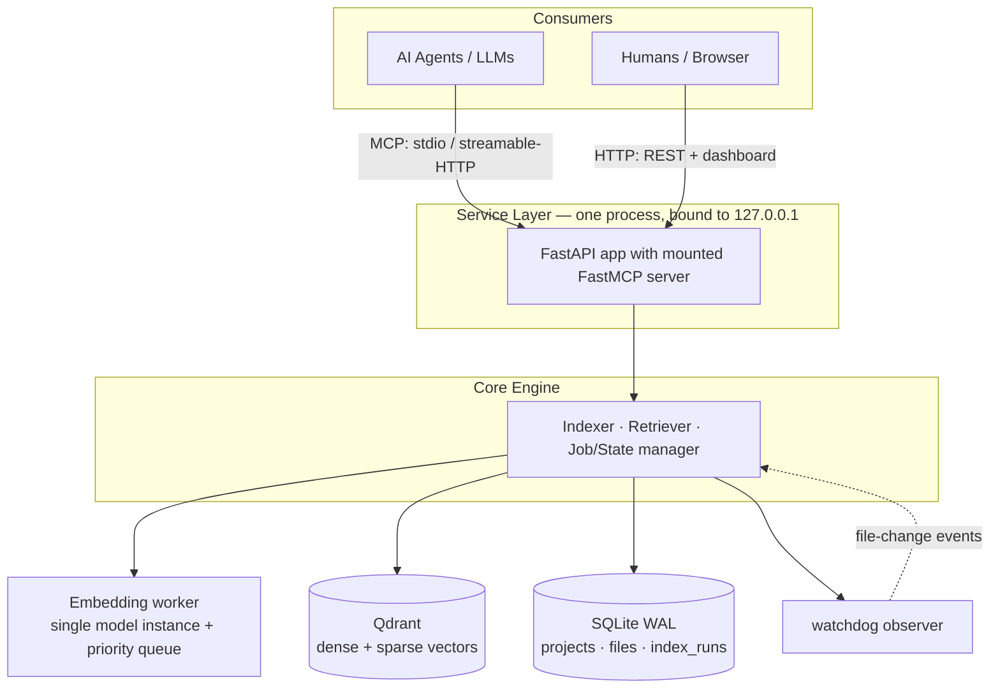
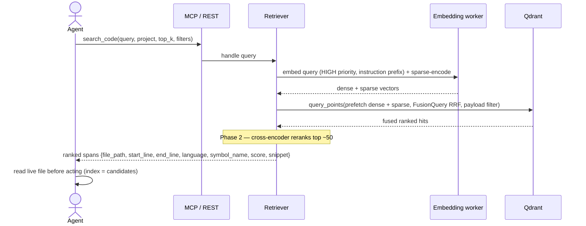
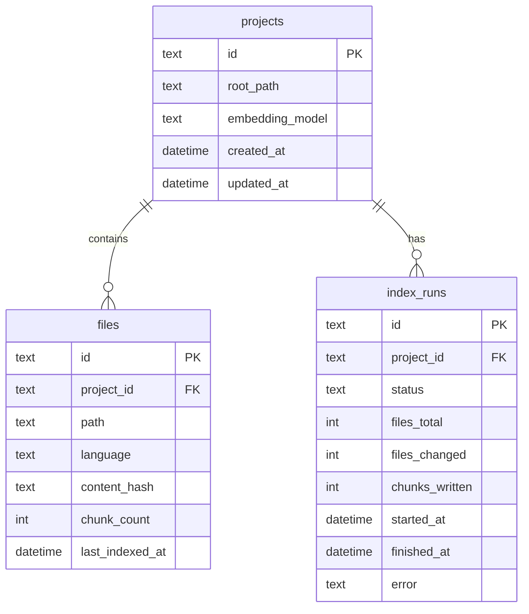

<!-- Generated by Cory — Architecture-Documentation-Polisher | 2026-06-15 -->
 
# Code Indexer — Architecture Overview
 
**Status:** MVP architecture, approved for build
**Scope:** Single-node, localhost-only code search service for AI agents
**Audience:** Developers, engineering managers, architects
 
---
 
## 1. Executive Summary
 
The Code Indexer builds and maintains a searchable index of a codebase so that AI agents and LLMs retrieve the *relevant* code spans for a query in one cheap call, instead of repeatedly scanning the whole repository. It is not a pure vector-database tool. It is a **hybrid retrieval service** that fuses two channels — a lexical/keyword channel (BM25) and a dense/semantic channel (code embeddings) — because each channel fails on the queries the other handles well.
 
Three design commitments carry the architecture. First, retrieval is **hybrid**: pure semantic search collapses on short keyword queries, and pure lexical search misses meaning-based queries, so both run together and their results are fused server-side. Second, the index stays fresh through **incremental, hash-based re-indexing**: only files whose content hash changes are re-chunked and re-embedded, because index staleness is the main reason teams abandon index-first code search. Third, the index is a **candidate generator, not ground truth**: the agent receives precise line ranges and reads the live file before acting, which sidesteps the correctness objections to embedding search.
 
The MVP runs as one process plus one Qdrant container, bound to localhost. It exposes the **Model Context Protocol (MCP)** as the primary agent interface and a small REST API with a server-rendered dashboard as the human monitoring interface. Authentication, network hosting, distributed indexing, and cross-repo navigation are explicit non-goals for this phase. The build proceeds through five milestones (M1–M5), with a measured retrieval-quality gate at M3.
 
---
 
## 2. Context & Drivers
 
### 2.1 Problem statement
 
Given a pointer to a codebase, build and maintain a searchable index so that agents retrieve relevant code spans for a query cheaply and quickly, rather than scanning the repository on every request. The phrase "matching results" hides a fork that determines the whole design, captured below.
 
### 2.2 Query types the MVP must serve
 
| Query type | Example | Best channel | MVP status |
|---|---|---|---|
| Natural-language → code | "where do we validate JWT expiry" | Dense / semantic | In scope |
| Symbol / keyword → code | `parseJwtClaims`, `RateLimiter` | Lexical / BM25 | In scope |
| Structural / shape | "functions that call `db.Exec` without a context arg" | AST / structural | Phase 2 |
 
A single-channel design serves only one row well. The MVP serves the first two; structural search is a deliberate phase-2 addition.
 
### 2.3 Why the obvious design is insufficient
 
The naive design — embed everything, store vectors, query by cosine similarity — fails in four documented ways. The architecture answers each.
 
1. **Staleness.** A vector index is wrong the moment a file is edited until it is re-embedded. *Answer: per-file content hashing plus a file watcher; only changed files are reprocessed.*
2. **Short-query collapse.** Short keyword queries — the most common developer search shape — drive most semantic models to near-zero ranking quality. *Answer: a BM25 channel that excels here, fused with the dense channel.*
3. **Chunking destroys logic.** Fixed-size splitting cuts a function from its signature, so the retrieved chunk misleads. *Answer: AST-aware chunking that keeps functions and classes intact.* The counter-evidence is acknowledged: a 2025 scaling study found line-based chunking competitive once a strong lexical channel exists [7]. The design therefore treats AST chunking as a real but bounded win, not the centerpiece.
4. **"Similar" is not "correct."** Embedding similarity returns code that *looks* like the answer, not code that *is* the answer. *Answer: the index returns candidates; the agent reads the live file before acting.*
### 2.4 Constraints
 
- **Localhost-only.** The MVP runs entirely on the developer's machine and binds to `127.0.0.1`. Network exposure and authentication are deferred until a later phase explicitly adds them.
- **Single node.** One service process and one Qdrant container. No distributed or sharded indexing.
- **Local model hosting.** Embeddings are produced by a local model, so source code never leaves the machine. A hosted embedder may be added later behind the same interface.
- **Maintainer fluency.** The implementation language is Python, matching both the ecosystem and the maintainer's expertise.
### 2.5 Non-goals (out of scope for the MVP)
 
Multi-user auth, distributed indexing, a call-graph or code-graph engine, fine-tuned embedding models, cross-repo navigation, and a polished single-page-application dashboard. Each is a real feature; none is needed to prove the core value.
 
### 2.6 Consumers
 
| Consumer | Interface | Role |
|---|---|---|
| AI agents / LLMs | MCP (stdio and streamable-HTTP) | Primary — issue searches, read spans |
| Humans | REST + server-rendered dashboard | Secondary — monitor index health |
 
---
 
## 3. Solution Overview
 
### 3.1 Architectural style
 
The system is a **hybrid retrieval service** with a single shared **Core Engine** wrapped by two thin adapter layers (MCP and REST). Both adapters call the same core functions, which prevents the two surfaces from drifting. The core contract with any consumer is explicit: results are *candidates* with precise line ranges, and the consumer verifies against the live file before acting.
 
### 3.2 Component diagram
 

 
### 3.3 Indexing data flow
 
```mermaid
sequenceDiagram
    actor Client
    participant API as FastAPI / MCP
    participant Core as Indexer
    participant FS as Filesystem
    participant Emb as Embedding worker
    participant Q as Qdrant
    participant DB as SQLite
    Client->>API: register / reindex project
    API->>Core: start run
    API-->>Client: 202 Accepted + run_id
    Core->>DB: write index_run (status = running)
    Core->>FS: discover files (respect .gitignore; skip binaries, secrets, oversize)
    Core->>Core: SHA-256 diff → new / changed / unchanged / deleted
    Core->>Core: cAST chunk changed files (+ secret redaction pass)
    Core->>Emb: enqueue dense + sparse encode (LOW priority, small batches)
    Emb-->>Core: vectors
    Core->>Q: upsert chunks (deterministic chunk_id)
    Core->>Q: delete stale chunks
    Core->>DB: update file state + finish run (status = done)
    Client->>API: GET status
    API->>DB: read run / file state
    DB-->>Client: progress
```
 
### 3.4 Retrieval data flow
 

 
---
 
## 4. Component Details
 
Every component below is a thin layer of responsibility over the Core Engine. The technology table in §4.10 collects versions and licenses in one place.
 
### 4.1 Core Engine
 
**Responsibility.** Own the indexing pipeline, the retrieval pipeline, and job/state management. Expose plain functions that both adapter layers call.
 
**Rationale.** A single core behind thin adapters keeps MCP and REST behavior identical and concentrates all logic in one testable place.
 
### 4.2 Indexer (discovery, secret handling, change detection)
 
**Responsibility.** Turn a project directory into a fresh set of chunks in Qdrant and a current state record in SQLite.
 
**Pipeline.**
1. **Discover.** Walk the tree; respect `.gitignore`; skip binaries, generated directories (`node_modules`, `dist`, `.git`), files over a size cap, and unsupported languages.
2. **Apply the secret skip-list.** Exclude files that commonly carry credentials (for example `.env`, `.env.*`, `*.pem`, `*.key`, `id_rsa`, `credentials`, `secrets.*`). These files are never chunked, embedded, or stored.
3. **Diff by hash.** Compare each file's current SHA-256 against the stored hash. Partition into new, changed, unchanged, and deleted.
4. **Chunk and redact.** Chunk changed and new files with the cAST chunker (§4.3). Run a **redaction pass** over chunk text to mask high-entropy strings and common secret patterns (API keys, tokens, connection strings) before any chunk is embedded or persisted.
5. **Encode.** Submit chunks to the embedding worker (§4.4) for dense and sparse encoding.
6. **Upsert and prune.** Write chunks to Qdrant with a deterministic `chunk_id`, then delete chunks whose `file_hash` no longer matches and all chunks for deleted files.
7. **Record.** Update SQLite file state and write an `index_runs` row with counts, duration, and per-file errors.
**Rationale for secret handling.** The service embeds code and returns snippets, so any indexed secret becomes retrievable from the vector store. A skip-list keeps secret-bearing files out entirely; the redaction pass is the second line of defense for secrets hardcoded inside otherwise-indexable source. The documented contract is still "do not point the indexer at repositories that you cannot afford to index," but the design no longer relies on that contract alone.
 
**Idempotency.** Because `chunk_id` is content-derived and the file-state table is the source of truth, an interrupted run re-runs safely and reprocesses only what is still out of date.
 
### 4.3 Chunker — cAST, reimplemented
 
**Responsibility.** Split source files into self-contained, size-bounded chunks that respect syntactic boundaries, and attach metadata to each chunk.
 
**Choice.** Implement the cAST "split-then-merge" algorithm directly on `tree-sitter-language-pack` parsers [2][8]. The algorithm recursively splits AST nodes that exceed the size budget, greedily merges small sibling nodes up to that budget, and guarantees that concatenating the chunks reproduces the file.
 
**Rationale, and why not the reference library.** cAST is the project's centerpiece for chunk quality, so the implementation is owned rather than imported. The published `astchunk` reference library is now on PyPI [16], but three factors favor reimplementation: it pulls its own per-language `tree-sitter-*` grammar packages, which collide with the single grammar source (`tree-sitter-language-pack`) used elsewhere; it is research-grade, and at least one downstream project vendors a fork rather than the published package, signalling churn; and the design needs custom metadata extraction (`symbol_name`, `node_type`) that requires touching chunker internals regardless. `astchunk` is retained only as a **test oracle** — chunk the same files with both and compare — not as a runtime dependency.
 
**Chunk sizing.** Target roughly 32–64 lines or 300–800 tokens per chunk, with small overlap, and never split a function below its signature. Attach `{file_path, start_line, end_line, language, node_type, symbol_name, file_hash}` to every chunk.
 
**Language coverage.** Bounded by available tree-sitter grammars. Files in unsupported languages fall back to line-based chunking — degraded, but not broken.
 
### 4.4 Embedding runtime and the concurrency model
 
**Responsibility.** Convert code chunks and queries into vectors using a single in-process model, while serving a background indexer (high throughput) and live search (low latency) from that one model without either starving the other.
 
**Problem.** `sentence-transformers` model inference is a synchronous, compute-bound call. Calling it directly inside an async handler blocks the event loop; running the indexer and live queries against the same model concurrently risks head-of-line blocking, double GPU memory, and unsafe concurrent forward passes.
 
**Design — one model, one dedicated worker, a priority queue.**
- Route **every** `encode()` call through a single dedicated worker thread (`ThreadPoolExecutor(max_workers=1)`), separate from the web framework's default thread pool. Async handlers `await` the result via `run_in_executor`, so the event loop never blocks. A single worker serializes model access, which guarantees thread-safety, one model instance in memory, and no concurrent GPU forward pass.
- Place a **two-tier priority queue** in front of the worker. Query embeds are high priority; index batches are low priority. The worker always serves high priority first.
- **Chop index embedding into small batches** (roughly 32 chunks). The worker re-checks the queue between batches, so a waiting query jumps ahead of the next batch. Worst-case query wait is one batch's encode time — tens of milliseconds — not the duration of a full index run. The query embed itself is one short string and is dwarfed by the Qdrant search that follows.
- **Bound CPU threads** (`torch.set_num_threads`) so the model does not consume every core and starve the event loop and Qdrant client. On CPU, leave one or two cores free; on a single GPU, serialization already arbitrates the shared device.
**Rejected alternative.** A second model instance reserved for queries doubles memory and, on a single GPU, buys nothing because both instances contend for the same compute. It is not worth it at MVP scale.
 
**Backpressure.** Under heavy query load, indexing throughput drops because queries keep preempting. Freshness lags briefly and recovers when queries quiet down. This is acceptable for the MVP.
 
**Default model.** `nomic-ai/CodeRankEmbed` — 137M parameters, **768-dimensional** output, 8192-token context, **MIT** license, roughly 521 MB, CPU-friendly [1]. It is instruction-aware: queries must be prefixed with `Represent this query for searching relevant code:`, while documents and code are embedded with **no** prefix.
 
**Documented upgrade paths (not default).**
- `Qwen/Qwen3-Embedding-0.6B` — Apache-2.0, up to 1024-dim (Matryoshka, user-selectable), 32K context — if multilingual or mixed prose/code queries dominate [14].
- `nomic-ai/nomic-embed-code` — 7B, 3584-dim — only with an H100-class GPU and a need for top-tier recall.
The dense vector dimension is configured from the active model, and `embedding_model` is stored in both the Qdrant payload and the SQLite `projects`/`files` rows so a model change is detectable and forces a full re-embed.
 
### 4.5 Retriever and fusion
 
**Responsibility.** Answer a query by encoding it on both channels, issuing one hybrid Qdrant query, fusing the result lists, and returning ranked spans.
 
**Pipeline.**
1. Dense-embed the query with the instruction prefix; sparse-encode the query terms.
2. Issue one `query_points` call carrying both vectors, with a payload filter for `project_id` and any user filters (language, path prefix, node type).
3. Qdrant fuses the dense and sparse result lists server-side using **Reciprocal Rank Fusion (RRF)** [5][6].
4. *(Phase 2)* A cross-encoder reranks the top ~50 fused results.
5. Return `{file_path, start_line, end_line, language, symbol_name, score, snippet}` for each hit.
**Fusion choice.** Default to **RRF with k = 60**, the value from the original RRF paper and Qdrant's default [6]. RRF scores each result by `1 / (k + rank)` summed across both channels, rewarding results that *both* channels rank reasonably. The alternative, Distribution-Based Score Fusion (DBSF), fuses on normalized scores rather than ranks. The M3 evaluation (§6.2) decides RRF versus DBSF and the value of k on a labeled query set; do not change the default without measured evidence.
 
### 4.6 Lexical / BM25 channel
 
**Responsibility.** Serve exact-symbol and short-keyword queries, where the dense channel is weakest.
 
**Choice and rationale.** Store BM25 sparse vectors alongside the dense vectors in the same Qdrant collection, with server-side Inverse Document Frequency (IDF) enabled, so one hybrid query covers both channels [5]. This channel is **non-negotiable**: it often contributes more to final quality than the choice of embedding model, and it is the only channel that reliably matches identifiers.
 
**Open implementation decision — tokenization.** For the M3 build, start with **Qdrant's native BM25** for simplicity and to get the evaluation running quickly. Then re-evaluate against the symbol/keyword subset of the eval set. Default whitespace tokenization does not split `parseJwtClaims` or `parse_jwt_claims` into subtokens, and exact-identifier matching is this channel's entire purpose. If the symbol subset underperforms, switch to **client-side, code-aware tokenization** that splits camelCase and snake_case identifiers and indexes both the full identifier and its parts. This is the first tuning lever, tied directly to the M3 gate.
 
### 4.7 Vector store — Qdrant
 
**Responsibility.** Store dense and sparse vectors with payload metadata, serve hybrid queries with server-side fusion and payload filtering, and handle concurrent reads while the indexer writes.
 
**Choice and rationale.** Qdrant provides native hybrid search — dense and sparse vectors in one collection with server-side RRF — which is exactly the two-channel retrieval this design needs, without hand-rolled fusion. It offers rich payload filtering (`project_id`, `language`, path prefix), strong concurrent-client handling, and runs as a single local Docker container. Because the product already runs a service, "it needs a server process" is not a real cost here.
 
**Alternatives considered.** *LanceDB* — embedded, zero separate process — is the right call for a strictly single-process desktop build that can serialize writes, but its multi-process concurrency limits clash with the indexer-plus-multiple-agents access pattern. *ChromaDB* has the simplest API but the weakest hybrid/filtering story and the lowest scaling ceiling. *pgvector* is reasonable if a relational store is wanted anyway, but it adds a Postgres dependency and a more manual hybrid path.
 
### 4.8 State store — SQLite (WAL)
 
**Responsibility.** Hold the relational source of truth: projects, per-file state, and index-run/job status. The dashboard reads from it.
 
**Choice and rationale.** SQLite is zero-config, single-file, transactional, and ships with Python. **Write-Ahead Logging (WAL)** allows unlimited concurrent readers plus a single writer, which fits a read-mostly dashboard alongside one indexing writer [9]. Use the standard-library `sqlite3` module behind a thin data-access layer; for this small fixed schema, an ORM adds dependency weight with little payoff. Set `journal_mode=WAL`, `synchronous=NORMAL`, and `busy_timeout=5000`, and run `wal_checkpoint(TRUNCATE)` after large index runs to bound WAL growth.
 
**Limit to remember.** WAL serializes writers and is unusable on network filesystems. The single-writer constraint becomes a bottleneck only if multiple writer processes appear — at which point a different store or a queue is warranted.
 
### 4.9 Service layer — MCP, REST, dashboard, and the file watcher
 
**MCP server (primary).** Implemented with the **standalone FastMCP 3.x** framework [4]. Mount the MCP ASGI app into FastAPI and **share its lifespan**, which is required so the streamable-HTTP session manager initializes; forgetting this produces a `RuntimeError: Task group is not initialized`. Expose **stdio** for locally spawned single agents and **streamable-HTTP** at `/mcp` for the always-on multi-agent service. (Server-Sent Events, the legacy MCP transport, is intentionally not used.)
 
MCP tools, each a thin wrapper over the core:
 
| Tool | Purpose |
|---|---|
| `search_code(query, project?, top_k?, filters?)` | Hybrid retrieval; returns ranked spans |
| `list_projects()` | Indexed projects with file/chunk counts and last-index time |
| `get_index_status(project)` | Run status, progress, errors |
| `get_chunk(chunk_id)` | Fetch an exact span |
| `reindex(project)` | Trigger a re-index (mutating action) |
 
**REST API (secondary).** `POST /projects`, `GET /projects`, `GET /projects/{id}/status`, `POST /projects/{id}/reindex`, `POST /search` (mirrors `search_code` for the dashboard test box), `GET /` (dashboard), `GET /healthz`.
 
**Dashboard.** Server-rendered with Jinja2. It is a monitoring surface — indexed projects, per-project file and chunk counts, last-index time, run status and progress, and failed files — so it needs no single-page-application build tooling.
 
**File watcher.** A `watchdog` observer raises filesystem events on watched projects; an edit triggers re-index of only the changed file within seconds [10].
 
**Background work.** Indexing is the only long-running job. A long-lived `asyncio` task and queue, started in the application lifespan, runs it; status is persisted to SQLite. Indexing endpoints return `202 Accepted` plus a run id, and clients poll `GET /projects/{id}/status` or the `get_index_status` tool. This keeps deployment to one process plus one container and avoids a task broker such as Celery.
 
### 4.10 Technology stack
 
| Layer | Choice | Version (mid-2026) | License | Rationale |
|---|---|---|---|---|
| Language / runtime | Python | 3.11+ (target 3.12/3.13) | PSF | Code-RAG ecosystem is Python-first; maintainer fluency |
| Package / project manager | uv | 0.11.x | MIT/Apache | Fast installs; pins interpreter and transitive deps [13] |
| Web framework | FastAPI + Uvicorn | 0.136.x / 0.49.x | MIT / BSD-3 | Async, OpenAPI, Pydantic, static serving [12] |
| Agent protocol | FastMCP (standalone) | 3.x | Apache-2.0 | Richer transports/auth; MCP is the 2026 agent standard [4] |
| MCP SDK (if used directly) | `mcp` | resolved by FastMCP | MIT | See §8 pinning note [3] |
| Parser | tree-sitter + tree-sitter-language-pack | 0.25.x / 1.8.x | MIT | One grammar source for 300+ languages [8] |
| Embedding runtime | sentence-transformers | 5.x | Apache-2.0 | Broad model support; easy model swap [11] |
| Default embedder | nomic-ai/CodeRankEmbed | 137M, 768-dim | **MIT** | Code-specialized, small, CPU-friendly [1] |
| Vector DB | Qdrant (Docker) + qdrant-client | server 1.15.x / client 1.18.x | Apache-2.0 | Native hybrid + RRF + filtering + concurrency [5] |
| State store | SQLite (`sqlite3`, WAL) | stdlib | Public domain | Zero-config relational truth [9] |
| File watcher | watchdog | 6.0.x | Apache-2.0 | Cross-platform filesystem events [10] |
| Reranker (Phase 2) | BAAI/bge-reranker-v2-m3 | ~568M | Apache-2.0 (per HF card) | Precision lever after fusion [15] |
 
> Versions in this space move quickly. Re-pin from the registry at build time and lock the resolved set in `uv.lock`.
 
---
 
## 5. Data Model
 
### 5.1 Entity-relationship overview
 

 
### 5.2 SQLite schema
 
- **`projects`** — `id`, `root_path`, `embedding_model`, `created_at`, `updated_at`.
- **`files`** — `id`, `project_id`, `path`, `language`, `content_hash`, `chunk_count`, `last_indexed_at`.
- **`index_runs`** — `id`, `project_id`, `status` ∈ {queued, running, done, failed}, `files_total`, `files_changed`, `chunks_written`, `started_at`, `finished_at`, `error`.
### 5.3 Qdrant point schema
 
- **`id`** — deterministic, content-derived `chunk_id` so re-runs upsert idempotently.
- **`vectors`** — `{ dense: float[768], bm25: sparse }`.
- **`payload`** — `{ project_id, file_path, start_line, end_line, language, node_type, symbol_name, file_hash, embedding_model }`.
### 5.4 Collection strategy
 
Use a **single shared collection** with a `project_id` payload filter at query time. It is simplest and supports cross-project search. Switch to a collection-per-project only for hard isolation or per-project lifecycle (dropping a project becomes dropping a collection). Document the choice; do not mix the two silently.
 
### 5.5 Versioning strategy
 
The embedding model defines the vector space, so changing it invalidates the entire index. `embedding_model` is recorded on every project and every Qdrant point; a model change forces a **full re-embed**, and the system refuses to serve mixed-model results. The SQLite schema is small and fixed, so the MVP uses no migration framework; revisit only if the schema grows. The Qdrant collection has no in-place schema migration beyond re-embedding.
 
---
 
## 6. Cross-Cutting Concerns
 
### 6.1 Security and trust boundary
 
The MVP is **localhost-only**. The service binds to `127.0.0.1`, never `0.0.0.0`, so the MCP and REST surfaces — including the mutating `reindex` tool — are not reachable from other machines. Authentication is intentionally absent because there is no network trust boundary to defend. Two protections still apply to indexed content: the **secret skip-list** keeps credential-bearing files out of the index entirely, and the **redaction pass** masks secrets hardcoded inside otherwise-indexable source (§4.2). When a later phase adds network hosting, FastMCP's built-in OAuth and auth-provider machinery is the on-ramp, and per-tool authorization can gate mutating tools such as `reindex`.
 
### 6.2 Retrieval quality and evaluation
 
Most claims in this design are empirical — hybrid beats single-channel, cAST helps, RRF beats the alternatives on this corpus — so they are validated rather than assumed. The M3 milestone owns this.
 
- **Golden set.** Build 30–50 hand-labeled queries on the target repository, each labeled with the correct file and line range(s). Mix the three query types from §2.2: natural-language→code, symbol/keyword, and a few structural queries (to confirm they fail gracefully and are honestly phase-2).
- **Primary metric — Recall@10.** It measures the actual contract: did the correct span appear among the candidates the agent will verify? Recall@5 and NDCG@10 are secondary; NDCG matters more once the reranker lands.
- **Relative gate, not an absolute target.** Measure M2 (dense-only) as the baseline, then require M3 (hybrid) to beat it on Recall@10 — **especially on the symbol/keyword subset**, which is the entire reason the lexical channel exists. If hybrid does not win there, the BM25 channel is misconfigured (see the tokenization decision in §4.6).
- **Harness.** A small script (~100 lines) runs the query set, compares returned line ranges to the golden labels, and reports the metrics. Run it at M2, at M3, and on any change to chunking, fusion, or model. The RRF-vs-DBSF comparison and the k sweep live inside it.
- **Caveat.** A 30–50 query labeled set is a few hours of real work and is exactly the step teams skip, but without it the design's quality claims are unfalsifiable on this codebase. At that sample size, ignore sub-point differences — they are noise.
### 6.3 Freshness and correctness
 
- **Freshness.** Hash-diff incremental indexing plus `watchdog` events. An edit on a watched project re-indexes only that file within seconds.
- **Correctness guardrail.** The contract is "these are candidates; read the file before trusting the content." Precise line ranges make verification cheap. This is what makes approximate retrieval safe.
- **Model-version safety.** Every chunk records `embedding_model`; changing the model forces a full re-index and the system never serves mixed-model results.
### 6.4 Concurrency and performance
 
The single-worker, priority-queue embedding model (§4.4) is the load-bearing concurrency decision: it keeps the event loop unblocked, bounds live-query latency to one index batch, and avoids double model memory and unsafe concurrent forward passes. Qdrant handles concurrent reads during writes natively; SQLite WAL handles concurrent dashboard reads during an indexing write.
 
### 6.5 Observability
 
The dashboard exposes last-index time per file, failed files, and run history, so a human can see when the index is behind reality. `GET /healthz` provides a liveness check. Index runs are fully recorded in `index_runs` with counts, durations, and per-file errors.
 
### 6.6 Scalability ceilings
 
| Trigger | Consequence | Response |
|---|---|---|
| Corpus exceeds one Qdrant node's RAM | Memory pressure | On-disk sparse/HNSW, quantization, or collection-per-project |
| Multiple writer processes appear | SQLite single-writer bottleneck | Move to a server DB or a write queue |
| Cross-repo search at scale | Shared-collection filter strains | Revisit shared collection vs dedicated collections |
| Very large monorepos (tens of millions of chunks) | Index/query latency | Tune HNSW and quantization; document the ceiling |
 
---
 
## 7. Deployment & Operations
 
### 7.1 Project layout
 
A uv packaged `src/` layout, which forces imports to resolve against the installed package rather than the working directory.
 
```
code-index/
├── pyproject.toml          # [project], [project.scripts], [build-system] = uv_build
├── uv.lock                 # pinned, resolved dependency set
├── .python-version         # pinned interpreter, auto-downloaded on first run
├── docker-compose.yml      # qdrant/qdrant: ports 6333/6334 + named volume
├── src/code_index/
│   ├── core/               # indexer, retriever, chunker (cAST), embedder, state (sqlite), watcher
│   ├── api/                # FastAPI routers, deps, templates/ (Jinja2), static/
│   ├── mcp/                # FastMCP server + tool definitions (thin wrappers over core)
│   └── app.py              # builds FastAPI, mounts MCP, starts the asyncio worker in lifespan
└── tests/
```
 
### 7.2 Environment
 
One service process and one Qdrant container. Qdrant runs from `docker-compose.yml` with a named volume for persistence and exposes 6333 (REST) and 6334 (gRPC). The service starts with `uv run uvicorn code_index.app:app --host 127.0.0.1 --port 8000`.
 
### 7.3 Backup and recovery
 
Two pieces of durable state: the Qdrant volume and the SQLite file. For the MVP, back both up together with a filesystem copy when the service is idle. There is no automated rollback; because indexing is idempotent and re-runnable from source, recovery is "restore the SQLite file and re-index if needed."
 
---
 
## 8. Risks & Mitigations
 
| # | Risk | Severity | Mitigation |
|---|---|---|---|
| 1 | **MCP SDK v2** (stable 2026-07-27) ships breaking transport/auth changes [3] | High | Let FastMCP drive the compatible `mcp` range; lock it; schedule a dependency-refresh pass after 2026-07-27 |
| 2 | **FastMCP 3.x churn** — 3.0 removed APIs and changed task scoping mid-3.x | Medium | Pin FastMCP hard in `uv.lock`; do not float; test transports after upgrades |
| 3 | Cross-file reasoning is weak (chunks do not follow call graphs) | Medium | Honest limitation; Phase 2 adds structural/`ast-grep` search |
| 4 | Embedding recall has a representational ceiling for any fixed dimension | Medium | Lexical channel and agent verification are the hedge, not bigger vectors |
| 5 | First full index of a large repo is slow | Low | One-time cost; communicate progress via the dashboard |
| 6 | BM25 tokenization may miss identifier subtokens | Medium | Measured at M3; switch to code-aware tokenization if the symbol subset underperforms (§4.6) |
| 7 | Language coverage bounded by tree-sitter grammars | Low | Unsupported files fall back to line-based chunking |
| 8 | Secret leakage into the index | Medium | Skip-list excludes credential files; redaction pass masks inline secrets (§4.2) |
 
> **Pinning note for Risks 1–2.** Do not independently pin `mcp>=1.27,<2`. FastMCP 3.x controls its own compatible `mcp` range, and an independent constraint risks an unresolvable lock. Install FastMCP, let it resolve `mcp`, and add a direct `mcp` constraint only if the low-level SDK is imported directly — reconciled with FastMCP's range.
 
---
 
## 9. Build Sequence & Roadmap
 
| Milestone | Deliverable | Proves |
|---|---|---|
| **M1 — Spine** | Project registration, discovery + `.gitignore`/binary/secret filtering, SHA-256 diff, SQLite state. No embeddings. | Incremental change detection works |
| **M2 — Dense search** | cAST chunk → CodeRankEmbed → Qdrant dense-only search. | Natural-language→code returns sane spans |
| **M3 — Hybrid** | Add BM25 sparse channel + RRF fusion. Run the §6.2 evaluation. | Hybrid beats dense-only on the symbol subset |
| **M4 — MCP** | Expose retriever as MCP tools; connect a real agent. | An agent calls `search_code` and reads files |
| **M5 — Dashboard + watcher** | Monitoring page + `watchdog` auto-reindex. | Humans can see index health; freshness is automatic |
| **Phase 2** | Reranker, structural/`ast-grep` search, git-aware diffing, hosted-embedder pluggability, multi-repo. | Post-MVP precision and reach |
 
---
 
## 10. Decision Log (ADR Summary)
 
| # | Decision | Chosen | Key reason | Main alternative (why not) |
|---|---|---|---|---|
| 1 | Overall shape | Hybrid retrieval service | Pure semantic collapses on keywords; pure lexical misses NL | Vector-only (fails short-query case) |
| 2 | Agent interface | MCP (primary), standalone FastMCP 3.x | Agents consume retrieval over MCP in 2026 | REST-only (bespoke per-agent glue) |
| 3 | Transport | stdio + streamable-HTTP | Current MCP transports | SSE (legacy, being retired) |
| 4 | Language | Python 3.11+ | Ecosystem + maintainer fluency | Rust (slow to MVP); Node (weak local embeddings) |
| 5 | Web framework | FastAPI + Uvicorn | Async + OpenAPI + Pydantic | Flask (sync); Django (heavy) |
| 6 | Chunking | cAST, reimplemented on tree-sitter-language-pack | Owns the centerpiece; one grammar source | `astchunk` (grammar conflict, research-grade); line splitter (breaks logic) |
| 7 | Embedding model | CodeRankEmbed 137M (local), **MIT**, 768-dim | Code-specialized, small, CPU-friendly | Nomic 7B (needs H100); hosted (violates local constraint) |
| 8 | Vector DB | Qdrant | Native dense+sparse hybrid + RRF + filtering | LanceDB (concurrency limits); Chroma (weak hybrid); pgvector (extra dep) |
| 9 | Lexical channel | BM25 sparse in Qdrant | Saves short-query/exact-symbol cases | Skipping it (quality loss) |
| 10 | Fusion | RRF (k=60) default | Rewards cross-channel consensus; paper/Qdrant default | DBSF (only if it measurably wins at M3) |
| 11 | Embedding concurrency | Single model, single worker, priority queue | Unblocks loop; bounds query latency; one model in memory | Direct in-handler call (blocks); two instances (no GPU gain) |
| 12 | Reranker | Cross-encoder, Phase 2 | Precision lever after fusion | None (acceptable for MVP) |
| 13 | Freshness | Hash-diff + watchdog | Re-embed only changed files | Full re-index on timer (wasteful) |
| 14 | State store | SQLite (WAL) | Zero-config relational truth | Qdrant-payload-only (no relational queries) |
| 15 | Background work | In-process asyncio worker | One workload, single node | Celery (broker overhead) |
| 16 | Dashboard | Jinja2 / server-rendered | Monitoring is read-mostly | React SPA (build overhead) |
| 17 | Trust boundary | Localhost-only, bind 127.0.0.1, no auth | No network boundary to defend in MVP | Networked + auth (deferred to a later phase) |
| 18 | Secret handling | Skip-list + redaction pass | Prevent secrets entering the vector store | Contract-only ("don't index secrets") |
 
---
 
## Appendix A — Glossary & Abbreviations
 
### Milestones
 
- **M1–M5** — the phased build sequence (§9). M1 spine, M2 dense search, M3 hybrid + evaluation, M4 MCP, M5 dashboard + watcher.
- **Phase 2** — post-MVP work: reranker, structural search, git-aware diffing, multi-repo.
### Retrieval concepts
 
- **Dense / semantic / embedding** — a neural model turns code or a query into a list of numbers (a *vector*) that captures meaning; similar meaning yields nearby vectors. "Dense" means every value is filled in. Wins on meaning-based queries.
- **BM25 / lexical / sparse** — classic keyword ranking ("Best Match 25"): scores by query-term frequency, down-weighting common terms. "Sparse" means one slot per vocabulary word, mostly zeros. Wins on exact symbol lookups.
- **Hybrid retrieval** — running the dense and lexical channels together and merging their results, because each fails where the other succeeds.
- **RRF (Reciprocal Rank Fusion)** — merges two ranked lists by scoring each result `1 / (k + rank)` summed across both; rewards results both channels rank well. Default `k = 60`.
- **DBSF (Distribution-Based Score Fusion)** — alternative fusion using normalized scores instead of ranks.
- **IDF (Inverse Document Frequency)** — the "rare terms matter more" weighting inside BM25, computed server-side by Qdrant.
- **ANN / HNSW** — Approximate Nearest Neighbor is fast, slightly lossy vector search; HNSW (Hierarchical Navigable Small World) is the graph index Qdrant uses for it.
- **top_k** — return the best *k* results.
### Models
 
- **CodeRankEmbed** — the default embedder: 137M parameters, code-specialized, MIT, 768-dim output, CPU-friendly. Requires a query-only instruction prefix.
- **Embedding dimension** — the length of the output vector (768 for CodeRankEmbed). Different models differ (768 / 1024 / 3584), so it is configurable.
- **Reranker / cross-encoder** — a Phase 2 model that reads query and code *together* to reorder the top candidates for precision; slower but sharper than the embedder (a *bi-encoder*, which encodes them separately).
- **Matryoshka / MRL** — an embedding trained so its vector can be truncated to fewer dimensions and still work (relevant only to the Qwen3 upgrade path).
### Parsing and chunking
 
- **AST (Abstract Syntax Tree)** — the structured tree a parser builds from source code (functions, classes, blocks as nodes), letting the chunker split along real boundaries.
- **cAST** — the "split-then-merge" chunking algorithm this project reimplements: recursively split oversized nodes, merge small siblings up to a size budget, and reproduce the file on concatenation.
- **tree-sitter** — the parser library that produces the AST; `node_type` and `symbol_name` are metadata pulled from each node.
### Infrastructure
 
- **MCP (Model Context Protocol)** — the 2026 standard for exposing tools to AI agents; the system's primary interface.
- **FastMCP** — the Python framework implementing MCP servers (standalone 3.x is used here).
- **SDK** — Software Development Kit; here, the official `mcp` Python library.
- **stdio / streamable-HTTP / SSE** — MCP transports: stdio for a locally spawned process, streamable-HTTP for the always-on service, SSE the legacy option being dropped.
- **FastAPI / Uvicorn / ASGI** — the web framework, its server, and the Asynchronous Server Gateway Interface they speak.
- **lifespan** — the ASGI startup/shutdown hook; it must be shared between FastAPI and the mounted MCP app.
- **uv** — a fast Python package and project manager.
- **Qdrant** — the vector database, run as a local Docker container.
- **SQLite / WAL** — the single-file relational store; Write-Ahead Logging lets readers and one writer work concurrently.
- **watchdog** — a filesystem-event library used for auto-reindex.
- **asyncio** — Python's built-in asynchronous concurrency framework (the in-process worker).
- **Jinja2** — server-side HTML templating for the dashboard.
- **REST** — the conventional HTTP API style; the system's secondary, human-facing interface.
### Evaluation metrics
 
- **Recall@k** — did the correct span appear in the top *k* results? The headline metric (Recall@10).
- **NDCG@10** — ranking quality discounted by position; rewards putting the right answer higher.
- **MRR** — Mean Reciprocal Rank: how high the first correct hit lands, averaged over queries.
- **Pass@1** — does the single top generation work? (From cited benchmarks, not this project's eval.)
### Other abbreviations
 
- **RAG** — Retrieval-Augmented Generation: fetch relevant context, feed it to an LLM.
- **ADR** — Architecture Decision Record (§10).
- **MVP** — Minimum Viable Product.
- **SHA-256** — the hash that detects file changes.
- **GIL** — Python's Global Interpreter Lock; the reason model inference is isolated to one dedicated worker thread.
- **202 Accepted** — the HTTP status for "request accepted, processing in the background."
- **CPU / GPU / VRAM** — processor, graphics processor, and graphics memory; relevant to model footprint.
---
 
## Appendix B — References
 
1. CodeRankEmbed model card (license: MIT; 768-dim; query prefix) — https://huggingface.co/nomic-ai/CodeRankEmbed
2. cAST: Enhancing Code RAG with Structural Chunking via AST (Zhang et al., 2025) — https://arxiv.org/abs/2506.15655
3. MCP Python SDK (v2 timeline; pinning guidance) — https://github.com/modelcontextprotocol/python-sdk
4. FastMCP documentation (transports, HTTP deployment, lifespan) — https://gofastmcp.com/deployment/http
5. Qdrant hybrid queries documentation — https://qdrant.tech/documentation/search/hybrid-queries/
6. Cormack, Clarke & Büttcher, "Reciprocal Rank Fusion…", SIGIR 2009 — https://www.researchgate.net/publication/221301121
7. Practical Code RAG at Scale (line-vs-AST chunking, BM25 trade-offs) — https://arxiv.org/abs/2510.20609
8. tree-sitter-language-pack — https://github.com/kreuzberg-dev/tree-sitter-language-pack
9. SQLite Write-Ahead Logging — https://sqlite.org/wal.html
10. watchdog — https://pypi.org/project/watchdog/
11. sentence-transformers — https://sbert.net/
12. FastAPI — https://fastapi.tiangolo.com/
13. uv — https://docs.astral.sh/uv/
14. Qwen3-Embedding-0.6B (upgrade path) — https://huggingface.co/Qwen/Qwen3-Embedding-0.6B
15. BAAI/bge-reranker-v2-m3 (Phase 2 reranker) — https://huggingface.co/BAAI/bge-reranker-v2-m3
16. astchunk reference implementation (test oracle only) — https://github.com/yilinjz/astchunk
*Accessed 2026-06-15. Model versions, database releases, and benchmark standings in this space move quickly; re-verify version-sensitive specifics against current sources before committing code.*
 
