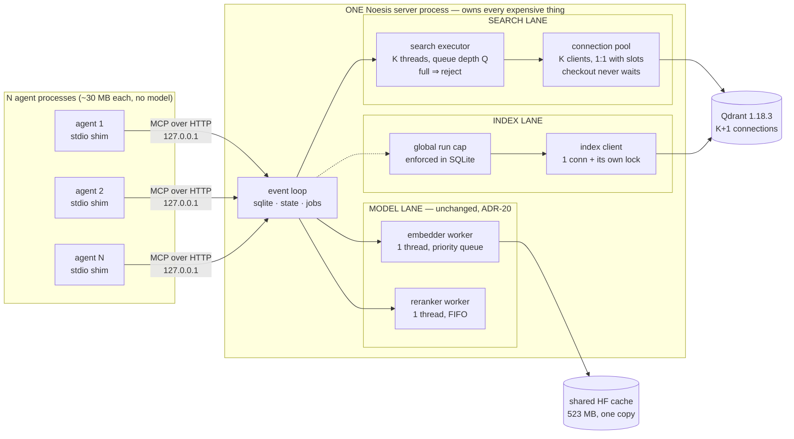
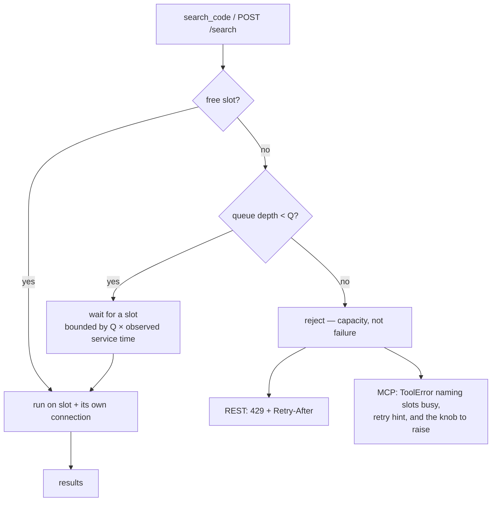
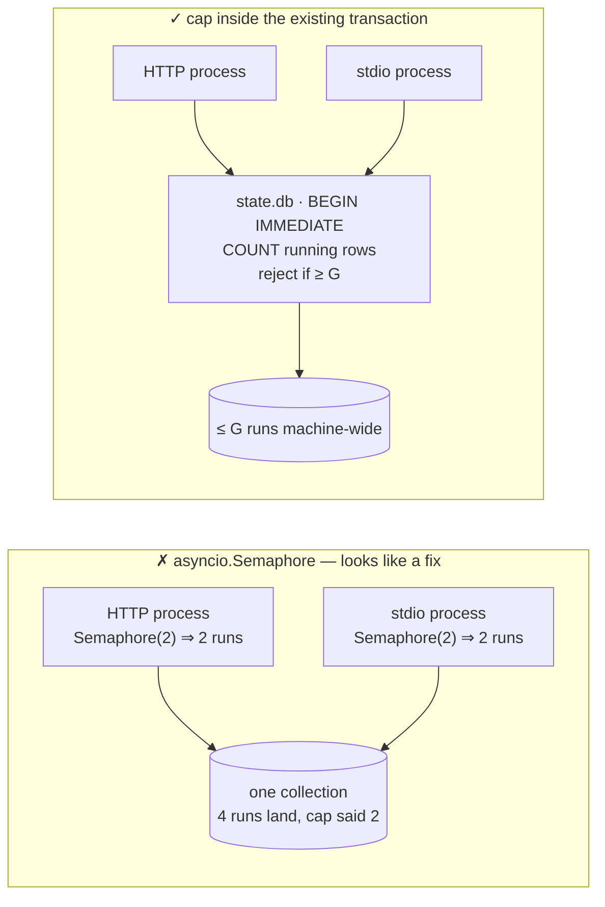

# Noesis concurrency model — close the reader race, bound the system, share one server

Companion architecture doc (diagrams + full evidence):
https://claude.ai/code/artifact/3d9fa8f7-e1fe-444f-9e0a-4ff4ffa4f73f

## Context

PR #50 fixed issue #48's query-vs-index race by giving `upsert_chunks` its own
`QdrantClient`. Review round 6 found the other half was never closed: `search()`
stays on the shared `client`, so two concurrent `search_code` calls corrupt each
other with **no indexing in flight at all**. ADR row 76 justifies that gap with a
measurement — "reader-only concurrency … never failed" — that does not reproduce.

Reproduced here against live Qdrant 1.18.3 at PR head `7f00a93`, through
`VectorStore.search`, with a correctness oracle (each thread owns a token matching
exactly one chunk):

- 16 readers / 0 writers: **5/5 attempts failed**. Against the real server, **up to
  15,864 of 16,000 queries returned another query's document**, with only 4–7
  exceptions — the damage is almost entirely silent.
- **The corruption latches.** `ModelEmbedder._drain_accumulator` recomputes only
  when `_embed_storage[model]` is empty, else `pop(0)`s. One race leaving a residue
  offsets the FIFO permanently. Measured: in latched trials every query after the
  first miss was wrong (rate 1.00), and 16/16 *quiet, single-threaded* queries after
  all load stopped were still wrong. Latched trials ended with FIFO residue 1, clean
  trials with 0. ~2 of 11 trials latched.
- Controls proving the oracle is not vacuous: 1 thread × 3,000 → 0 wrong;
  16 threads + a mutex × 48,000 queries → 0 wrong, 0 errors.

Two escape routes tested and closed:

- **gRPC/protobuf does not help.** Paired alternating trials in one session: REST
  latched 1/6, gRPC latched 1/6 (6,136/6,400 wrong on the latched gRPC trial).
  Instrumented: 1 accumulate + 1 drain per sparse query on *either* transport. The
  corruption is above the wire.
- **Upstream has not fixed it.** qdrant-client 1.19.0 (newest, one minor past our
  pin): no `threading` import, no `Lock`, same dict, same `pop(0)`, same
  drain-only-if-empty rule.

Outcome intended: every queue into an expensive resource carries a number; the
corruption becomes unreachable rather than locked against; and many agents on one
machine costs one model, not N.

## Decisions already locked (do not re-open)

| Decision | Choice |
|---|---|
| Execution | One coherent PR. No worktree fan-out — the change does not decompose into independently-mergeable units. |
| Branch | `claude/noesis-issue-47-48-fix` (PR #50's branch) — permission granted. |
| Scope | Correctness floor + bounded search executor/backpressure + global index-run cap + CI guardrail. |
| Docs | Full concurrency rewrite across the doc set. |
| Shim | **Ships in this PR** (revised from "follow-up"). |
| K and Q | **Derived**, with config override for bigger machines. |
| Overload response | **Rate-limit shaped**; MCP gets an agent-readable error. |
| Artifact | Saved into the repo for future reference. |

## Target architecture



Three lanes, three bounds, each matched to what the resource is: searches are
I/O-bound so K run at once; indexing is long and write-heavy so it gets its own
connection and a machine-wide cap; models are compute-bound so one thread owns
each, exactly as ADR-20 already has it.

## Work items

### 0. Save the architecture doc into the repo
`architecture-docs/concurrency-architecture.html` — the published artifact, as-is.
Deliberately **not** under `docs/`: `docs.yml` runs `mkdocs build --strict` over
`docs/` only, and an unreferenced page there risks failing the build.
`architecture-docs/` is already the home for long-form design docs outside mkdocs.

### 1. Search lane — bounded pool + per-client lock
`core/vectorstore.py`, `runtime.py`, `core/config.py`

- `VectorStore` receives a set of query connections built by `runtime.py` (the only
  module that knows how to construct a client) and checks one out per sparse/hybrid
  search from a `queue.Queue`. Dense-only search skips the pool — **verified**: a
  dense query makes 0 accumulate / 0 drain calls; sparse and hybrid make 1 each.
- The lock remains as the correctness **floor**, because the `:memory:`
  configuration used by ~25 existing tests cannot have a second connection (a second
  local client is a *different database*). **Key it to the client object, not the
  role**: when `index_client is client`, the query guard and the write guard must be
  the same mutex — otherwise search and upsert hold two different locks over one
  `ModelEmbedder`, which is issue #48's original race, still open in that
  configuration today.
- `close()` closes every owned connection with per-connection isolation, matching
  `close_runtime_context`'s existing pattern.

### 2. Bounded search executor + rate-limit-shaped rejection
`core/retriever.py`, `api/routes.py`, `mcp/server.py`, `runtime.py`, `core/config.py`

Store calls move off CPython's default executor (`min(32, cpu+4)`, today shared with
the indexer's ~15 `to_thread` sites, git subprocesses, hashing and file reads) onto a
dedicated executor sized to K, so a slot and a connection are 1:1.



- **REST: 429 + `Retry-After`.** Your instinct was right, and for a reason worth
  stating: 503 is also what a dead or unreachable server returns, so an agent cannot
  tell "Noesis is busy" from "Noesis is down" — connection-refused and `/healthz`
  already cover the latter. 429 says unambiguously *retry, you were throttled*.
  (Strict RFC reading favours 503 for capacity; the disambiguation is worth more here,
  and it is a one-line change if you disagree.)
- **MCP: `raise ToolError(...)`** — the file's existing convention
  (`mcp/server.py:60,63,123,148`), which FastMCP surfaces as an `isError` result the
  agent reads. Message names the condition, the retry delay and the remedy, e.g.
  *"Noesis is at capacity: 4/4 search slots busy, 16 queued. Retry in ~200 ms. To
  allow more concurrent searches, raise `[qdrant] query_connections`."*

### 3. Global cap on concurrent index runs
`core/state.py` (`try_start_run`), `core/jobs.py`, `core/config.py`

`try_start_run` already guarantees one run per project **across processes** via
`BEGIN IMMEDIATE` + owner-liveness probe. It has no total cap, so N projects with
`auto_reindex` start N runs against one embedder worker and one index connection.



An in-process semaphore bounds one process while the other proceeds unaware — the
documented deployment runs HTTP + stdio against one DB. The cap is one extra `COUNT`
inside a transaction already being taken, returning the existing
`already_running`-shaped status so the watcher's re-arm path
(`watcher.py:503-513`) and the REST/MCP callers need no change.

### 4. The stdio shim and its election — researched and verified
New: `src/noesis/mcp/shim.py` (or `__main__.py --shim`), `runtime.py`, docs

Two findings make this small rather than a protocol project:

- **`fastmcp 3.4.2` has `FastMCP.as_proxy()`** — the shim is a thin stdio↔HTTP proxy,
  not a reimplementation.
- **`filelock 3.29.5` is already installed transitively** (via `huggingface_hub`), so
  using it directly needs a decision row but adds zero supply-chain surface — the
  same promotion story as ADR-78 did for `huggingface_hub`.

```mermaid
sequenceDiagram
  participant S as shim (one of N)
  participant F as endpoint.json
  participant K as FileLock (advisory)
  participant V as Noesis server
  S->>F: read endpoint, probe /healthz
  alt server alive
    F-->>S: port
    Note over S: FAST PATH — no lock taken
  else no server
    S->>K: acquire (blocks; OS-released on death)
    S->>F: re-check under lock (double-checked locking)
    alt another shim started it while we waited
      Note over S: reuse — this is what 9 of 10 shims do
    else we are elected
      S->>V: spawn detached
      S->>V: poll /healthz, exponential backoff to deadline
      S->>F: publish endpoint.json
    end
    S->>K: release
  end
  Note over V: port bind is the ultimate arbiter —<br/>a second server gets EADDRINUSE and exits
```

**Verified on this machine, five properties, not asserted:**

| Property | Test | Result |
|---|---|---|
| No thundering herd | 10 shims start at once, cold, server takes 6 s to be ready | **1 server**, 9 reused, all done in ~6.2 s |
| Warm path is lock-free | 10 shims, server already up | 6 fast-path (no lock at all), 1 server total |
| Bind is the real arbiter | second `bind()+listen()` on the same port, `SO_REUSEADDR` set | **refused**, `errno=98 Address already in use` |
| Stale endpoint file | `endpoint.json` left behind pointing at a dead port | not fooled, re-elected, 1 server |
| Crash safety | lock holder `SIGKILL`ed, no cleanup possible | lock file remains but OS released it; next starter won in 1.32 s, no wedge |

Advisory `flock` is chosen over the alternatives for one property: **the OS releases
it when the process dies**, so there is no stale-lock wedge. A PID file needs a
liveness probe (which is exactly why `try_start_run` carries `_owner_alive`), and a
SQLite row has the same problem. systemd socket activation is the textbook answer on
Linux but needs install privileges and does not port to macOS/Windows.

### 5. Derived K and Q, with an override
`core/config.py`, `docs/reference/configuration.md`, `README.md`

`K = clamp(cpu_count, 2, 8)`; `Q = 4 × K`. Measured sweep, 16 concurrent searches,
5,000 points, hybrid, prefetch 50, on this 4-CPU box:

| K | conns | q/s | p50 | p95 | p99 |
|---|---|---|---|---|---|
| 1 | 2 | 258 | 3.8 ms | 4.7 ms | 9.0 ms |
| 2 | 3 | 353 | 5.6 ms | 8.1 ms | 9.5 ms |
| **4** | **5** | **384** | **10.0 ms** | **16.0 ms** | **20.4 ms** |
| 6 | 7 | 375 | 14.2 ms | 23.7 ms | 30.5 ms |
| 8 | 9 | 375 | 20.3 ms | 33.3 ms | 42.1 ms |
| 12 | 13 | 379 | 26.2 ms | 48.4 ms | 58.4 ms |

Throughput saturates at `K = cpu_count` and stays flat to K=12 while latency grows
monotonically — because **Qdrant is co-resident and competing for the same cores**, so
K past the knee just moves the queue from our pool into Qdrant, buying latency for no
throughput. Floor 2 because K=1 costs 33% throughput. Ceiling 8 is a judgment call,
not a measurement: I cannot measure a 16-core box here, which is precisely why the
override exists.

Override follows the established "`None` means auto-derive" precedent
(`EmbedderSettings.device`, `RerankerSettings.device`):
`query_connections: int | None = None`, `query_queue_depth: int | None = None`,
`max_concurrent_index_runs: int | None = None`, validated with the existing
`_require_positive_int`. Resolved values are logged at startup so an operator can see
what was derived.

### 6. CI guardrail
`.claude/scripts/ci_greps.sh`, `docs/contributing.md`

Forbid `QdrantClient(` outside `runtime.py`/`prefetch.py`, and raw `self._client`
use in the query path. Follow the file's existing shape: `|| true`, explicit
`--include`, and a comment naming the rule and the review round that motivated it.

### 7. Tests — every one watched failing first (rule 9)
- `tests/test_vectorstore_concurrency.py`: reader-vs-reader on one `:memory:` client
  asserting **correct results**, not absence of exceptions. This oracle gap is why six
  review rounds missed the bug. A real assertion, not `xfail` — deterministic with the
  guard in.
- `tests/test_qdrant_concurrency.py` (`-m server`; already runs in CI via the
  `server-compat` job): reader-only against a live server, plus the **latch oracle** —
  run load, stop it, then assert quiet sequential queries are still correct.
- Pool exhaustion → 429 / `ToolError`, including the message naming the knob.
- Global index cap, exercised across two connections to prove it is not in-process.
- Election: single-server-under-N-starters, stale endpoint, crash-released lock — the
  five properties above, as tests rather than one-off scripts.
- One test pinning that the single-client configuration shares one lock.

### 8. Docs + decision record (full rewrite)
- `architecture-docs/code-indexer-expanded-architecture.md`: a real **concurrency
  model section** — what owns what, what is shared, what is bounded and by which knob
  — not another table row. Table rows are why this was reviewable-but-wrong. Row 76
  marked superseded with its false measurement corrected; new rows for the pool, the
  executor, the cap, the shim, and `filelock`'s promotion to a direct dependency
  (hard rule 3).
- `docs/internals/vector-store.md`, `docs/internals/runtime.md`, and `README.md`'s
  client-split diagram (currently the only user-facing explanation of it).
- `docs/reference/configuration.md` (two places: the `[qdrant]` table and the full
  example) + `README.md`'s example TOML.
- `docs/getting-started/connecting-agents.md`: the shim, and why multi-agent setups
  want one server. State the measured cost — **1342 MB RSS for one embedder process,
  1140 MB PSS each with two running, `Shared_File` = 0 MB**. Weights are private, so
  ten stdio agents ≈ 11 GB. The on-disk cache *is* shared (523 MB one copy; cold
  98.5 s → warm 11.7 s; four simultaneous cold starts on one empty cache all
  succeeded), so re-downloading was never the problem — RAM is.
- `docs/project/decisions.md` + `docs/project/risks.md` mirrors — **already 7 rows
  behind** (stop at 75 while the architecture doc is at 82).
- `docs/contributing.md`: the missing `-m server` tier row, and the new guardrail.

### 9. Lesson (rule 7)
Another occurrence of lesson 20 (a check that cannot fail): an exception-only oracle
plus no reader-only test let a false verification claim survive five rounds. Via
`/lesson` — `bump`, not `add`, if it matches.

## Verification

1. `uv run pytest -q` — default suite (currently 736 passed, 1 xfailed).
2. `uv run pytest -m server -q` — live tier. Docker + Qdrant 1.18.3 are running here.
3. Every new regression test run against pre-fix code first and **observed failing for
   the stated reason** before the fix lands.
4. `bash .claude/scripts/ci_greps.sh`, including the new pattern verified to fire
   against a deliberately reintroduced raw-client call.
5. Re-run the reader-vs-reader probe post-fix: expect 0 wrong of 48,000. Re-run the
   K sweep and confirm the figures the ADR quotes.
6. Start the real server; run N concurrent `search_code` calls; confirm the bounded
   executor, the 429/`ToolError` path, and the logged derived values.
7. Launch 10 real shims at once against a cold machine; confirm one server process,
   nine reuses, and that no agent pays the model load.

## Residual risks, stated not hidden

- **The server becomes a single point of failure.** Previously each agent was
  independent. Mitigation: the shim re-elects when the endpoint is dead, so a crash
  costs one cold start rather than a wedged fleet.
- **`~30 MB` per shim is an estimate**, not a measurement — a bare Python + MCP client
  process. It gets measured once the shim exists.
- **The reranker is excluded from every memory figure** because it defaults to off.
  With `reranker.enabled = true` each process grows by roughly its 2.3 GB of weights,
  which I did not load.
- **fastembed writes `files_metadata.json` with an unlocked, non-atomic
  `write_text`**, and reads it back through an unguarded `json.loads`. Two cold
  processes could in principle tear it. I could not reproduce it in four concurrent
  cold starts, and the failure would be loud (an exception), not silent corruption —
  flagged, not fixed.
