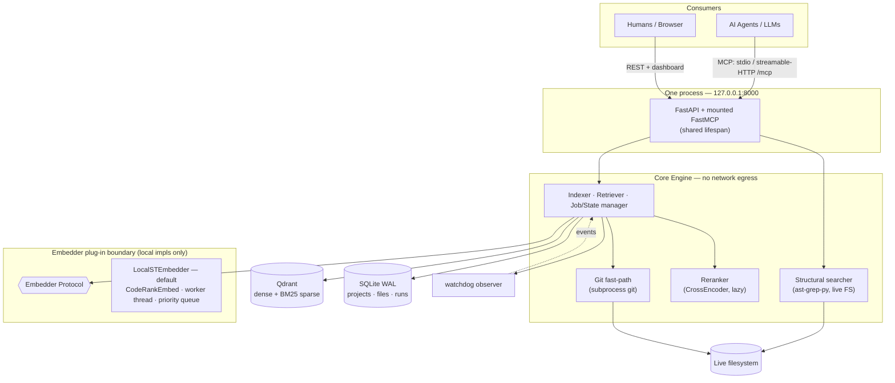

# Architecture

Noesis is one process, two thin adapters, one core engine, and two stores — a hybrid code-retrieval service that runs entirely on `127.0.0.1`.

## System overview

Three properties are encoded in that diagram:

- The **structural searcher reads the filesystem, not Qdrant** — structural results are never stale by construction ([ADR-21](../project/decisions.md)).
- The **reranker sits behind the retriever**, invisible to the data model — its score is response-only, never stored.
- The **embedder boundary contains only local implementations** — there is no edge leaving the machine ([ADR-25](../project/decisions.md), see [Security model](security.md)).

## One core, two adapters

`api/` (REST + dashboard) and `mcp/` (MCP tools) are deliberately thin: every operation lives in `core/`, and both adapters call the same functions. MCP and REST responses for the same query are asserted identical in tests. MCP is the **primary** interface (agents consume retrieval over MCP); REST is **secondary** (dashboard and scripting).

Both transports build their resources through one shared path, `runtime.build_runtime_context()` (`src/noesis/runtime.py`) — connecting SQLite, failing orphaned runs from dead processes, resolving the compute device, constructing the embedder/vector store/optional reranker, and sweeping orphaned Qdrant points. The stdio MCP server (`python -m noesis.mcp`) and the HTTP app (`noesis.app:app`) therefore always agree on state.

## Component responsibilities

| Component | Module | Responsibility |
|---|---|---|
| Indexer | `core/indexer.py` | Orchestrates discover → hash-diff → chunk → embed → upsert; per-file error containment; drift self-heal |
| Retriever | `core/retriever.py` | Hybrid dense+sparse query, RRF fusion, optional rerank |
| Chunker | `core/chunker.py` | cAST split-then-merge chunking along AST boundaries |
| Embedder | `core/embedder.py` | `Embedder` Protocol + `LocalSTEmbedder` (CodeRankEmbed) on a priority-queue worker thread |
| Reranker | `core/reranker.py` | `Reranker` Protocol + lazy cross-encoder on its own worker thread |
| Vector store | `core/vectorstore.py` | Qdrant collection management, deterministic point ids, hybrid search |
| Structural search | `core/structural.py` | ast-grep pattern matching over live files |
| Discovery | `core/discovery.py` | File walking with `.gitignore`, secret, lockfile, size, and binary filters |
| Hash diff | `core/hashdiff.py` | SHA-256 change partitioning (new / changed / unchanged / deleted) |
| Git fast-path | `core/gitfast.py` | Candidate-set narrowing via `git diff` + `git status` |
| Watcher | `core/watcher.py` | Filesystem events → pending changes → optional scoped auto-reindex |
| Jobs | `core/jobs.py` | Single launch path for index runs, in-memory progress + ETA |
| State | `core/state.py` | SQLite (WAL) schema, migrations, run lifecycle, crash recovery |
| Dashboard | `core/dashboard.py` | Read models and actions behind the Jinja2 dashboard |
| Config | `core/config.py` | `config.toml` loading and defaults |
| Compute | `core/compute.py` | Device resolution (`cuda` → `mps` → `cpu`) |
| Telemetry | `core/telemetry.py` | Metadata-only query logging (never query text) |

## Threads and concurrency

The service is a single asyncio event loop plus a small set of dedicated threads:

- **Embedder worker** — one thread owns the embedding model. Jobs arrive through a priority queue: query embeds are HIGH priority, document batches are LOW, so **queries preempt indexing**. Under heavy query load, index freshness lags and then recovers.
- **Reranker worker** — a second, separate single thread ([ADR-20](../project/decisions.md)). A rerank of 50 pairs takes materially longer than a query embed; sharing one worker would let a rerank head-of-line-block the next query's embedding.
- **Default thread pool** — structural scans and file I/O run via `run_in_executor` on the default pool, never on the model workers, so a structural search cannot queue behind an index batch.
- **Watcher threads** — watchdog observers (inotify or polling) whose event threads do string checks only: no hashing, no file reads, no database access.

Heavy synchronous work inside the indexer (hashing, chunking) is pushed off the event loop with `asyncio.to_thread`.

## Data stores

| Store | What it holds | Where |
|---|---|---|
| SQLite (WAL) | Projects, per-file state, index runs, pending changes, per-file run errors, metadata-only query log, watcher stats, app settings | `~/.local/share/noesis/noesis.sqlite` by default |
| Qdrant | One shared collection: named dense vector (768-dim COSINE) + named BM25 sparse vector per chunk, payload-filtered by `project_id` | Docker container, `127.0.0.1:6333` |

The live file is always ground truth: search hits are candidates that agents should re-read from disk before acting.

## Where to go next

- [Indexing pipeline](indexing-pipeline.md) — how files become vectors
- [Retrieval](retrieval.md) — how a query becomes ranked spans
- [Chunking](chunking.md) — the cAST algorithm
- [Freshness](freshness.md) — watcher and git fast-path
- [Security model](security.md) — why nothing leaves the machine
