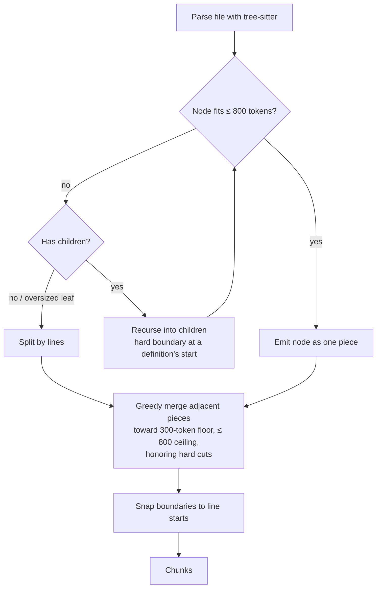

# Chunking — the cAST algorithm

Noesis chunks source files along AST boundaries with a split-then-merge algorithm (cAST), so a chunk is a coherent unit — a function, a class — rather than an arbitrary window of lines.

Implementation: `src/noesis/core/chunker.py`, reimplemented on `tree-sitter-language-pack` with `astchunk` used only as a dev/test oracle.

## Token budget

| Constant | Value | Meaning |
|---|---|---|
| `MIN_CHUNK_TOKENS` | 300 | Soft floor — greedy merging aims to fill chunks at least this far |
| `MAX_CHUNK_TOKENS` | 800 | Hard ceiling — only an indivisible single line may estimate above this |

The token estimator is fixed by decision: **`ceil(non-whitespace characters / 4)`** (`_token_estimate`, marked "Do not change"). It is cheap, deterministic, and close enough to real tokenizer counts for budgeting.

## Split, then merge

**Split.** The tree is walked top-down. A node whose span fits the ceiling becomes a single piece. A node over budget is split by recursing into its children; an over-budget *leaf* (a giant string literal, a minified line) is split by lines as a last resort.

**Merge.** Adjacent small pieces are greedily packed into chunks up to the 800-token ceiling, aiming for the 300-token floor — so a file of tiny functions doesn't produce dozens of fragment chunks.

**Hard cuts.** Definition nodes (`decorated_definition`, `*_definition`, `*_declaration`) set hard boundaries before and after themselves, and the merge never crosses one. The invariant: **a function is never split below its signature** — a definition either fits whole in a chunk, or (only when it alone exceeds the ceiling) is split via its own children behind a hard boundary forced at its start. A signature is never orphaned from its body by a merge.

## The reassembly invariant

Concatenating `chunk.text` over a file's chunks, in order, reproduces the file **byte-for-byte, with no overlap**. Whitespace and comments between siblings attach to the following chunk, and every boundary is snapped to a line start, so `start_line`/`end_line` slice the file's lines exactly. This is tested, not aspirational — and it means a chunk's line range can always be trusted to open an editor at the right place.

## Metadata

Each chunk carries:

| Field | Source |
|---|---|
| `node_type` | The AST node kind of the chunk's dominant piece (e.g. `function_definition`) |
| `symbol_name` | The node's `name` field via tree-sitter `child_by_field_name("name")`, when present |
| `start_line` / `end_line` | 1-based inclusive line bounds |
| `language` | Canonical language name (from file extension) |
| `file_hash` | SHA-256 of the file content the chunk came from — part of the deterministic chunk id |

## Fallback ladder

Chunking **never fails a file**: no detected language, no grammar available, or a parse failure all degrade to line-based pieces under the same budget. Grammar downloads happen once at prefetch time; a missing grammar at runtime just means line-mode for that language.

Parsers are cached **per thread** — tree-sitter-language-pack parser objects are pyo3-unsendable and must not cross threads.

## Supported languages

Canonical language names come from file extensions (`EXT_TO_LANGUAGE` in `src/noesis/core/languages.py`). `LANGUAGE_MAP` maps each canonical name to its tree-sitter grammar and its ast-grep language string — kept explicit because the two engines' identifiers are independent by contract.

| # | Language | AST chunking | Structural search |
|---|---|---|---|
| 1 | python | yes | yes |
| 2 | javascript | yes | yes |
| 3 | typescript | yes | yes |
| 4 | tsx | yes | yes |
| 5 | go | yes | yes |
| 6 | rust | yes | yes |
| 7 | java | yes | yes |
| 8 | c | yes | yes |
| 9 | cpp | yes | yes |
| 10 | csharp | yes | yes |
| 11 | ruby | yes | yes |
| 12 | php | yes | yes |
| 13 | swift | yes | yes |
| 14 | kotlin | yes | yes |
| 15 | scala | yes | yes |
| 16 | bash | yes | yes |
| 17 | html | yes | yes |
| 18 | css | yes | yes |
| 19 | json | yes | yes |
| 20 | yaml | yes | yes |
| 21 | markdown | yes | yes |

!!! note "toml and sql"
    `toml` and `sql` are canonical languages (detected, indexed, chunked) but are **deliberately absent from `LANGUAGE_MAP`**: ast-grep 0.44 does not support them, and an unsupported language string doesn't raise — it panics. Membership in the map is the only gate before ast-grep is called, so structural search cleanly reports these two as unsupported.

Any other extension is still indexed via the line-based fallback — it just loses AST-aware boundaries and symbol metadata.
