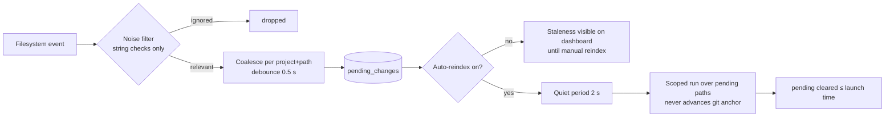

# Freshness

An index that silently goes stale is the top reason index-first tools get abandoned. Noesis attacks staleness from three directions: cheap re-indexing (hash-diff), a git fast-path that makes re-scans fast on large repos, and a file watcher that can keep the index current within seconds — always keeping staleness *visible* even when automatic reindexing is off.

## The file watcher

`core/watcher.py` observes watched project roots and records edits as **pending changes** — visible on the [dashboard](../reference/dashboard.md) as an amber badge.



**Two per-project flags, both OFF by default:**

| Flag | Off (default) | On |
|---|---|---|
| **Watch** | Project not observed | Events recorded as pending changes, shown on the dashboard |
| **Auto-reindex** | Pending changes wait for a manual reindex | After a quiet period, changed files are re-embedded automatically |

The default-off design is deliberate ([ADR-40](../project/decisions.md)): unsolicited background embedding would burn GPU/CPU without consent. With Watch on but Auto-reindex off you still *see* staleness — the index just doesn't rebuild until you ask. Turning Auto-reindex on also catches up any backlog that accumulated while it was off.

### Event handling is deliberately cheap

The watchdog event thread does **string checks only** — no hashing, no file reads, no database access — so watching never contends with your editor writing a file. It drops: excluded directories (`.git`, `node_modules`, `.venv`, …), secret files, generated lockfiles, editor noise (`.swp`, `~`, `.tmp`, `.#`, vim's `4913` write-probe), directory events (except deletes), and anything the root `.gitignore` excludes. Moves become delete + create.

Surviving events are **coalesced** per `(project, path)` with a 0.5 s debounce — created + modified collapses to created, last event wins — then flushed to `pending_changes`. Seen-vs-coalesced counts land in `watcher_stats` and feed the usage page.

### Dual observers

Watchdog's inotify backend receives **zero events** on network/virtualized mounts — notably WSL2's `/mnt/*` (9p). The watcher therefore picks its observer per root ([ADR-45](../project/decisions.md)): roots on inotify-blind filesystems (9p, cifs, nfs, vboxsf, `fuse.*`, …, detected by longest-mountpoint-prefix match over `/proc/mounts`) get a **polling observer** whose directory walk prunes excluded dirs at the source ([ADR-46](../project/decisions.md) — an unpruned poll of a `.venv` measured ~350 s per interval; pruned, ~0.6 s). Other roots keep native inotify. The dashboard tags polled roots with a "polling" badge.

### Scoped runs stay safe

A watcher-triggered run is scoped to exactly the pending paths — but it still re-runs discovery and SHA-256 hashing on them; **the hash remains the source of truth**. Scoped runs deliberately **never advance the git fast-path anchor**, so the next full pass can never skip a file the watcher didn't see. If a run is already in flight, the trigger re-arms instead of being lost.

## The git fast-path

On a git repo with a stored anchor (`last_indexed_commit`), a full reindex doesn't need to hash every file. The candidate set is:

```
git diff --name-status <anchor>..HEAD   ∪   git status --porcelain (staged + unstaged + untracked)
```

Only candidates get hashed; deletions from both sources feed the stale-chunk pruner. The correctness boundary ([ADR-23](../project/decisions.md), [ADR-37](../project/decisions.md)):

1. The fast path may only **shrink** the set of files that get hashed. It never marks a file unchanged on its own authority.
2. Directory-level entries (nested repos, submodule gitlinks) match as *prefixes* — which can only widen the hash set.
3. **Fallback to a full hash-walk** — silent, logged, never an error — on any of: not a git repo, git binary absent, no stored anchor, anchor not an ancestor of HEAD (`git merge-base --is-ancestor`, which catches history rewrites even before gc), detached HEAD, repo mid-merge/rebase/cherry-pick/bisect, non-zero git exit, or a 30 s timeout.
4. The anchor advances **only after a clean, successful full run**.

Per-run telemetry (`fast_path_used`, `candidate_count` vs `files_total`) makes the optimization's value measurable on the usage page — on this repo's own runs, a 3-file change hashes ~3 files instead of hundreds.

## Why hashing stays the source of truth

Git knows nothing about unsaved editor buffers mid-write, non-git directories exist, and history rewrites happen. SHA-256 hash-diff catches all of those; git only makes the scan cheaper. Every layer above (watcher scoping, git candidates) can only *narrow which files get hashed* — never override what the hash says.
