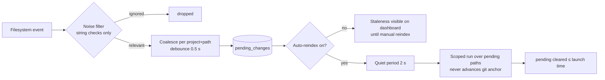

# Freshness

An index that silently goes stale is the top reason index-first tools get abandoned. Noesis attacks staleness from three directions: cheap re-indexing (hash-diff), a git fast-path that makes re-scans fast on large repos, and a file watcher that can keep the index current within seconds — always keeping staleness *visible* even when automatic reindexing is off.

## The file watcher

`core/watcher.py` observes watched project roots and records edits as **pending changes** — visible on the [dashboard](../reference/dashboard.md) as an amber badge.


```mermaid
flowchart LR
    E[Filesystem event] --> F{Noise filter<br/>string checks only}
    F -- ignored --> X[dropped]
    F -- relevant --> C[Coalesce per project+path<br/>debounce 0.5 s]
    C --> P[(pending_changes)]
    P --> Q{Auto-reindex on?}
    Q -- no --> V[Staleness visible on dashboard<br/>until manual reindex]
    Q -- yes --> W[Quiet period 2 s] --> R[Scoped run over pending paths<br/>never advances git anchor]
    R --> P2[pending cleared ≤ launch time]
```

**Two per-project flags, both OFF by default:**

| Flag | Off (default) | On |
|---|---|---|
| **Watch** | Project not observed | Events recorded as pending changes, shown on the dashboard |
| **Auto-reindex** | Pending changes wait for a manual reindex | After a quiet period, changed files are re-embedded automatically |

The default-off design is deliberate ([ADR-40](../project/decisions.md)): unsolicited background embedding would burn GPU/CPU without consent. With Watch on but Auto-reindex off you still *see* staleness — the index just doesn't rebuild until you ask. Turning Auto-reindex on also catches up any backlog that accumulated while it was off.

### Event handling is deliberately cheap

The watchdog event thread does **string checks only** — no hashing, no file reads, no database access — so watching never contends with your editor writing a file. It drops: excluded directories (`.git`, `node_modules`, `.venv`, …), secret files, generated lockfiles, editor noise (`.swp`, `~`, `.tmp`, `.#`, vim's `4913` write-probe), directory events (except deletes), and anything the root `.gitignore` excludes. Moves become delete + create.

Surviving events are **coalesced** per `(project, path)` with a 0.5 s debounce — created + modified collapses to created, last event wins — then flushed to `pending_changes`. Seen-vs-coalesced counts land in `watcher_stats` and feed the usage page.

### Dual observers

Watchdog's inotify backend receives **zero events** on network/virtualized mounts — notably WSL2's `/mnt/*` (9p). The watcher therefore picks its observer per root ([ADR-45](../project/decisions.md)): roots on inotify-blind filesystems (9p, cifs, nfs, vboxsf, `fuse.*`, …, detected by longest-mountpoint-prefix match over `/proc/mounts`) get a **polling observer** whose directory walk prunes excluded dirs at the source ([ADR-46](../project/decisions.md) — an unpruned poll of a `.venv` measured ~350 s per interval; pruned, ~0.6 s). Other roots keep native inotify. The dashboard tags polled roots with a "polling" badge.

### Scoped runs stay safe

A watcher-triggered run is scoped to exactly the pending paths — but it still re-runs discovery and SHA-256 hashing on them; **the hash remains the source of truth**. Scoped runs deliberately **never advance the git fast-path anchor**, so the next full pass can never skip a file the watcher didn't see. If a run is already in flight, the trigger re-arms instead of being lost.

Not advancing the anchor has a consequence worth spelling out. The dirty-set write that normally rides along with an anchor advance never fires for a scoped run, so a scoped run records the paths it indexed into `dirty_paths` itself. Without that, a file whose only indexed version came from a scoped run would be missing from the set the next fast path re-admits — and if it were reverted to its committed content in the meantime, neither `git diff` nor `git status` would mention it, leaving the stale content indexed indefinitely. The write is union-only, so it can only ever widen the next candidate set.

Union-only keeps it correct but not bounded, and the set is normally trimmed by the same write that advances the anchor — which needs a resolvable HEAD. A **full** walk trims it even with no commit to record: a full walk re-hashes every discovered file, so the only thing left owing re-admission is whatever it could not reach.

That remainder is the point. A full walk that hit a fault does not clear the set outright — it *replaces* it with exactly the paths it could not verify ([ADR-60](../project/decisions.md)): files that failed to index or to hash, paths under a subtree it could not walk, and deletions a screening fault held back. On a clean run that remainder is empty and the set is cleared, which is what it always did.

Both of those drains need a *full* run, and that used to be the catch: every automatic trigger is scoped. The watcher's quiet-period run, its start-up catch-up, and the dashboard's two catch-up paths all pass an explicit candidate set, so none of them could take either drain branch. After a project's first full run the set only grew, and each accumulated path was unioned back into the next scoped run's candidate set — so the scoped path decayed toward re-hashing every file any scoped run had ever touched. Not a correctness bug (widening is always safe) but a steadily worsening one, and invisible, since scoped runs report no candidate count.

### Promotion: getting a full walk back automatically

A scoped run is now **promoted to a full walk** ([ADR-57](../project/decisions.md)) when any of three things is true:

- a configured number of scoped runs have gone by since the last completed full one (default 20);
- the effective candidate set (pending ∪ dirty) reaches a fraction of the indexed file count (default 0.25);
- an unattributable discovery failure has left the whole index unverified, which no scoped run is wide enough to fix.

The cost is smaller than it sounds: discovery already stats and binary-sniffs every file on *every* run, scoped or not, so the walk is paid either way and a promoted run is roughly 2× that run rather than 100×. Past the fraction threshold a scoped run costs about what the full walk costs while delivering none of its drains, which is the point the second trigger identifies.

The decision is made in one place — the single launch path every scoped caller already goes through — because the candidate set feeds both the run *and* the clearing of pending rows afterwards. Promoting deeper down would leave a run that examined everything clearing only the narrow set it was originally given. Each trigger is independently disabled by setting it to `0` in [`[indexing]`](../reference/configuration.md#indexing).

## The git fast-path

On a git repo with a stored anchor (`last_indexed_commit`), a full reindex doesn't need to hash every file. The candidate set is:

```
git diff --name-status <anchor>..HEAD   ∪   git status --porcelain (staged + unstaged + untracked)
```

Only candidates get hashed; deletions from both sources feed the stale-chunk pruner. The correctness boundary ([ADR-23](../project/decisions.md), [ADR-37](../project/decisions.md)):

1. The fast path may only **shrink** the set of files that get hashed. It never marks a file unchanged on its own authority.
2. Directory-level entries (nested repos, submodule gitlinks) match as *prefixes* — which can only widen the hash set.
3. **Fallback to a full hash-walk** — silent, logged, never an error — on any of: not a git repo, git binary absent, no stored anchor, anchor not an ancestor of HEAD (`git merge-base --is-ancestor`, which catches history rewrites even before gc), detached HEAD, repo mid-merge/rebase/cherry-pick/bisect, non-zero git exit, or a 30 s timeout.
4. The anchor advances after a successful run whose failures — if any — can be **named**. It never advances past a run that finished `failed`, nor past a failure no path set describes (an unreadable walk root, a path outside the root, or a directory error under `follow_symlinks`): there the walk proved nothing about *which* files are affected, so there is nothing honest to carry. Anything else it could not verify rides along in `dirty_paths` and is re-hashed next run ([ADR-60](../project/decisions.md)).

Per-run telemetry (`fast_path_used`, `candidate_count` vs `files_total`) makes the optimization's value measurable on the usage page — on this repo's own runs, a 3-file change hashes ~3 files instead of hundreds.

## When a directory can't be read

Discovery treats a filesystem fault as *absence of evidence*, never as evidence of absence ([ADR-51](../project/decisions.md)): if a directory's scan fails, nothing under it can be proven deleted, so nothing under it is deleted. The suppression is scoped to the failing subtree, so the rest of the project keeps converging normally ([ADR-54](../project/decisions.md)).

That is the right call, and it used to have no exit. The stored paths hidden by the failure came back as "unverified" and were re-queued for retry on every run — correct for a transient 9p blip, but under a *permanently* unreadable directory (a root-owned dir, a dead mount) the same set was re-derived and re-queued forever. The "awaiting reindex" list never emptied, and every process start launched a scoped run that walked the same broken tree.

Noesis now tracks each failing directory with a consecutive-failure count ([ADR-56](../project/decisions.md)). Past a threshold (default 5 runs) the directory is **quarantined** and the paths it hides stop being re-queued, so the backlog drains.

!!! warning "Quarantine is not a deletion, and never becomes one"
    A quarantined directory's indexed content is **kept and stays searchable**. Quarantine bounds only the *retry*; the deletion decision is untouched and still requires positive evidence that a file is gone. What you lose is the guarantee that the content is current — which is why the directory stays listed on the dashboard rather than disappearing quietly.

**Recovery needs no action and no operator.** Discovery walks the whole tree on every run — scoping narrows only which files get *hashed* — so every run is already a fresh probe of every directory. The first run that manages to walk the directory again re-admits everything it holds into that run's own candidate set, re-hashing the subtree and picking up any edit made while it was unreadable. Then the record disappears.

That last part is what makes it safe to stop re-queueing. A file edited while its directory was unreadable has already lost its watcher event, so without something to retry it the stale content would sit in the index until a human forced a full run. The re-admission is a better answer than the retry queue was: it is derived fresh from the recovery itself rather than depending on a queued row surviving.

The record also clears if the directory was genuinely deleted, or has been filtered out of the project's index scope. Both are correct resets — in each case the walk reached the location and legitimately found nothing, so the files leave the index the ordinary way.

**Meanwhile the rest of the project stays fast.** An unreadable directory used to freeze the git anchor for the whole project, so every later run diffed against an ever-older commit and re-hashed a candidate set that grew with each commit. It does not any more: the anchor keeps up with HEAD and takes the unverifiable paths with it in `dirty_paths` ([ADR-60](../project/decisions.md)). Measured on a project with one permanently unreadable directory over eight commits, the candidate set went from `1, 2, 3, 4, 5, 6, 7, 8` — climbing without limit — to `1, 4, 4, 4, 4, 4, 4, 4`: this run's real change plus the three files behind the broken directory, which cost nothing to carry because a candidate that discovery never sees is never hashed.

## Why hashing stays the source of truth

Git knows nothing about unsaved editor buffers mid-write, non-git directories exist, and history rewrites happen. SHA-256 hash-diff catches all of those; git only makes the scan cheaper. Every layer above (watcher scoping, git candidates) can only *narrow which files get hashed* — never override what the hash says.
