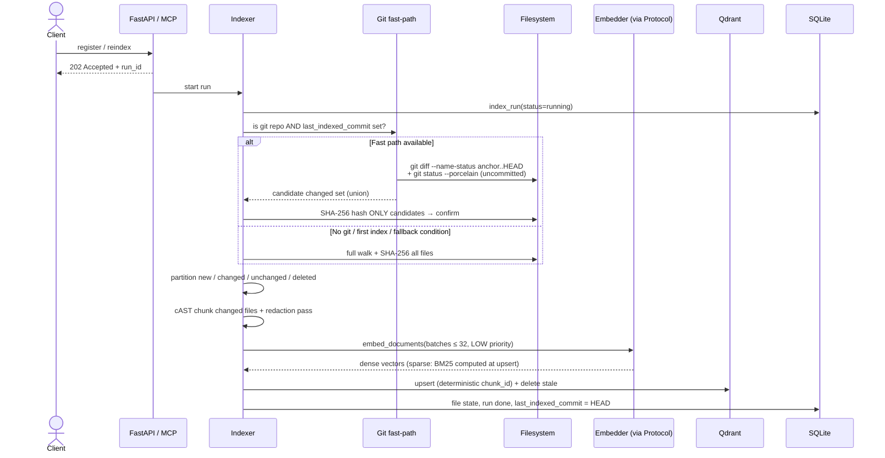

# Indexing pipeline

Indexing turns a registered folder into searchable chunks: **discover → hash-diff → chunk → embed → upsert**, run as a background job with live progress.

## Sequence

## The stages

1. **Discovery** (`core/discovery.py`) walks the tree and filters through ordered layers: excluded directories (`.git`, `node_modules`, `.venv`, …), nested `.gitignore` semantics (last-match-wins, negations honored), a secret skip-list (`.env`, `*.pem`, keys), a generated-lockfile skip-list (`uv.lock`, `package-lock.json`, …), per-project extra ignores and language filters, a size cap (1 MiB default), and a binary sniff (NUL byte in the first 8 KiB).
2. **Hash-diff** (`core/hashdiff.py`) SHA-256s each candidate and partitions files into *new / changed / unchanged / deleted* against stored state. Only new and changed files are re-embedded; deleted files have their chunks pruned. This is what makes re-indexing cheap.
3. **Git fast-path** (`core/gitfast.py`) narrows *which files get hashed* on repos with a stored anchor commit. It may only shrink the hash set — the hash remains the source of truth. See [Freshness](freshness.md) for the fallback rules.
4. **Chunking** (`core/chunker.py`) splits changed files along AST boundaries into a 300–800 token budget; concatenating a file's chunks reproduces it byte-for-byte. See [Chunking](chunking.md).
5. **Embedding** goes through the `Embedder` Protocol in batches of ≤ 32 at LOW priority, so live queries always preempt an index run.
6. **Upsert** writes points to Qdrant under deterministic UUIDv5 ids derived from `project_id:file_path:start_line:file_hash` — re-embedding the same content is idempotent. New points are written before stale ones are pruned, and an in-flight upsert is shielded from cancellation ([ADR-47](../project/decisions.md)) so a project deletion can never race a write into orphaned points.

## Runs, progress, and ETA

Every index operation is a **run**: registration or reindex returns `202` with a `run_id` immediately, and the work proceeds in a background task (`core/jobs.py`). While running, `GET /runs/{run_id}` merges an in-memory progress snapshot — files done, files to index, chunks written, percent complete, and a linear ETA. Concurrent runs on the same project are refused atomically (`already_running`), and runs owned by a dead process are failed on startup (owner identity is `<boot>:<pid>:<starttime>`).

## Per-file error containment

If one file fails to read, chunk, or embed, the failure is recorded in `run_file_errors` with the error text, counted in `files_failed`, and the run continues ([ADR-41](../project/decisions.md)). Failed files are visible on the [dashboard](../reference/dashboard.md) and are retried on the next run because their state was never updated. Only a run where *every* file fails — or a non-per-file exception — is marked `failed`.

!!! note "Why not abort on first error?"
    One unreadable file would leave every other file stale and give the dashboard nothing to show. Containment keeps the index maximally fresh and makes failures observable instead of fatal.

## Drift self-heal

SQLite and Qdrant can silently diverge if the Qdrant collection is lost or recreated externally: SQLite still says "indexed", the hash-diff sees no content change, and search would return nothing forever. Each full run therefore compares the exact Qdrant point count against the expected chunk total ([ADR-49](../project/decisions.md)); on mismatch it scrolls per-file point counts, re-embeds files whose live count differs from stored state, and prunes orphan paths present in Qdrant but absent from both state and disk. Repair is surgical and idempotent (deterministic point ids). Scoped watcher runs only warn — they must preserve their candidate scope.

## Scope rules

- **Watcher-triggered runs** are scoped to exactly the pending files and **never advance the git anchor**, so a later full pass can never skip a file the watcher didn't see.
- **`last_indexed_commit`** is advanced only after a clean, full, successful run with a resolvable HEAD.
