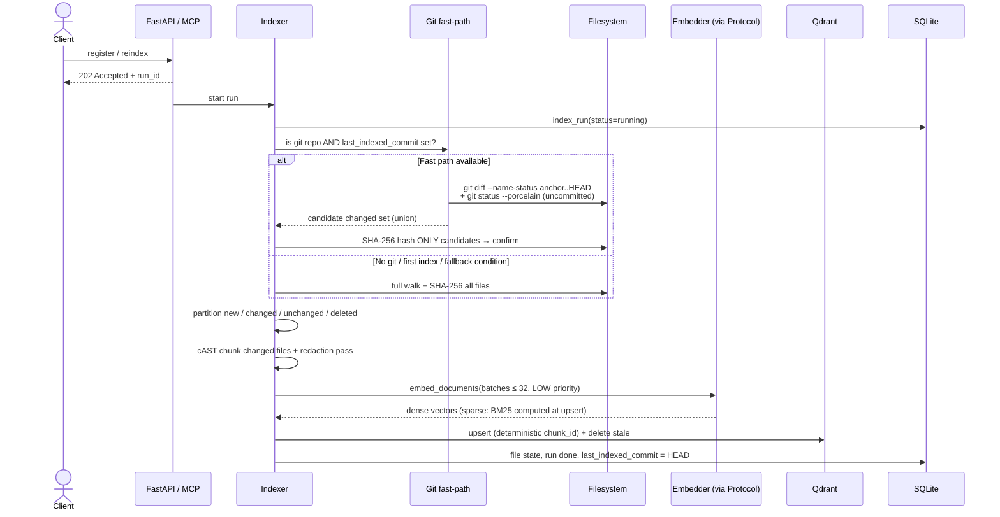

# Indexing pipeline

Indexing turns a registered folder into searchable chunks: **discover → hash-diff → chunk → embed → upsert**, run as a background job with live progress.

## Sequence

```mermaid
sequenceDiagram
    actor Client
    participant API as FastAPI / MCP
    participant Idx as Indexer
    participant Git as Git fast-path
    participant FS as Filesystem
    participant Emb as Embedder (via Protocol)
    participant Q as Qdrant
    participant DB as SQLite
    Client->>API: register / reindex
    API-->>Client: 202 Accepted + run_id
    API->>Idx: start run
    Idx->>DB: index_run(status=running)
    Idx->>Git: is git repo AND last_indexed_commit set?
    alt Fast path available
        Git->>FS: git diff --name-status anchor..HEAD<br/>+ git status --porcelain (uncommitted)
        Git-->>Idx: candidate changed set (union)
        Idx->>FS: SHA-256 hash ONLY candidates → confirm
    else No git / first index / fallback condition
        Idx->>FS: full walk + SHA-256 all files
    end
    Idx->>Idx: partition new / changed / unchanged / deleted
    Idx->>Idx: cAST chunk changed files + redaction pass
    Idx->>Emb: embed_documents(batches ≤ 32, LOW priority)
    Emb-->>Idx: dense vectors (sparse: BM25 computed at upsert)
    Idx->>Q: upsert (deterministic chunk_id) + delete stale
    Idx->>DB: file state, run done, last_indexed_commit = HEAD
```

## The stages

1. **Discovery** (`core/discovery.py`) walks the tree and filters through ordered layers: excluded directories (`.git`, `node_modules`, `.venv`, …), nested `.gitignore` semantics (last-match-wins, negations honored), a secret skip-list (`.env`, `*.pem`, keys), a generated-lockfile skip-list (`uv.lock`, `package-lock.json`, …), per-project extra ignores and language filters, a file-type gate (only regular files are ever opened), a size cap (1 MiB default), and a binary sniff (NUL byte in the first 8 KiB). Failures that are not genuine absence are reported to the indexer rather than skipped silently — see [Discovery](../internals/discovery.md).
2. **Hash-diff** (`core/hashdiff.py`) SHA-256s each candidate and partitions files into *new / changed / unchanged / deleted* against stored state. Only new and changed files are re-embedded; deleted files have their chunks pruned. This is what makes re-indexing cheap.
3. **Git fast-path** (`core/gitfast.py`) narrows *which files get hashed* on repos with a stored anchor commit. It may only shrink the hash set — the hash remains the source of truth. See [Freshness](freshness.md) for the fallback rules.
4. **Chunking** (`core/chunker.py`) splits changed files along AST boundaries into a 300–800 token budget; concatenating a file's chunks reproduces it byte-for-byte. See [Chunking](chunking.md).
5. **Embedding** goes through the `Embedder` Protocol in batches of ≤ 32 at LOW priority, so live queries always preempt an index run.
6. **Upsert** writes points to Qdrant under deterministic UUIDv5 ids derived from `project_id:file_path:start_line:file_hash` — re-embedding the same content is idempotent. New points are written before stale ones are pruned, and an in-flight upsert is shielded from cancellation ([ADR-47](../project/decisions.md)) so a project deletion can never race a write into orphaned points.

## Runs, progress, and ETA

Every index operation is a **run**: registration or reindex returns `202` with a `run_id` immediately, and the work proceeds in a background task (`core/jobs.py`). While running, `GET /runs/{run_id}` merges an in-memory progress snapshot — files done, files to index, chunks written, percent complete, and a linear ETA. Concurrent runs on the same project are refused atomically (`already_running`), and runs owned by a dead process are failed on startup (owner identity is `<boot>:<pid>:<starttime>`).

## Per-file error containment

If one file fails to read, chunk, or embed, the failure is recorded in `run_file_errors` with the error text, counted in `files_failed`, and the run continues ([ADR-41](../project/decisions.md)). Failed files are visible on the [dashboard](../reference/dashboard.md) and are retried on the next run because their state was never updated. Only a run where *every* file fails — or a non-per-file exception — is marked `failed`.

!!! note "Why not abort on first error?"
    One unreadable file would leave every other file stale and give the dashboard nothing to show. Containment keeps the index maximally fresh and makes failures observable instead of fatal.

## Deletion requires evidence

Deletion is inferred from absence: a file tracked in state that discovery did not return is treated as deleted, and its chunks are pruned. That inference is only sound when the walk actually succeeded, so a discovery failure now suppresses it ([ADR-51](../project/decisions.md)):

- A **file-level** failure (the file exists but could not be read) carries its stored hash forward as unchanged, exactly like a hash-time `OSError`. It can never reach the deleted set.
- A **directory-level** failure means part of the tree went unwalked, and the paths it hid cannot be enumerated. The run therefore skips deletions *and* orphan pruning **for the paths under that directory**, and the error blocks the git anchor from advancing so the next run re-examines everything. Paths elsewhere in the tree were walked normally and stay provable ([ADR-54](../project/decisions.md)) — otherwise one directory that is permanently unreadable (root-owned, or a dead network mount) would freeze deletion for the whole project forever. Suppression widens back to the whole run whenever the failure cannot be attributed to a subtree: the walk root itself, a path outside the root, or `follow_symlinks`.
- An **empty scan against non-empty state** is refused outright. If discovery returns nothing while the state DB still tracks files, the run treats that as an unreadable root — not as the deletion of every file. This one cannot be expressed as an error check: a root that exists but is empty (a mountpoint not populated yet) walks cleanly and raises nothing at all, so the emptiness itself has to be the signal. It applies only to that silent case: when discovery *did* report a directory failure, that error is the diagnosis — it names the directory and carries the real errno — and the guard defers to it rather than recording a second, generic `<root>` failure over the top of it. So a walk that saw no files because the one subtree holding them was unreadable keeps the subtree scoping above, and a deletion elsewhere in the tree stays provable. Two escapes keep that guard from stranding the project ([ADR-55](../project/decisions.md)): if the walk *enumerated* files and the filters removed all of them — an [index-scope narrowing](../reference/dashboard.md), a new `.gitignore` — the root is demonstrably readable and those files should leave the index; and `?force=true` on the REST `reindex` lets an operator assert that a genuinely empty root is real (REST only — the MCP tool's caller is an agent, not an operator). `force` relaxes nothing else: a directory that failed to scan still suppresses deletions under it.
- The suppressed paths are not lost: they are re-queued as pending changes under their own file paths, so the watcher retries them individually. A path that really was deleted is simply re-detected and pruned by the next clean run. Directory paths and the `<root>` sentinel are deliberately excluded from that re-queue — a scoped run matches its candidates exactly, so a directory would match nothing and then clear its own pending row. They stay visible in `run_file_errors` for the operator.
- That retry is **bounded**, because a directory can fail permanently — a root-owned directory, a dead mount — and then the same set is re-derived and re-queued on every run forever, leaving a backlog that never drains. Each failing directory carries a consecutive-failure count, and past a threshold it is **quarantined**: the paths it hides stop being re-queued ([ADR-56](../project/decisions.md)). Quarantine bounds the *retry* only — the deletion decision above is untouched, so the content stays indexed and searchable, and nothing here can purge on doubt. Recovery is automatic: because discovery walks the whole tree on every run regardless of scoping, the first run that reaches the directory again re-admits everything under it into its own candidate set, re-hashing the subtree and catching any edit made while it was unreadable. That re-admission is what makes dropping the retry safe — a file edited behind an unreadable directory lost its watcher event, so the retry queue was otherwise the only thing that would ever revisit it.

The asymmetry is deliberate. Skipping a deletion costs stale rows until the next clean run; performing one on bad evidence costs searchable content until a full reindex — and, once the anchor advances, silently.

## Drift self-heal

SQLite and Qdrant can silently diverge if the Qdrant collection is lost or recreated externally: SQLite still says "indexed", the hash-diff sees no content change, and search would return nothing forever. Each full run therefore compares the exact Qdrant point count against the expected chunk total ([ADR-49](../project/decisions.md)); on mismatch it scrolls per-file point counts, re-embeds files whose live count differs from stored state, and prunes orphan paths present in Qdrant but absent from both state and disk. Repair is surgical and idempotent (deterministic point ids). Scoped watcher runs only warn — they must preserve their candidate scope.

## Scope rules

- **Watcher-triggered runs** are scoped to exactly the pending files and **never advance the git anchor**, so a later full pass can never skip a file the watcher didn't see. Because they never advance the anchor, they also never reach the code that persists the working-tree-dirty set — so they record what they indexed into `dirty_paths` directly, or content only ever indexed by a scoped run would be invisible to the next fast path's re-admission and a revert would stay stale forever.
- **`last_indexed_commit`** is advanced only after a clean, full, successful run with a resolvable HEAD.
- **A scoped run's candidate set is matched exactly**, with no prefix expansion — so anything re-queued for retry must be re-queued as the file paths themselves, never as a parent directory.
