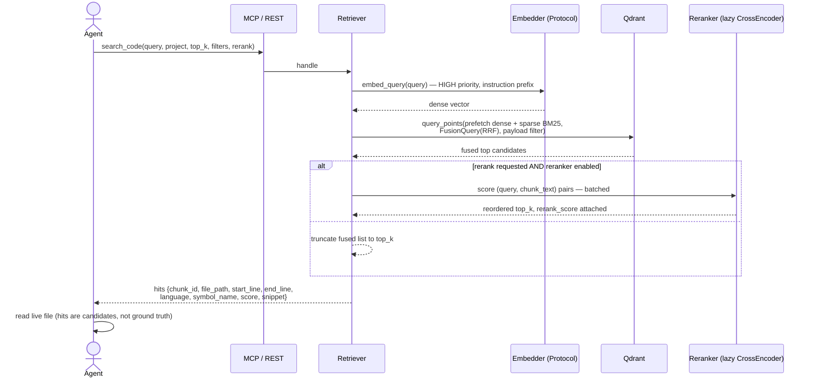

# Retrieval

A search fuses two complementary channels — dense semantic vectors and lexical BM25 — with Reciprocal Rank Fusion, then optionally reranks the top candidates with a cross-encoder.

## Sequence

## The two channels

| Channel | How it works | Good at |
|---|---|---|
| **Dense** | `nomic-ai/CodeRankEmbed` (768-dim) embeds the query on the HIGH-priority worker with the model's instruction prefix (`Represent this query for searching relevant code:`); COSINE similarity against chunk vectors | "what does this *mean*" — natural-language intent |
| **Sparse** | BM25: term frequencies encoded client-side via `Qdrant/bm25`, IDF applied server-side (`Modifier.IDF`) | "find this exact token" — identifiers, symbols, error strings |

Fusion is Qdrant's `FusionQuery(RRF)` over both prefetch lists. The RRF constant is fixed server-side and not configurable ([ADR-32](../project/decisions.md)). Prefetch depth per channel is `max(top_k, candidates)` — 50 by default — because recall depends on channel depth even when only `top_k` results are returned.

Three request channels exist: `hybrid` (default, both lists fused), `dense`, and `sparse`. The sparse channel skips query embedding entirely — no model call at all.

## Optional reranking

When requested (and enabled in config), the top fused candidates — 50 by default — are scored as `(query, chunk_text)` pairs by `BAAI/bge-reranker-v2-m3` on its own dedicated worker thread. Sorting is stable; non-finite scores sink to the bottom and are nulled in the payload. The `rerank_score` is **response-only** — it never touches the stored schema.

The reranker ships **off by default**: measured on a T4 GPU it improved NDCG@10 by +0.106 but cost ~12 s per reranked query ([ADR-35](../project/decisions.md), full numbers in [Evaluation](../internals/evaluation.md)). The response always states whether reranking was applied (`reranked: true/false`) — asking for a rerank when the reranker is disabled is not an error.

## Deterministic chunk ids

Every hit carries a `chunk_id`: a UUIDv5 computed over `project_id:file_path:start_line:file_hash` in a fixed namespace. Because the id is content-derived:

- re-indexing unchanged content produces the *same* point (upserts are idempotent),
- changed content produces a *new* id (stale points are pruned),
- agents can fetch the exact indexed span later with `get_chunk(chunk_id)` ([ADR-36](../project/decisions.md)) — search hits are the only discovery surface for ids.

The `snippet` in each hit is the first 200 characters of the chunk; `get_chunk` returns the full stored text.

## Hits are candidates

The index is a lookup accelerator, not ground truth — the file on disk is. An agent's loop should be: `search_code` → pick candidates → **read the live file** (or `get_chunk` for the exact indexed snapshot) → act. Under heavy editing the index may briefly lag; see [Freshness](freshness.md).

## Filters and telemetry

Results can be filtered by `language` (payload keyword index; `project_id` is always filtered). Every search is logged **metadata-only** — interface, channel, latency, result count; never the query text ([Security model](security.md)).
