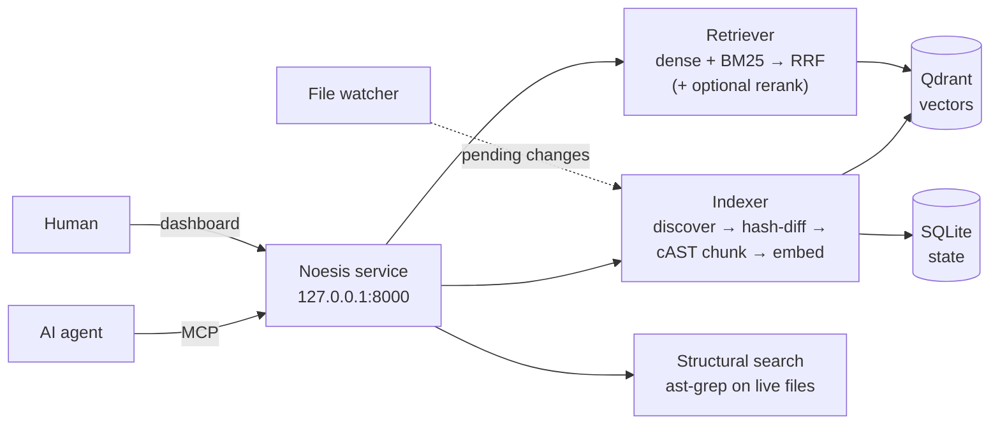

# Noesis

{ .noesis-banner }
{ .noesis-banner }

**Beyond search. Toward understanding.**

Noesis is an AI-native code-understanding engine. It gives AI agents deep,
current knowledge of your codebase through **hybrid retrieval** (dense
embeddings + lexical BM25 + optional reranking), **structural AST search**, and
**local-first incremental indexing** — with a human dashboard and a file
watcher that keep the index fresh.

**MCP is the primary interface** (agents consume retrieval over MCP); REST is
the secondary interface (dashboard + scripting). Everything runs on
`127.0.0.1` only: after a one-time asset download, no code, query, or metadata
ever leaves the machine ([ADR-25](project/decisions.md)).

## How it works in 30 seconds

1. **Register** a repo or folder. The indexer discovers indexable files,
   chunks them along AST boundaries, embeds each chunk locally, and writes
   vectors to Qdrant plus per-file state to SQLite.
2. **Search** — a natural-language query fuses semantic and lexical results
   (optionally reranked), or an AST pattern matches the live filesystem.
3. The **watcher** notices edits and (opt-in) re-embeds only changed files
   within seconds; the **dashboard** shows health, freshness, and usage.

## Where to go

| I want to… | Start here |
|---|---|
| Install and index my first repo | [Installation](getting-started/installation.md) → [Quickstart](getting-started/quickstart.md) |
| Connect Claude Code or another agent | [Connecting agents (MCP)](getting-started/connecting-agents.md) |
| Understand the design | [Architecture](concepts/architecture.md) and the other Concepts pages |
| Look up a tool, route, or config key | [MCP tools](reference/mcp-tools.md) · [REST API](reference/rest-api.md) · [Configuration](reference/configuration.md) |
| Read the code-level docs | [Internals](internals/embedder.md) · [API reference](api/index.md) |
| See why a decision was made | [Decision log](project/decisions.md) — every decision carries a rationale |
| See what shipped | [Releases](releases.md) |

## The retrieval channels

| Channel | Model | Role | Default |
|---|---|---|---|
| Dense | `nomic-ai/CodeRankEmbed` (768-dim) | semantic "what does this *mean*" | always on |
| Sparse | `Qdrant/bm25` (native IDF) | lexical "find this exact token" | always on |
| Rerank | `BAAI/bge-reranker-v2-m3` | precision reorder of top candidates | **off** (opt-in — [measured](internals/evaluation.md)) |

!!! note "Local-only by construction"
    Model calls go through two boundaries (`core/embedder.py`,
    `core/reranker.py`); nothing in `core/` may make outbound HTTP, and CI
    greps enforce it. See the [security model](concepts/security.md).
