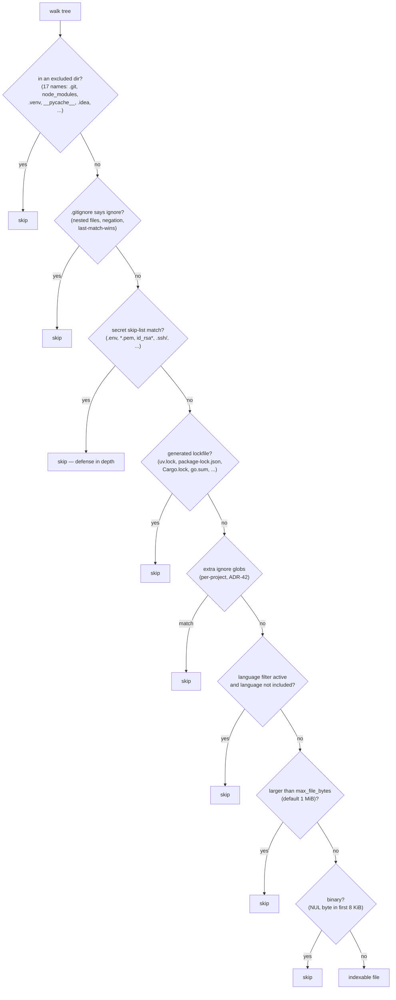

# Discovery

`src/noesis/core/discovery.py` walks a project tree and decides, file by file, what is allowed to enter the index — and, by reuse, what structural search is allowed to scan.

## Role

`discover_files(root, config)` returns sorted, POSIX-style relative paths of indexable files. Every path must survive an ordered ladder of filters:

## The filter layers

| Layer | Contents | Rationale |
|---|---|---|
| `EXCLUDED_DIRS` | 17 directory names (`.git`, `.hg`, `.svn`, `node_modules`, `dist`, `build`, `target`, `.venv`, `venv`, `__pycache__`, `.mypy_cache`, `.pytest_cache`, `.ruff_cache`, `.tox`, `.eggs`, `.idea`, `.vscode`) | never descend — cheap prune at walk time |
| Nested `.gitignore` | `_IgnoreStack` with git's semantics via `pathspec` ([ADR-28](../project/decisions.md)) | each spec is anchored at its directory; deeper specs consulted after shallower ones, so the deepest matching pattern — including negations — decides (last-match-wins) |
| `SECRET_SKIP_PATTERNS` | 22 gitignore-style patterns (`.env`, `.env.*`, `*.pem`, `*.key`, `*.p12`, `*.pfx`, `*.jks`, `*.keystore`, `id_rsa*`, `id_ed25519*`, `id_ecdsa*`, `id_dsa*`, `*.ppk`, `credentials*`, `.netrc`, `.npmrc`, `.pypirc`, `*.tfvars`, `secrets.*`, `*.secret`, `**/.aws/**`, `**/.ssh/**`) | defense-in-depth on top of `.gitignore` — a secret file is skipped even when no `.gitignore` mentions it, so it can never enter the index (a retrievable surface) or structural-search results |
| `GENERATED_SKIP_PATTERNS` | 14 lockfile names (`uv.lock`, `package-lock.json`, `npm-shrinkwrap.json`, `yarn.lock`, `pnpm-lock.yaml`, `bun.lockb`, `Cargo.lock`, `poetry.lock`, `Pipfile.lock`, `go.sum`, `composer.lock`, `Gemfile.lock`, `packages.lock.json`, `flake.lock`) | committed (so not gitignored), text, often huge, pure retrieval noise — indexing one can dominate a small repo's embed cost ([ADR-31](../project/decisions.md)) |
| Extra ignores | per-project gitignore-style globs, anchored at the project root | registration-time scoping ([ADR-42](../project/decisions.md)) |
| Language filter | `include_languages` set; `None` = all | when active, files with no detected language are dropped — the user asked for specific languages |
| Size cap | `max_file_bytes`, default 1 048 576 | embedding cost guard |
| Binary sniff | NUL byte in the first 8192 bytes | text-only index |

## `DiscoveryConfig`

| Field | Default | Meaning |
|---|---|---|
| `max_file_bytes` | `1_048_576` | per-file size cap |
| `follow_symlinks` | `False` | symlink traversal opt-in |
| `include_languages` | `None` | language allowlist; `None` = everything |
| `extra_ignore_patterns` | `()` | additional root-anchored globs |

Per-project overrides for all four are stored on the `projects` row at registration ([ADR-42](../project/decisions.md)); `NULL` columns mean "use the default".

## Key invariants

- **Symlink cycle guard**: traversal tracks `(st_dev, st_ino)` pairs so following symlinks can never loop.
- **Secrets never leak through any surface**: structural search reuses this exact filter chain, so a file discovery would exclude can never appear in `structural_search` results either.
- **Filter order is meaningful**: cheap directory prunes run first; the binary sniff (which opens the file) runs last.
- The walk yields deterministic, sorted output — stable across runs for identical trees.
