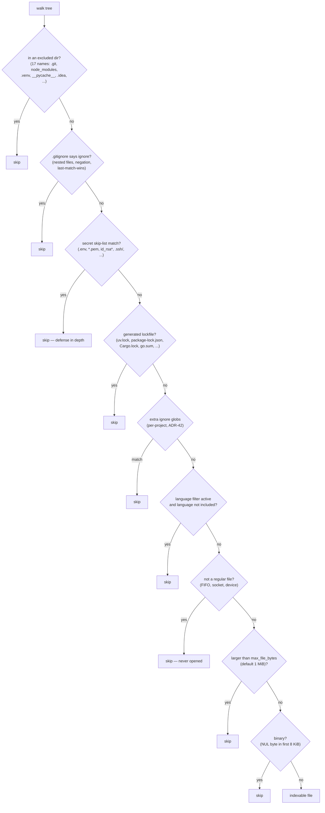

# Discovery

`src/noesis/core/discovery.py` walks a project tree and decides, file by file, what is allowed to enter the index — and, by reuse, what structural search is allowed to scan.

## Role

`discover_files(root, config)` returns sorted, POSIX-style relative paths of indexable files. Every path must survive an ordered ladder of filters:

```mermaid
flowchart TB
    A["walk tree"] --> B{"in an excluded dir?\n(17 names: .git, node_modules,\n.venv, __pycache__, .idea, ...)"}
    B -- yes --> X1["skip"]
    B -- no --> C{".gitignore says ignore?\n(nested files, negation,\nlast-match-wins)"}
    C -- yes --> X2["skip"]
    C -- no --> D{"secret skip-list match?\n(.env, *.pem, id_rsa*, .ssh/, ...)"}
    D -- yes --> X3["skip — defense in depth"]
    D -- no --> E{"generated lockfile?\n(uv.lock, package-lock.json,\nCargo.lock, go.sum, ...)"}
    E -- yes --> X4["skip"]
    E -- no --> F{"extra ignore globs\n(per-project, ADR-42)"}
    F -- match --> X5["skip"]
    F -- no --> G{"language filter active\nand language not included?"}
    G -- yes --> X6["skip"]
    G -- no --> N{"not a regular file?\n(FIFO, socket, device)"}
    N -- yes --> X9["skip — never opened"]
    N -- no --> H{"larger than max_file_bytes\n(default 1 MiB)?"}
    H -- yes --> X7["skip"]
    H -- no --> I{"binary?\n(NUL byte in first 8 KiB)"}
    I -- yes --> X8["skip"]
    I -- no --> J["indexable file"]
```

## The filter layers

| Layer | Contents | Rationale |
|---|---|---|
| `EXCLUDED_DIRS` | 17 directory names (`.git`, `.hg`, `.svn`, `node_modules`, `dist`, `build`, `target`, `.venv`, `venv`, `__pycache__`, `.mypy_cache`, `.pytest_cache`, `.ruff_cache`, `.tox`, `.eggs`, `.idea`, `.vscode`) | never descend — cheap prune at walk time |
| Nested `.gitignore` | `_IgnoreStack` with git's semantics via `pathspec` ([ADR-28](../project/decisions.md)) | each spec is anchored at its directory; deeper specs consulted after shallower ones, so the deepest matching pattern — including negations — decides (last-match-wins) |
| `SECRET_SKIP_PATTERNS` | 22 gitignore-style patterns (`.env`, `.env.*`, `*.pem`, `*.key`, `*.p12`, `*.pfx`, `*.jks`, `*.keystore`, `id_rsa*`, `id_ed25519*`, `id_ecdsa*`, `id_dsa*`, `*.ppk`, `credentials*`, `.netrc`, `.npmrc`, `.pypirc`, `*.tfvars`, `secrets.*`, `*.secret`, `**/.aws/**`, `**/.ssh/**`) | defense-in-depth on top of `.gitignore` — a secret file is skipped even when no `.gitignore` mentions it, so it can never enter the index (a retrievable surface) or structural-search results |
| `GENERATED_SKIP_PATTERNS` | 14 lockfile names (`uv.lock`, `package-lock.json`, `npm-shrinkwrap.json`, `yarn.lock`, `pnpm-lock.yaml`, `bun.lockb`, `Cargo.lock`, `poetry.lock`, `Pipfile.lock`, `go.sum`, `composer.lock`, `Gemfile.lock`, `packages.lock.json`, `flake.lock`) | committed (so not gitignored), text, often huge, pure retrieval noise — indexing one can dominate a small repo's embed cost ([ADR-31](../project/decisions.md)) |
| Extra ignores | per-project gitignore-style globs, anchored at the project root | registration-time scoping ([ADR-42](../project/decisions.md)) |
| Language filter | `include_languages` set; `None` = all | when active, files with no detected language are dropped — the user asked for specific languages |
| File-type gate | `stat.S_ISREG` on the `stat` the size cap already needs | only regular files are ever opened. A FIFO reports `st_size` 0, so it passed the size cap, and the binary sniff's `open()` then blocked until some process opened the write end — hanging discovery inside its worker thread with nothing raising. Device and socket nodes are skipped here too, explicitly rather than by accident |
| Size cap | `max_file_bytes`, default 1 048 576 | embedding cost guard |
| Binary sniff | NUL byte in the first 8192 bytes | text-only index |

## Failures are reported, not swallowed

`discover_files(root, config, errors=…)` takes an optional `DiscoveryErrors`
collector with two lists of `(path, message)` pairs: `files` and `dirs`. When
it is omitted, failures are skipped silently exactly as before — the
structural-search and registration-preview callers rely on that.

The distinction the collector exists to make is between a path that is *gone*
and a path that could not be *read*:

| Failure | Treated as | Why |
|---|---|---|
| `FileNotFoundError` / `NotADirectoryError` on a file or **subdirectory** | genuine deletion — not recorded | the filesystem is ground truth at the moment it is read |
| the same errors on the **walk root itself** | recorded in `errors.dirs` as `<root>` | `os.walk` routes the root's own scandir failure through the same hook, and an unmounted or renamed root arrives as `FileNotFoundError`. A missing root is never evidence that files were deleted — it is evidence the scan could not run |
| any other `OSError` on a file (`EACCES`, `EIO`, `ESTALE`, …) | recorded in `errors.files` | the file still exists; it was merely unreadable this run |
| any other `OSError` from `os.walk` (via its `onerror` hook) | recorded in `errors.dirs` | part of the tree went unwalked; its contents are unknown |

This matters because everything downstream infers deletion from *absence*. A
path missing from the walk is indistinguishable from a path deleted on disk,
so a transient fault on a network mount used to purge every chunk under an
unreadable subtree — and then advance the git anchor, making the loss
permanent. The indexer now gives file-level errors the same carry-forward
treatment as a hash-time failure, and a directory-level error suppresses
deletion and orphan pruning for the whole run ([ADR-51](../project/decisions.md)).

Directory paths are recorded relative to the root, or as the sentinel
`<root>` when the walk failed at the root itself.

## `DiscoveryConfig`

| Field | Default | Meaning |
|---|---|---|
| `max_file_bytes` | `1_048_576` | per-file size cap |
| `follow_symlinks` | `False` | symlink traversal opt-in |
| `include_languages` | `None` | language allowlist; `None` = everything |
| `extra_ignore_patterns` | `()` | additional root-anchored globs |

Per-project overrides for all four are stored on the `projects` row at registration ([ADR-42](../project/decisions.md)); `NULL` columns mean "use the default".

## Key invariants

- **Symlink cycle guard**: traversal tracks `(st_dev, st_ino)` pairs so following symlinks can never loop.
- **Secrets never leak through any surface**: structural search reuses this exact filter chain, so a file discovery would exclude can never appear in `structural_search` results either.
- **Filter order is meaningful**: cheap directory prunes run first; the binary sniff (which opens the file) runs last, and nothing opens a path that is not a regular file.
- **Absence is never assumed to mean deletion**: a path can only fall out of the walk silently when the filesystem said it was genuinely gone. Every other failure is reported to the caller.
- The walk yields deterministic, sorted output — stable across runs for identical trees.
