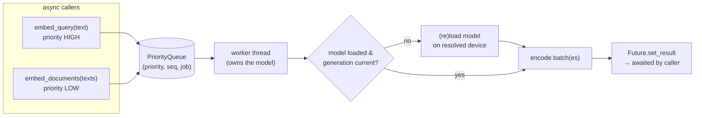

# Embedder

Every embedding call in Noesis goes through one tiny async Protocol defined in `src/noesis/core/embedder.py` — the first of the two model-loading boundaries in the codebase.

## Role

The `Embedder` Protocol is the plug-in boundary between the retrieval/indexing pipeline and whatever local model produces vectors:

```python
@runtime_checkable
class Embedder(Protocol):
    @property
    def model_id(self) -> str: ...
    @property
    def dim(self) -> int: ...
    async def embed_documents(self, texts: list[str]) -> list[list[float]]: ...
    async def embed_query(self, text: str) -> list[float]: ...
```

Three implementations exist:

| Implementation | Purpose | Model | Dim |
|---|---|---|---|
| `LocalSTEmbedder` | production default | `nomic-ai/CodeRankEmbed` | 768 |
| `FakeEmbedder` | offline tests (sha256-derived vectors, no download) | `fake-embedder-v1` | 8 |
| Alternative local models | documented upgrade path ([ADR-24](../project/decisions.md)) | Qwen3-Embedding-0.6B / nomic-embed-code | 1024 / 3584 |

## Design decisions

- **Why the interface is deliberately tiny.** The documented local upgrade paths differ in vector dimension (768 / 1024 / 3584) and instruction handling. Everything downstream reads `dim` (the Qdrant collection is created from `embedder.dim`, never a hardcoded size) and `model_id`, so swapping models is a configuration change, not a refactor. See [ADR-24](../project/decisions.md).
- **`model_id` is the versioning key.** It is written to the Qdrant payload and to SQLite `projects.embedding_model`. Changing the model triggers the full re-embed rule, and the system refuses to serve mixed-model results — no new mechanism was needed, which is exactly why the abstraction is cheap.
- **The query prefix is private.** CodeRankEmbed requires the instruction prefix `"Represent this query for searching relevant code: "` on queries (and only queries). `LocalSTEmbedder` applies it inside `embed_query`; callers never see or apply prefixes. An instruction-aware alternative model would handle its own convention behind the same method.
- **Local-only, structurally.** The Protocol has no credentials or transport surface; remote embedding was rejected outright ([ADR-25](../project/decisions.md)). `sentence_transformers` is imported lazily inside the loader and this module is one of only two allowed import sites ([ADR-33](../project/decisions.md)) — CI greps enforce it.
- **Device hot-swap via generation bump ([ADR-40](../project/decisions.md)).** `set_device()` increments a generation counter; the worker reloads the model when its loaded generation falls behind. Because the single worker thread owns the model, the swap is race-free by construction — in-flight jobs finish on the old device. Device resolution is explicit (`core/compute.py`) rather than trusting sentence-transformers auto-detect, which was observed picking CPU on a CUDA box.

## Concurrency model

`LocalSTEmbedder` runs one dedicated worker thread that owns the model — forward passes are never concurrent. Jobs flow through a `queue.PriorityQueue` of `(priority, seq, job)`:

| Priority | Value | Used by |
|---|---|---|
| `_HIGH` | 0 | `embed_query` — interactive path |
| `_LOW` | 1 | `embed_documents` — indexing path |
| `_SHUTDOWN` | 2 | `close()` sentinel — drains queued jobs first |

An interactive query therefore preempts queued indexing batches: freshness lags under query load and recovers. `seq` is a monotonic counter keeping FIFO order within a priority class.



The worker starts lazily on the first embed call (daemon thread, so never calling `close()` is safe) and the model loads inside the worker on its first job. Documents are encoded in batches of `batch_size` (default 32).

## Key invariants

- No module outside `core/embedder.py` and `core/reranker.py` imports `sentence_transformers` (hard rule 1, CI-enforced).
- Nothing outside the boundary knows the vector size except by reading `dim`.
- A query embedding of a text is never equal to its document embedding — `FakeEmbedder` mirrors the prefix seam precisely so tests catch prefix misuse.
- Worker exceptions propagate to the awaiting caller via the future; they never kill the worker thread.
- Log lines record `model_id` and device only — never code or query text ([ADR-25](../project/decisions.md)).
