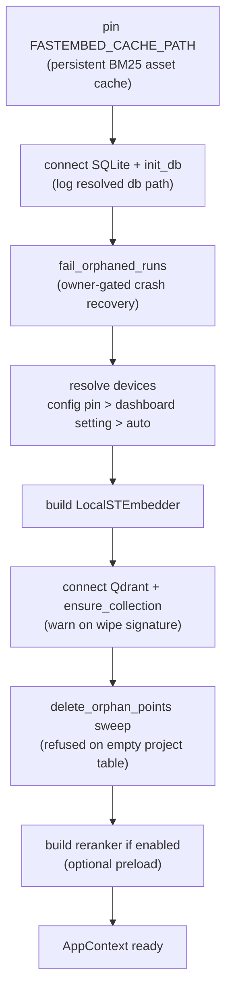

# Runtime & process model

`src/noesis/runtime.py` builds and tears down the core resources; `src/noesis/app.py` wraps them in the FastAPI + MCP process; `src/noesis/mcp/__main__.py` is the standalone stdio server. Both transports share one build path so their wiring cannot diverge.

## `AppContext`

The single dataclass every adapter reads:

| Field | Meaning |
|---|---|
| `conn` | SQLite connection (WAL) |
| `store` | `VectorStore` over the Qdrant client |
| `embedder` | active `Embedder` |
| `reranker` | `Reranker` or `None` — `reranker.enabled=false` removes the model entirely |
| `rerank_candidates` | fused-candidate depth reranked per request (default 50) |
| `embed_batch_size` | outer embed-batch size for index runs (default 32) |
| `structural` | `StructuralSettings` (max results, timeout) |
| `git_fast_path` | git fast-path toggle |
| `jobs` / `progress` | background index tasks and their live progress |
| `watcher` | `WatcherManager`, owned by the lifespan |
| `config_device_pin` / `config_reranker_device_pin` | config.toml device pins — the dashboard device control defers to them |

## `build_runtime_context` — startup order

Shared by the FastAPI lifespan and the stdio entry point. The order is deliberate:

- **Cache pin first**: without it fastembed defaults to the system tmp dir, which evaporates on reboot and would trigger a runtime re-download — the one thing the offline posture forbids.
- **Crash recovery in two halves**: `fail_orphaned_runs` clears SQLite rows a dead process left `running`; `delete_orphan_points` clears the Qdrant points one left behind. Startup is the only safe moment for the sweep — no run of this process is in flight, and a project row is always committed before its first point is written, so a co-process mid-indexing can never look like an orphan.
- **Wipe signature warning**: if `ensure_collection` had to *create* the collection while the state DB already tracks indexed files, the collection was wiped externally — logged loudly; a full reindex self-heals by re-embedding drifted files ([ADR-49](../project/decisions.md)).
- **Device precedence ([ADR-40](../project/decisions.md))**: a config.toml pin wins (operator config is never second-guessed by UI state), then the dashboard's persisted choice, then auto-detect (`cuda` → `mps` → `cpu`).

## Teardown order (H5)

`close_runtime_context`: **cancel jobs → await their unwind → close model workers → close SQLite.** Cancelling a task only schedules `CancelledError`; the cancelled run still has to resume and execute its exception handler, which writes the run row as failed. Closing the connection first would make that final write raise and leave the row stuck `running`.

## The two transports

**HTTP process** (`uvicorn noesis.app:app --host 127.0.0.1 --port 8000`): `create_app()` builds one FastAPI app with the REST router, dashboard router, static files, and the FastMCP server mounted at `/mcp` via `mcp.http_app(path="/")`, with `combine_lifespans` initializing the MCP session manager alongside the core resources. `TrustedHostMiddleware` (`127.0.0.1`, `localhost`, `testserver`) closes the DNS-rebinding class: binding localhost stops remote hosts, but a browser visiting a page whose domain re-resolves to `127.0.0.1` would otherwise reach mutation endpoints. MCP tools resolve the context lazily per call, so they can only run after the lifespan has set it.

**stdio process** (`python -m noesis.mcp`): serves the same six tools for agent hosts that spawn local servers. Core resources are built inside the FastMCP lifespan so they live on the serving event loop. `runtime.py` exists precisely so this entry point never imports `noesis.app`, whose module body builds an entire FastAPI app at import time — any failure there would kill the stdio server before `main()` runs.

Both processes may share one state DB and one Qdrant collection; the owner-stamped run rows and `BEGIN IMMEDIATE` launch guard keep them from racing runs (see [SQLite schema](sqlite-schema.md)).

## Prefetch (`python -m noesis.prefetch`)

The only module whose job is to trigger downloads — deliberately outside `core/`. Fetches: tree-sitter grammars for every canonical language (missing grammar = degraded line-chunk fallback, not fatal), the embedding weights (via the Embedder boundary — one `embed_query` forces the download), the reranker weights (via a `preload`, skippable with `--skip-reranker`), and fastembed's ~100 KB BM25 tokenizer assets. Flags: `--skip-model`, `--model`, `--skip-reranker`, `--reranker-model`. The fastembed cache is anchored to `$XDG_CACHE_HOME/noesis/fastembed` (cwd-independent) so prefetch and every serving process resolve one cache. After prefetch, the service makes zero outbound network calls at runtime.

## Logging

`configure_logging()` (`src/noesis/logging_config.py`) is idempotent and writes to **stderr only** — stdout belongs to the stdio JSON-RPC stream. The stdio entry point additionally passes `propagate=False` so a host root handler bound to stdout can never receive these records and corrupt the protocol. Log lines carry paths, model ids, devices, and counts — never code, query text, or chunk content ([ADR-25](../project/decisions.md)).
