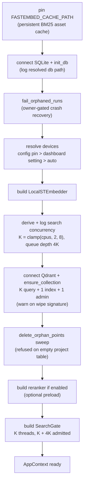

# Runtime & process model

`src/noesis/runtime.py` builds and tears down the core resources; `src/noesis/app.py` wraps them in the FastAPI + MCP process; `src/noesis/mcp/__main__.py` is the standalone stdio server, or — with `--shared` — a proxy onto one shared HTTP server that builds nothing itself. Both transports share one build path so their wiring cannot diverge.

## `AppContext`

The single dataclass every adapter reads:

| Field | Meaning |
|---|---|
| `conn` | SQLite connection (WAL) |
| `store` | `VectorStore` over the Qdrant connections — K query + 1 index + 1 admin ([ADR-83](../project/decisions.md), see [vector store](vector-store.md#connection-model-adr-83)) |
| `embedder` | active `Embedder` |
| `reranker` | `Reranker` or `None` — `reranker.enabled=false` removes the model entirely |
| `search_gate` | `SearchGate` — the bounded search executor and its admission control ([ADR-84](../project/decisions.md)). Defaulted via factory, never `None`, so there is exactly **one** search path: a permanent unbounded fallback would be the old default-executor behaviour surviving under a new name |
| `rerank_candidates` | fused-candidate depth reranked per request (default 50) |
| `embed_batch_size` | outer embed-batch size for index runs (default 32) |
| `structural` | `StructuralSettings` (max results, timeout) |
| `git_fast_path` | git fast-path toggle |
| `jobs` / `progress` | background index tasks and their live progress |
| `watcher` | `WatcherManager`, owned by the lifespan |
| `config_device_pin` / `config_reranker_device_pin` | config.toml device pins — the dashboard device control defers to them |

## `build_runtime_context` — startup order

Shared by the FastAPI lifespan and the stdio entry point. The order is deliberate:

```mermaid
flowchart TB
    A["pin FASTEMBED_CACHE_PATH\n(persistent BM25 asset cache)"] --> B["connect SQLite + init_db\n(log resolved db path)"]
    B --> C["fail_orphaned_runs\n(owner-gated crash recovery)"]
    C --> D["resolve devices\nconfig pin > dashboard setting > auto"]
    D --> E["build LocalSTEmbedder"]
    E --> P["derive + log search concurrency\nK = clamp(cpus, 2, 8), queue depth 4K"]
    P --> F["connect Qdrant + ensure_collection\nK query + 1 index + 1 admin\n(warn on wipe signature)"]
    F --> G["delete_orphan_points sweep\n(refused on empty project table)"]
    G --> H["build reranker if enabled\n(optional preload)"]
    H --> S["build SearchGate\nK threads, K + 4K admitted"]
    S --> I["AppContext ready"]
```

- **Cache pin first**: without it fastembed defaults to the system tmp dir, which evaporates on reboot and would trigger a runtime re-download — the one thing the offline posture forbids.
- **Crash recovery in two halves**: `fail_orphaned_runs` clears SQLite rows a dead process left `running`; `delete_orphan_points` clears the Qdrant points one left behind. Startup is the only safe moment for the sweep — no run of this process is in flight, and a project row is always committed before its first point is written, so a co-process mid-indexing can never look like an orphan.
- **Wipe signature warning**: if `ensure_collection` had to *create* the collection while the state DB already tracks indexed files, the collection was wiped externally — logged loudly; a full reindex self-heals by re-embedding drifted files ([ADR-49](../project/decisions.md)).
- **Device precedence ([ADR-40](../project/decisions.md))**: a config.toml pin wins (operator config is never second-guessed by UI state), then the dashboard's persisted choice, then auto-detect (`cuda` → `mps` → `cpu`).
- **Concurrency resolved before the connections are made**: `K` is derived and logged — with the CPU count and whether it was configured or derived — before any client exists, because a derived value nobody can see is a value nobody can debug. The *same* number then sizes the query pool and the `SearchGate`; they must be 1:1, or a checked-out search waits on a connection no thread is holding, or the reverse.

## Search concurrency (ADR-83/84)

`SearchGate` (`src/noesis/core/search_gate.py`) does two jobs that have to agree on one number, which is why they live in one object.

**Bounding.** Every `store.search` used to land on CPython's default executor — `min(32, cpu+4)` threads, process-wide, shared with the indexer's ~15 `to_thread` sites, its git subprocesses, hashing and file reads. That pool is neither sized for search nor reserved for it. The gate runs search on its own executor, sized to exactly the number of Qdrant query connections, so a thread is free exactly when a connection is. That 1:1 pairing is the invariant, and it is also why **only search runs here**: `get_chunk` and the point counts stay on the default executor because they use the admin connection, so giving them a slot would burn a thread no connection is backing.

**Rejecting.** A bounded executor on its own only moves an unbounded backlog from one queue to another. So the gate admits at most `connections + queue_depth` calls and refuses the rest with `SearchOverloaded`. Under many agents the honest failure is a fast, legible rejection rather than a request that sits for an unbounded time — a silent stall is the failure mode this whole change exists to remove.

| Surface | At capacity |
|---|---|
| REST `POST /search` | **429** with a `Retry-After` header and the live counts in `detail` |
| MCP `search_code` | `ToolError` stating that nothing failed and nothing ran, what to retry, and which knob raises the limit |

429 and not 503: 503 is also what a dead or unreachable server returns, and a client that cannot tell "busy" from "down" retries the wrong way. Connection-refused and a failing `/healthz` already mean down; this means slow down. `Retry-After` is a flat conservative integer rather than a computed estimate — the header takes integer seconds, and a derived figure would be a guess dressed as a measurement, so the message carries the real counts instead and lets the caller judge.

### Index-run cap ([ADR-85](../project/decisions.md))

`try_start_run` already guaranteed one run per project across processes, via `BEGIN IMMEDIATE` plus an owner-liveness probe, but nothing capped the total: N registered projects with `auto_reindex` could start N runs at once against one embedder worker, one index connection and one executor. `[indexing] max_concurrent_index_runs` (default 4) is enforced **inside that same transaction**, because that is the only place it can be atomic across processes — an `asyncio.Semaphore` would bound the HTTP server while the stdio MCP process proceeded unaware, and the documented deployment runs both against one DB. The running-row scan is global for the same reason, so the dead-owner cleanup now covers other projects' orphans too; a crashed co-process's stale row would otherwise count against the cap until the next restart.

It surfaces as a typed `IndexCapacityReached`, deliberately **not** a third return status: `watcher.py` matches the literal `"already_running"` string to decide whether to re-arm its quiet-period trigger, so a new status would have fallen through, counted a run that never started, and left pending files sitting until the user touched another file. Every call site handles it explicitly — REST `/projects`, `/reindex` and the dashboard's reindex-pending answer 429 with `Retry-After`; MCP `reindex` raises a `ToolError` saying nothing was started; the watcher defers, re-arms and does **not** count the run. A project's own live run still reads as `already_running`, which is a truthful answer about work already happening.

## Teardown order (H5)

`close_runtime_context`: **cancel jobs → await their unwind → close the search gate → close model workers → stop the telemetry writer → close SQLite.** Cancelling a task only schedules `CancelledError`; the cancelled run still has to resume and execute its exception handler, which writes the run row as failed. Closing the connection first would make that final write raise and leave the row stuck `running`.

The search gate closes *before* the store: an in-flight search holds one of the store's query connections, and closing the store under it would pull the connection out from beneath a live call. Every close in that sequence runs under `await asyncio.to_thread(...)`, which preserves the ordering while keeping the joins off the event loop. Each model worker's `close()` joins its thread with a 5 s bound (a stuck load is abandoned, never waited on forever), and the telemetry writer has its own bounded join — invoked synchronously from an async teardown, those would stall the loop for up to 5 s apiece, and in the combined lifespan that stalls the MCP session manager's shutdown along with it. The telemetry writer must be stopped here rather than left to process exit: it holds its own handle to the state DB, which would otherwise outlive `conn`, block temp-directory cleanup on Windows and WSL, and survive a DB-file removal ([ADR-52](../project/decisions.md)). Stopping it also empties its queue: rows ahead of the shutdown sentinel are written by the exiting worker. With one exception: if the join times out, the queue is left alone. The writer still owns it and has not reached the sentinel, so draining would swallow the sentinel and leave that thread blocked on `get()` forever with its connections open — the leak this teardown exists to prevent, arriving through it.

**The writer is per `AppContext`, not per process** ([ADR-59](../project/decisions.md), [issue #27](https://github.com/behl1anmol/Noesis/issues/27)). `ctx.telemetry` is a `QueryTelemetry` instance the context owns, so this teardown closes *its* writer and cannot reach anyone else's — two live contexts in one process have two independent writers, two queues and two sets of handles. That is what makes `close()` **terminal**: a `record_query` arriving after teardown drops its row instead of starting a fresh worker with a fresh `state.connect()` handle the closing context would never reap. Measured at the pre-change tip, a single post-teardown `record_query` left one file descriptor on the state DB with no owner; it now leaves none.

Terminality was previously rejected as costing *"a module-global that every test building a second context would have to reset"* ([PR #24](https://github.com/behl1anmol/Noesis/pull/24) round-7 review). That was a property of the global rather than an argument against terminal state: with instance state there is nothing to reset, because a second context simply constructs a second writer that is open from birth — the same shape `LocalSTEmbedder` has always had one directory over. Dropping the late row is deliberate and does not follow the embedder's lead in raising: a refused embedding is a correctness loss, while a refused telemetry row is this module's documented contract, so it is logged at DEBUG and the query path never sees an exception.

## The two transports

**HTTP process** (`uvicorn noesis.app:app --host 127.0.0.1 --port 8000`): `create_app()` builds one FastAPI app with the REST router, dashboard router, static files, and the FastMCP server mounted at `/mcp` via `mcp.http_app(path="/")`, with `combine_lifespans` initializing the MCP session manager alongside the core resources. `TrustedHostMiddleware` (`127.0.0.1`, `localhost`, `testserver`) closes the DNS-rebinding class: binding localhost stops remote hosts, but a browser visiting a page whose domain re-resolves to `127.0.0.1` would otherwise reach mutation endpoints. MCP tools resolve the context lazily per call, so they can only run after the lifespan has set it.

**stdio process** (`python -m noesis.mcp`): serves the same six tools for agent hosts that spawn local servers. Core resources are built inside the FastMCP lifespan so they live on the serving event loop. `runtime.py` exists precisely so this entry point never imports `noesis.app`, whose module body builds an entire FastAPI app at import time — any failure there would kill the stdio server before `main()` runs.

**Shim process** (`python -m noesis.mcp --shared`, [ADR-86](../project/decisions.md)): a third process *shape* over the same two transports — stdio inwards, HTTP outwards. It builds no `AppContext` at all: no model, no Qdrant pool, no state-DB handle, just `fastmcp`'s proxy onto the shared server's `/mcp/` mount. That is what makes it 165 MB against a standalone server's 1342 MB, and it is only correct because ADR-83/84/85 made one process safe to serve every agent — one server answering every agent's query *is* the reader-vs-reader concurrency that used to corrupt results.

Its singleton election is in `src/noesis/mcp/shim.py`: probe the configured port (no lock, 0.07 s warm), else take an exclusive `filelock`, re-check under it, then spawn the server detached and poll `/healthz` with bounded backoff. `filelock` over a PID file or a SQLite row for one property neither has — the OS releases it when the holder dies, so a killed starter cannot wedge every future shim — and the port bind is the final arbiter behind all of it. The port is configured (`[server] port`), never discovered; there is no endpoint file, and [connecting agents](../getting-started/connecting-agents.md#option-c-shared-server-via-the-stdio-shim) has the operator-facing version.

Both processes may share one state DB and one Qdrant collection; the owner-stamped run rows and `BEGIN IMMEDIATE` launch guard keep them from racing runs, and that same guard now carries the machine-wide run cap (see [SQLite schema](sqlite-schema.md)).

## Prefetch (`python -m noesis.prefetch`)

The only module whose job is to trigger downloads — deliberately outside `core/`. Fetches: tree-sitter grammars for every canonical language (missing grammar = degraded line-chunk fallback, not fatal), the embedding weights (via the Embedder boundary — one `embed_query` forces the download), the reranker weights (via a `preload`, skippable with `--skip-reranker`), and fastembed's ~100 KB BM25 tokenizer assets. Flags: `--skip-model`, `--model`, `--skip-reranker`, `--reranker-model`. The fastembed cache is anchored to `$XDG_CACHE_HOME/noesis/fastembed` (cwd-independent) so prefetch and every serving process resolve one cache. After prefetch, the service makes zero outbound network calls at runtime.

## Logging

`configure_logging()` (`src/noesis/logging_config.py`) is idempotent and writes to **stderr only** — stdout belongs to the stdio JSON-RPC stream. The stdio entry point additionally passes `propagate=False` so a host root handler bound to stdout can never receive these records and corrupt the protocol. Log lines carry paths, model ids, devices, and counts — never code, query text, or chunk content ([ADR-25](../project/decisions.md)).
