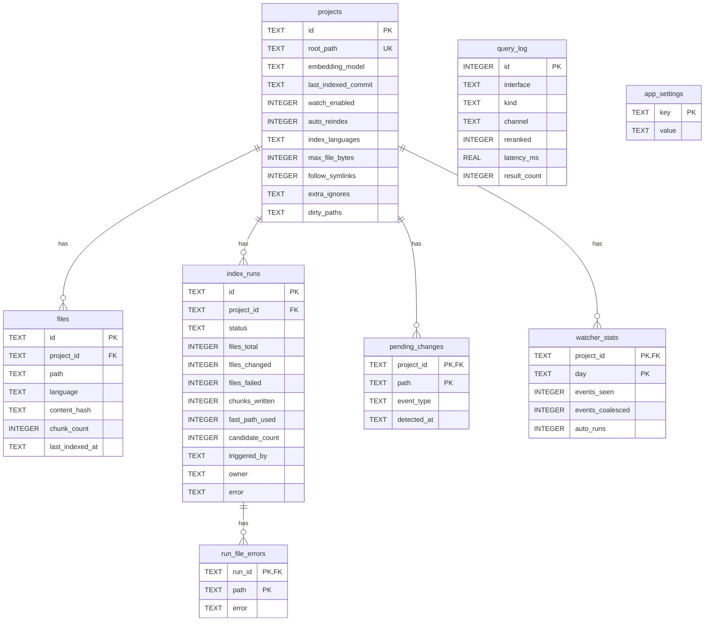

# SQLite schema

All relational state lives in one WAL-mode SQLite file (`src/noesis/core/state.py`), default `~/.local/share/noesis/noesis.sqlite`. All mutating functions commit before returning — callers never manage transactions.

## Connection pragmas

| Pragma | Value | Why |
|---|---|---|
| `journal_mode` | `WAL` | readers never block the writer; suits the dual-process deployment |
| `synchronous` | `NORMAL` | safe with WAL, faster than FULL |
| `busy_timeout` | `5000` ms | retries on lock contention instead of failing immediately |
| `foreign_keys` | `ON` | FK constraints enforced |

## The eight tables

### `projects`

| Column | Type | Meaning |
|---|---|---|
| `id` | TEXT PK | project id (UUID hex) |
| `root_path` | TEXT UNIQUE | resolved absolute path |
| `embedding_model` | TEXT | versioning key; mismatch on re-register raises `MixedModelError` (mapped to HTTP 409) |
| `created_at`, `updated_at` | TEXT | ISO-8601 UTC |
| `last_indexed_commit` | TEXT NULL | git fast-path anchor; NULL = no fast path |
| `watch_enabled`, `auto_reindex` | INTEGER default 0 | per-project watcher flags, both off by default ([ADR-40](../project/decisions.md)) |
| `index_languages` | TEXT NULL | JSON list; NULL = all languages ([ADR-42](../project/decisions.md)) |
| `max_file_bytes` | INTEGER NULL | NULL = discovery default (1 MiB) |
| `follow_symlinks` | INTEGER default 0 | discovery option |
| `extra_ignores` | TEXT NULL | JSON list of extra ignore globs |
| `dirty_paths` | TEXT NULL | JSON list — working-tree-dirty paths at the last anchor advance, re-admitted as candidates next run |

### `files`

| Column | Type | Meaning |
|---|---|---|
| `id` | TEXT PK | file row id |
| `project_id` | TEXT FK | owning project |
| `path` | TEXT | relative path, `UNIQUE(project_id, path)` |
| `language` | TEXT NULL | canonical language name |
| `content_hash` | TEXT | SHA-256 at last index |
| `chunk_count` | INTEGER | chunks written for this file |
| `last_indexed_at` | TEXT NULL | ISO timestamp |

### `index_runs`

| Column | Type | Meaning |
|---|---|---|
| `id` | TEXT PK | run id returned to clients |
| `project_id` | TEXT FK | owning project |
| `status` | TEXT CHECK | `queued` / `running` / `done` / `failed` |
| `files_total`, `files_changed`, `files_failed` | INTEGER | run outcome counters ([ADR-41](../project/decisions.md)) |
| `chunks_written` | INTEGER | chunks upserted |
| `fast_path_used`, `candidate_count` | INTEGER | git fast-path telemetry — measures the optimization's value per run |
| `triggered_by` | TEXT | `manual` / watcher provenance |
| `owner` | TEXT | process identity that owns the run (see below) |
| `started_at`, `finished_at`, `error` | TEXT | lifecycle |

The remaining tables: `pending_changes` (watcher backlog, PK `(project_id, path)`, `event_type` CHECK `created`/`modified`/`deleted`); `run_file_errors` (per-file failure containment, PK `(run_id, path)`); `query_log` (metadata-only telemetry — interface `rest`/`mcp`, kind `search`/`structural`, channel, reranked, latency, result count — **never query text**, [ADR-25](../project/decisions.md)); `watcher_stats` (per-project per-day event counters); `app_settings` (key/value, e.g. the dashboard compute-device setting).

## Design decisions

- **Additive, guarded migrations.** `CREATE TABLE IF NOT EXISTS` never alters an existing table, so every schema evolution is an `ALTER TABLE ... ADD COLUMN` in the `_MIGRATIONS` tuple, applied only when `PRAGMA table_info` shows the column missing. The loop runs under `BEGIN IMMEDIATE` because the dual-transport deployment (HTTP + stdio MCP on one DB) can call `init_db` concurrently — an unguarded check-then-ALTER races into a `duplicate column name` error that `busy_timeout` cannot retry. Older DBs upgrade in place.
- **Owner identity `<boot>:<pid>:<starttime>`.** Each process stamps runs with a token built from the kernel boot id, its PID, and the process start time from `/proc/<pid>/stat` field 22. This closes both recycling holes: a different boot id means reboot (dead), and a matching PID with a different start time means the PID was recycled within one boot (also dead).
- **Crash recovery is owner-gated.** `fail_orphaned_runs` (startup) marks `running` runs as `failed('interrupted')` only when their owning process is dead — a starting process must never kill the other live process's run, which would both lose the run and disarm the concurrent-run guard. Rows with no owner (pre-M7 DBs) are treated as dead.
- **Atomic run launch.** `try_start_run` opens a run under `BEGIN IMMEDIATE`, so the running-check and insert are one unit even across processes — two transports cannot race two runs onto the same collection. Dead-owner `running` rows found here are failed immediately rather than waiting for the next restart.
- **Typed conflict.** `MixedModelError` is a typed exception so adapters map it to HTTP 409 without matching message text.

## Key invariants

- One writer at a time per project run — enforced by the DB, not by in-process locks.
- Every mutating helper commits before returning; there are no long-lived transactions.
- `query_log` never stores query text — telemetry is metadata-only by design.
- Schema upgrades never rewrite or drop data; they only add nullable/defaulted columns.
