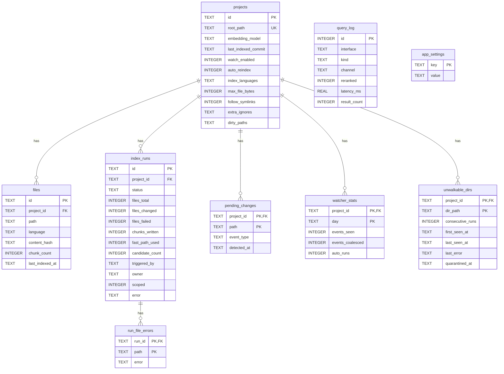

# SQLite schema

All relational state lives in one WAL-mode SQLite file (`src/noesis/core/state.py`), default `~/.local/share/noesis/noesis.sqlite`. All mutating functions commit before returning — callers never manage transactions.

## Connection pragmas

| Pragma | Value | Why |
|---|---|---|
| `journal_mode` | `WAL` | readers never block the writer; suits the dual-process deployment |
| `synchronous` | `NORMAL` | safe with WAL, faster than FULL |
| `busy_timeout` | `5000` ms | retries on lock contention instead of failing immediately |
| `foreign_keys` | `ON` | FK constraints enforced |

## The nine tables

```mermaid
erDiagram
    projects ||--o{ files : "has"
    projects ||--o{ index_runs : "has"
    projects ||--o{ pending_changes : "has"
    projects ||--o{ watcher_stats : "has"
    projects ||--o{ unwalkable_dirs : "has"
    index_runs ||--o{ run_file_errors : "has"

    projects {
        TEXT id PK
        TEXT root_path UK
        TEXT embedding_model
        TEXT last_indexed_commit
        INTEGER watch_enabled
        INTEGER auto_reindex
        TEXT index_languages
        INTEGER max_file_bytes
        INTEGER follow_symlinks
        TEXT extra_ignores
        TEXT dirty_paths
    }
    files {
        TEXT id PK
        TEXT project_id FK
        TEXT path
        TEXT language
        TEXT content_hash
        INTEGER chunk_count
        TEXT last_indexed_at
    }
    index_runs {
        TEXT id PK
        TEXT project_id FK
        TEXT status
        INTEGER files_total
        INTEGER files_changed
        INTEGER files_failed
        INTEGER chunks_written
        INTEGER fast_path_used
        INTEGER candidate_count
        TEXT triggered_by
        TEXT owner
        INTEGER scoped
        TEXT error
    }
    pending_changes {
        TEXT project_id PK, FK
        TEXT path PK
        TEXT event_type
        TEXT detected_at
    }
    run_file_errors {
        TEXT run_id PK, FK
        TEXT path PK
        TEXT error
    }
    query_log {
        INTEGER id PK
        TEXT interface
        TEXT kind
        TEXT channel
        INTEGER reranked
        REAL latency_ms
        INTEGER result_count
    }
    watcher_stats {
        TEXT project_id PK, FK
        TEXT day PK
        INTEGER events_seen
        INTEGER events_coalesced
        INTEGER auto_runs
    }
    unwalkable_dirs {
        TEXT project_id PK, FK
        TEXT dir_path PK
        INTEGER consecutive_runs
        TEXT first_seen_at
        TEXT last_seen_at
        TEXT last_error
        TEXT quarantined_at
    }
    app_settings {
        TEXT key PK
        TEXT value
    }
```

### `projects`

| Column | Type | Meaning |
|---|---|---|
| `id` | TEXT PK | project id (UUID hex) |
| `root_path` | TEXT UNIQUE | resolved absolute path |
| `embedding_model` | TEXT | versioning key; mismatch on re-register raises `MixedModelError` (mapped to HTTP 409) |
| `created_at`, `updated_at` | TEXT | ISO-8601 UTC |
| `last_indexed_commit` | TEXT NULL | git fast-path anchor; NULL = no fast path |
| `watch_enabled`, `auto_reindex` | INTEGER default 0 | per-project watcher flags, both off by default ([ADR-40](../project/decisions.md)) |
| `index_languages` | TEXT NULL | JSON list; NULL = all languages ([ADR-42](../project/decisions.md)) |
| `max_file_bytes` | INTEGER NULL | NULL = discovery default (1 MiB) |
| `follow_symlinks` | INTEGER default 0 | discovery option |
| `extra_ignores` | TEXT NULL | JSON list of extra ignore globs |
| `dirty_paths` | TEXT NULL | JSON list — working-tree-dirty paths at the last anchor advance, re-admitted as candidates next run. Scoped watcher runs union the paths they indexed into it as well (they never advance the anchor, so the write that normally accompanies it never fires for them); the union runs in a `BEGIN IMMEDIATE` transaction so two writers cannot lose each other's paths. Cleared by an anchor advance, or — for a project with no git anchor — by any clean full walk, which re-hashes everything and so leaves nothing owing re-admission |

### `files`

| Column | Type | Meaning |
|---|---|---|
| `id` | TEXT PK | file row id |
| `project_id` | TEXT FK | owning project |
| `path` | TEXT | relative path, `UNIQUE(project_id, path)` |
| `language` | TEXT NULL | canonical language name |
| `content_hash` | TEXT | SHA-256 at last index |
| `chunk_count` | INTEGER | chunks written for this file |
| `last_indexed_at` | TEXT NULL | ISO timestamp |

### `index_runs`

| Column | Type | Meaning |
|---|---|---|
| `id` | TEXT PK | run id returned to clients |
| `project_id` | TEXT FK | owning project |
| `status` | TEXT CHECK | `queued` / `running` / `done` / `failed` |
| `files_total`, `files_changed`, `files_failed` | INTEGER | run outcome counters ([ADR-41](../project/decisions.md)) |
| `chunks_written` | INTEGER | chunks upserted |
| `fast_path_used`, `candidate_count` | INTEGER | git fast-path telemetry — measures the optimization's value per run |
| `triggered_by` | TEXT | `manual` / watcher provenance |
| `owner` | TEXT | process identity that owns the run (see below) |
| `scoped` | INTEGER NULL | `1` when the run was given an explicit candidate set, `0` for a full walk. Written at INSERT, not at completion, so a run that crashes still counts toward the promotion trigger ([ADR-57](../project/decisions.md)). NULL means the row predates the column; `scoped_runs_since_full` reads that as a full walk, so the counter starts from zero on an upgraded DB rather than inheriting a fabricated history |
| `started_at`, `finished_at`, `error` | TEXT | lifecycle |

### `unwalkable_dirs`

Directories discovery could not walk, and for how long ([ADR-56](../project/decisions.md)). Empty is the healthy state.

| Column | Type | Meaning |
|---|---|---|
| `project_id`, `dir_path` | TEXT PK | `dir_path` is exactly what `DiscoveryErrors.dirs` reports: a root-relative prefix, the `<root>` sentinel, or an absolute path when the failure could not be attributed to any subtree |
| `consecutive_runs` | INTEGER | failures in a row. Incremented by each run that reports the directory; the row is **deleted** — not zeroed — by a run that proves it reachable, so recovery and reset are the same event |
| `first_seen_at`, `last_seen_at` | TEXT | ISO timestamps. `first_seen_at` survives repeated failures, so the dashboard can show how long this has been going on |
| `last_error` | TEXT | newest errno/message, so an operator sees the current reason rather than the original one |
| `quarantined_at` | TEXT NULL | set once `consecutive_runs` reaches `indexing.unwalkable_quarantine_runs`. Only ever set, never cleared — recovery removes the whole row |

Why a table rather than a JSON column on `projects` (as `dirty_paths` is): it needs per-row counters and timestamps, it has to be queryable for the dashboard, and a read-modify-write blob on the event loop is exactly what `add_dirty_paths` already has to guard against.

**A row here is not a deletion record.** Nothing under an unwalked directory is ever purged — "the walk could not look" is not evidence of absence ([ADR-51](../project/decisions.md)). Quarantine bounds only the *retry*: it stops those paths being re-queued into `pending_changes`, which is what lets a permanently unreadable directory's backlog drain. The deletion decision stays keyed on the run's own unwalked prefixes and is untouched by anything in this table.

The remaining tables: `pending_changes` (watcher backlog, PK `(project_id, path)`, `event_type` CHECK `created`/`modified`/`deleted`); `run_file_errors` (per-file failure containment, PK `(run_id, path)` — `path` is usually a project-relative file, but also carries the `<root>` sentinel, a directory rel for an unwalked subtree, and the `<screening>:` / `<identity>:` synthetic keys of [ADR-58](../project/decisions.md), which exist precisely so a screening fault and a real per-file error on the same `.gitignore` cannot overwrite each other through `INSERT OR REPLACE`); `query_log` (metadata-only telemetry — interface `rest`/`mcp`, kind `search`/`structural`, channel, reranked, latency, result count — **never query text**, [ADR-25](../project/decisions.md)); `watcher_stats` (per-project per-day event counters); `app_settings` (key/value, e.g. the dashboard compute-device setting).

## Design decisions

- **Additive, guarded migrations.** `CREATE TABLE IF NOT EXISTS` never alters an existing table, so every schema evolution is an `ALTER TABLE ... ADD COLUMN` in the `_MIGRATIONS` tuple, applied only when `PRAGMA table_info` shows the column missing. The loop runs under `BEGIN IMMEDIATE` because the dual-transport deployment (HTTP + stdio MCP on one DB) can call `init_db` concurrently — an unguarded check-then-ALTER races into a `duplicate column name` error that `busy_timeout` cannot retry. Older DBs upgrade in place.
- **Owner identity `<boot>:<pid>:<starttime>`.** Each process stamps runs with a token built from the kernel boot id, its PID, and the process start time from `/proc/<pid>/stat` field 22. This closes both recycling holes: a different boot id means reboot (dead), and a matching PID with a different start time means the PID was recycled within one boot (also dead).
- **Crash recovery is owner-gated.** `fail_orphaned_runs` (startup) marks `running` runs as `failed('interrupted')` only when their owning process is dead — a starting process must never kill the other live process's run, which would both lose the run and disarm the concurrent-run guard. Rows with no owner (pre-M7 DBs) are treated as dead.
- **Atomic run launch.** `try_start_run` opens a run under `BEGIN IMMEDIATE`, so the running-check and insert are one unit even across processes — two transports cannot race two runs onto the same collection. Dead-owner `running` rows found here are failed immediately rather than waiting for the next restart.
- **Typed conflict.** `MixedModelError` is a typed exception so adapters map it to HTTP 409 without matching message text.

## Key invariants

- One writer at a time per project run — enforced by the DB, not by in-process locks.
- Every mutating helper commits before returning; there are no long-lived transactions.
- `query_log` never stores query text — telemetry is metadata-only by design.
- Schema upgrades never rewrite or drop data; they only add nullable/defaulted columns.
