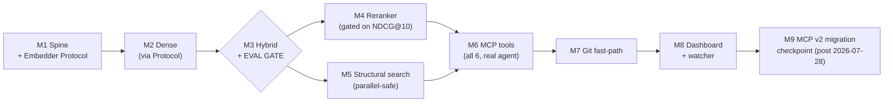

# Milestones

Noesis was built in nine milestones. Exit criteria are the definition of done — a milestone closes only when its criterion is proven, and the M3 evaluation gate sits deliberately in front of every quality feature. The board below reflects the as-built order after [ADR-38](decisions.md) promoted the dashboard + watcher to M8 and renumbered the MCP v2 checkpoint to M9.

| # | Milestone | Deliverable | Exit criterion (proves) | Status |
|---|---|---|---|---|
| M1 | Spine | Registration, discovery + filtering (gitignore/binary/secret), SHA-256 diff, SQLite WAL, `Embedder` Protocol with a fake impl for tests | Incremental detection works on a real repo; the interface compiles the whole downstream design | Done |
| M2 | Dense | cAST chunker → `LocalSTEmbedder` (CodeRankEmbed) → Qdrant dense-only, REST `POST /search` | NL→code returns sane spans; zero direct `SentenceTransformer` calls outside the embedder module (CI grep) | Done |
| M3 | Hybrid + **gate** | Native BM25 sparse + RRF; 40-query golden set; harness with Recall@10 primary | Hybrid beats dense-only on Recall@10, especially the symbol subset | Done |
| M4 | Reranker | bge-reranker-v2-m3 on a dedicated worker, `rerank` flag, lazy load, harness extended with NDCG@10 + latency | Measured NDCG@10 delta recorded; default-on/off decided from data → shipped **default-off** ([ADR-35](decisions.md)) | Done |
| M5 | Structural search | `structural_search` core fn + REST endpoint, `LANGUAGE_MAP`, discovery-filter reuse | Known patterns return exact expected match sets; skip-listed files never appear | Done |
| M6 | MCP | FastMCP mounted (shared lifespan), stdio + streamable-HTTP, all six tools; a real agent connected | Agent completes a task using `search_code` → read file, and `structural_search`, end to end | Done |
| M7 | Git fast-path | Candidate-set diffing, `last_indexed_commit` anchor, telemetry | Re-index of a large repo with a 3-file change hashes ~3 files; every fallback condition tested | Done |
| M8 | Dashboard + watcher | Jinja2 monitoring dashboard (overview / project detail / usage), watchdog watcher, per-project flags, device setting, registration + deletion | Humans see index health; freshness is automatic when enabled, staleness always visible when not | Done |
| M9 | MCP v2 checkpoint | Post-2026-07-28: assess stable MCP v2 + FastMCP's compatible range; migrate or explicitly re-pin with a dated revisit | Transports pass integration tests against the pinned, decided-upon versions; decision recorded | Scheduled — pinned to the upstream 2026-07-28 release date, not to preceding work |

M1–M8 are shipped — the feature set documented across [Concepts](../concepts/architecture.md) and [Reference](../reference/mcp-tools.md) is the delivered scope. M9 is calendar-pinned: it happens when the MCP v2 stable release lands upstream, which is why the `mcp<2` pin is a hard rule until that checkpoint decides otherwise.
