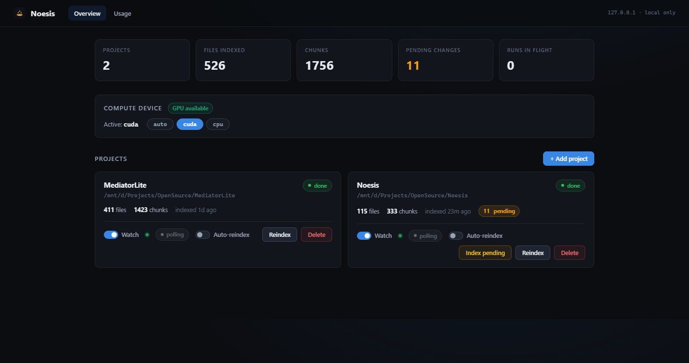
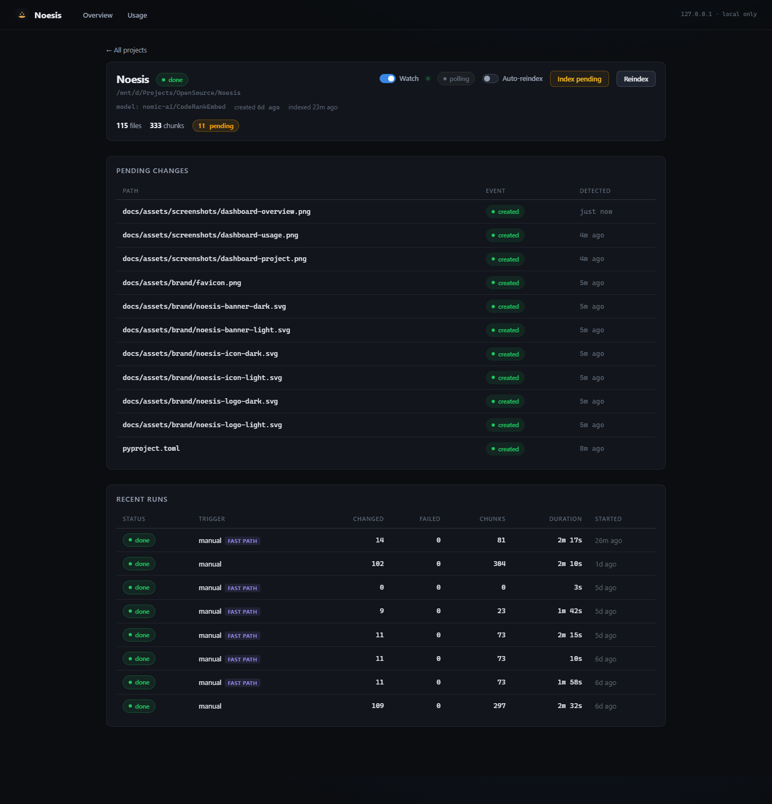
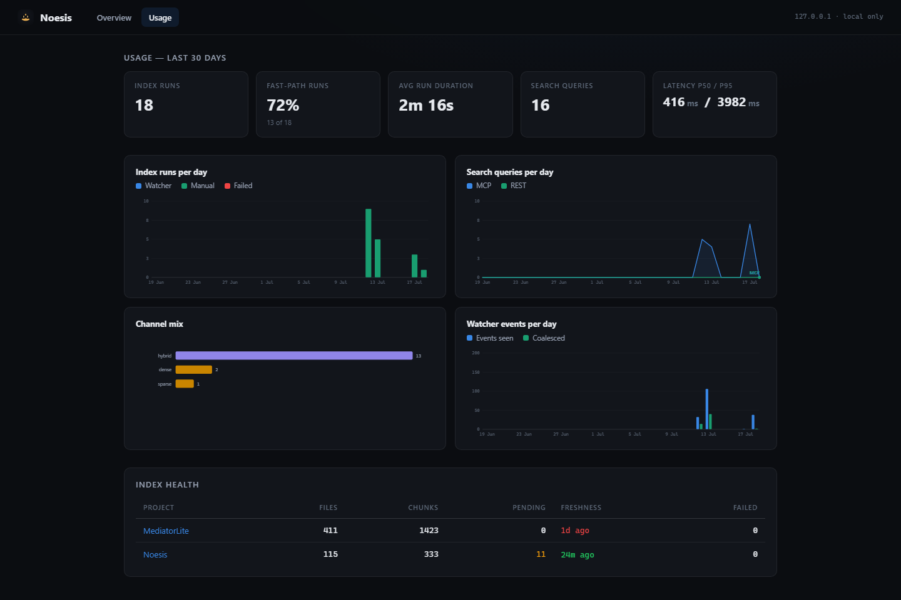

# Dashboard

The dashboard is the human monitoring surface: three server-rendered Jinja2 pages with zero build tooling and zero CDN assets — it renders with the network cable pulled ([ADR-25](../project/decisions.md) spirit). Pages poll small JSON endpoints (`/api/state`, `/api/projects/{id}/state`, `/api/usage`) to update progress bars and badges live without a reload.

## Overview (`/`)

- **Totals row** — projects, files indexed, chunks, pending changes (amber when non-zero), runs in flight.
- **Compute-device panel** — active device with `auto` / `cuda` / `cpu` (and `mps` where available) pills; a "GPU available" badge when CUDA/MPS is present. Switching hot-reloads the models (see [GPU and devices](../getting-started/gpu.md)); a config pin locks this control.
- **Project cards** — one per registered project: file/chunk counts and freshness ("indexed 23m ago"), a pending-changes badge, the latest run-status chip (green *done*, red *failed*, animated *running* with a live progress bar and ETA), per-project **Watch** and **Auto-reindex** toggles, and **Reindex** / **Index pending** / **Delete** actions (delete removes the index only — chunks, run history, pending — never source files).
- **Add project** — a modal that registers a repo without leaving the browser: type a path or use the built-in folder browser, optionally scope the index (languages, max file size, follow-symlinks, extra ignore globs), see a pre-flight preview of how many files each language contributes, then *Add only* or *Add + index now*.

## Project detail (`/projects/{id}/view`)

Drill into one project:

- **Pending changes** — files the watcher has seen, with event type (created/modified/deleted) and detection time, waiting for *Index pending* or the auto-reindex quiet period.
- **Failed files** — per-file errors of the most recent run (indexing continues past individual failures; failed files are retried next run).
- **Recent runs** — status, trigger (manual vs watcher, with a *fast path* badge when git narrowing applied), files changed/failed, chunks written, duration, start time.

## Usage (`/usage`)

Metadata analytics over the last 30 days (`?days=` clamps 1–365), drawn as inline SVG by `src/noesis/api/static/app.js` — no chart library:

- **Index activity** — runs per day (watcher- vs manual-triggered, failures in red), fast-path hit rate, average run duration.
- **Search usage** — queries per day (MCP vs REST), latency p50/p95, and the channel mix (hybrid / dense / sparse).
- **Watcher activity** — filesystem events seen vs coalesced per day, auto-reindex triggers.
- **Index health** — per-project files, chunks, pending backlog, freshness age, failed-file counts.

!!! note "Privacy: metadata only"
    Search usage records *that* a query ran and how it performed — interface, channel, latency, result count. The query text is never stored ([ADR-40](../project/decisions.md); `query_log` schema in [SQLite schema](../internals/sqlite-schema.md)).

## Implementation notes

Pages are thin adapters (`src/noesis/api/dashboard.py`) over `src/noesis/core/dashboard.py`; templates live in `src/noesis/api/templates/`, assets in `src/noesis/api/static/` with an mtime-based cache-busting token, and the HTML itself is served `Cache-Control: no-store`. All mutating endpoints require local origin. Endpoint list: [REST API reference](rest-api.md#dashboard-endpoints).
