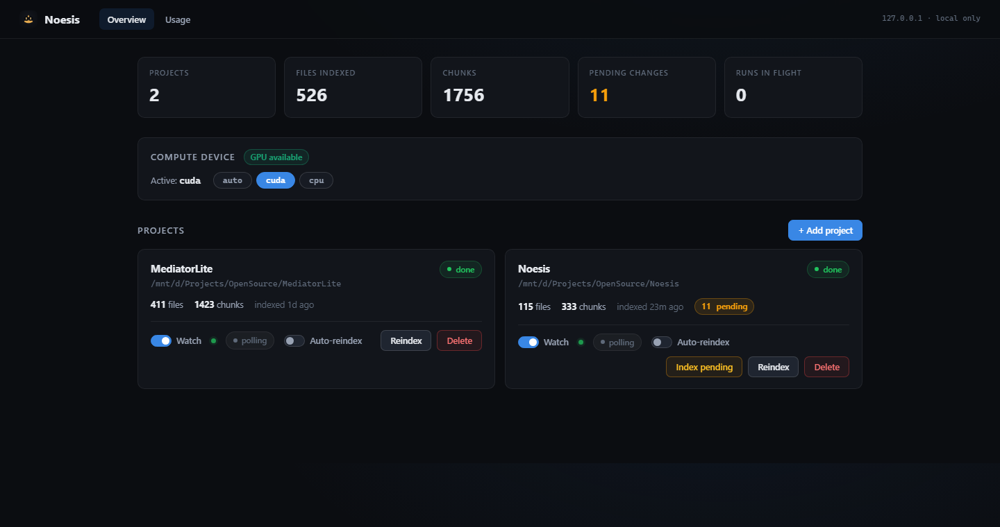
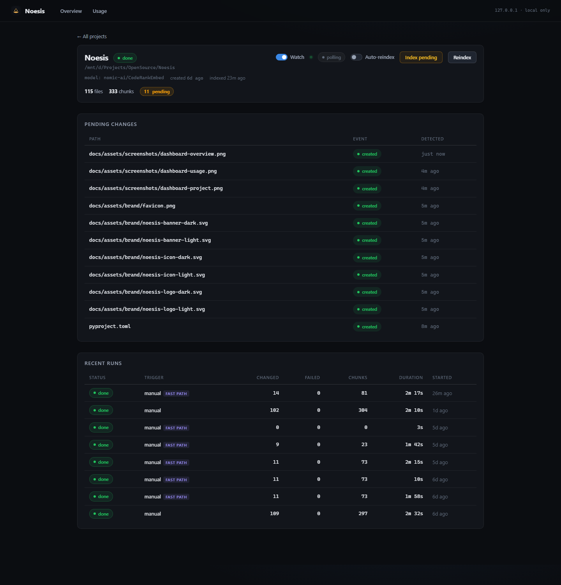
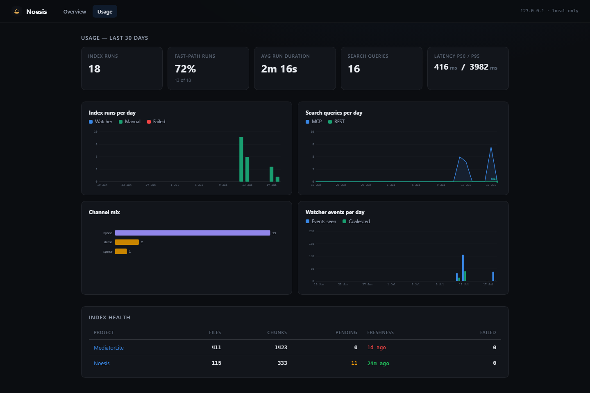

# Dashboard

The dashboard is the human monitoring surface: three server-rendered Jinja2 pages with zero build tooling and zero CDN assets — it renders with the network cable pulled ([ADR-25](../project/decisions.md) spirit). Pages poll small JSON endpoints (`/api/state`, `/api/projects/{id}/state`, `/api/usage`) to update progress bars and badges live without a reload.

## Overview (`/`)



- **Totals row** — projects, files indexed, chunks, pending changes (amber when non-zero), runs in flight.
- **Compute-device panel** — active device with `auto` / `cuda` / `cpu` (and `mps` where available) pills; a "GPU available" badge when CUDA/MPS is present. Switching hot-reloads the models (see [GPU and devices](../getting-started/gpu.md)); a config pin locks this control.
- **Project cards** — one per registered project: file/chunk counts and freshness ("indexed 23m ago"), a pending-changes badge, the latest run-status chip (green *done*, red *failed*, animated *running* with a live progress bar and ETA), per-project **Watch** and **Auto-reindex** toggles, and **Reindex** / **Index pending** / **Delete** actions (delete removes the index only — chunks, run history, pending — never source files).
- **Add project** — a modal that registers a repo without leaving the browser: type a path or use the built-in folder browser, optionally scope the index (languages, max file size, follow-symlinks, extra ignore globs), see a pre-flight preview of how many files each language contributes, then *Add only* or *Add + index now*.

## Project detail (`/projects/{id}/view`)



Drill into one project:

- **Pending changes** — files the watcher has seen, with event type (created/modified/deleted) and detection time, waiting for *Index pending* or the auto-reindex quiet period.
- **Unreadable directories** — see below; hidden when there are none.
- **Failed files** — per-file errors of the most recent run (indexing continues past individual failures; failed files are retried next run).
- **Recent runs** — status, trigger (manual vs watcher, with a *fast path* badge when git narrowing applied), files changed/failed, chunks written, duration, start time.

!!! warning "If every run fails with “discovery returned no files”"
    When a scan finds zero files while the index still tracks some, the run is failed on purpose rather than emptying the project — an unmounted or renamed root looks exactly like "every file was deleted" ([ADR-55](../project/decisions.md)). Check the root first: if the disk is not mounted, mounting it fixes the next run with no further action.

    If the root really is empty and you want the index emptied to match, that assertion needs an operator, and **the dashboard's Reindex button cannot make it** — it posts to the right endpoint but never sends the flag. Use the JSON API directly:

    ```bash
    curl -X POST 'http://127.0.0.1:8000/projects/{project_id}/reindex?force=true'
    ```

    `force` accepts the empty result as deletion evidence and does nothing else — a directory that failed to *scan* still suppresses deletions underneath it, forced or not. It is also deliberately absent from the MCP `reindex` tool, since the caller there is an agent rather than a person who can look at the disk.

### Unreadable directories

Directories discovery could not walk — a permissions change, a dead network
mount, a subtree that disappeared out from under a stale handle. The panel
appears only when there are some, and lists each with how many consecutive runs
it has failed, how many indexed files sit behind it, when it was first seen, and
the underlying error.

The important thing to know reading it: **nothing under an unreadable directory
is ever deleted from the index.** Discovery cannot see the files, and "I could
not look" is not evidence that they are gone — so their content is kept and
stays searchable. What is lost is only the *guarantee that it is current*.

A directory that keeps failing eventually shows a **quarantined** tag. That
means the files it hides have stopped being re-queued for retry, because
retrying something that cannot be read produced a permanently non-draining
"awaiting reindex" list. Quarantine changes nothing else — in particular it is
still not permission to delete anything.

Recovery is automatic and needs no action: the first run that manages to walk
the directory again re-hashes everything under it, which picks up any edit made
while it was unreadable, and the row disappears. The row also clears if the
directory was genuinely deleted or has been filtered out of the project's index
scope — in those cases its files then leave the index normally, because the walk
reached the location and found nothing there.

So the panel is a to-do list, not an error log. Either fix the directory (remount
the disk, fix the permissions) or, if the exclusion is intentional, narrow the
project's index scope so discovery stops trying. Thresholds are under
[`[indexing]`](configuration.md#indexing).

## Usage (`/usage`)



Metadata analytics over the last 30 days (`?days=` clamps 1–365), drawn as inline SVG by `src/noesis/api/static/app.js` — no chart library:

- **Index activity** — runs per day (watcher- vs manual-triggered, failures in red), fast-path hit rate, average run duration.
- **Search usage** — queries per day (MCP vs REST), latency p50/p95, and the channel mix (hybrid / dense / sparse).
- **Watcher activity** — filesystem events seen vs coalesced per day, auto-reindex triggers.
- **Index health** — per-project files, chunks, pending backlog, freshness age, failed-file counts.

!!! note "Privacy: metadata only"
    Search usage records *that* a query ran and how it performed — interface, channel, latency, result count. The query text is never stored ([ADR-40](../project/decisions.md); `query_log` schema in [SQLite schema](../internals/sqlite-schema.md)).

!!! note "Search usage is eventually consistent"
    Telemetry rows are handed to a dedicated writer thread and written outside the request, so a query is not guaranteed to appear on this page the instant its response returns — normally microseconds, but under heavy write contention it can lag briefly or be dropped ([ADR-52](../project/decisions.md)). That is the deliberate trade: telemetry may lose a row, but it can never slow a query. Index activity, watcher activity, and index health are read straight from committed state and are not affected.

## Implementation notes

Pages are thin adapters (`src/noesis/api/dashboard.py`) over `src/noesis/core/dashboard.py`; templates live in `src/noesis/api/templates/`, assets in `src/noesis/api/static/` with an mtime-based cache-busting token, and the HTML itself is served `Cache-Control: no-store`. All mutating endpoints require local origin. Endpoint list: [REST API reference](rest-api.md#dashboard-endpoints).
